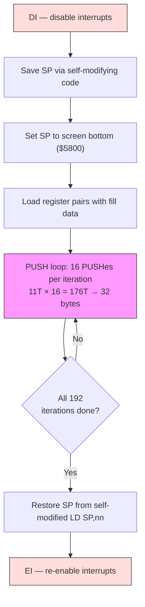

# Розділ 3: Інструментарій демосценера

У кожного ремесла є свій набір хитрощів --- патернів, до яких практики тягнуться настільки інстинктивно, що перестають вважати їх хитрощами. Z80-демосценер тягнеться до технік із цього розділу.

Ці патерни --- розгорнуті цикли, самомодифікований код, стек як канал передачі даних, LDI-ланцюжки, генерація коду та RET-ланцюжок --- з'являються майже в кожному ефекті, який ми будуватимемо в частині II. Вони відрізняють демо, що вміщується в один кадр, від того, якому потрібно три. Вивчи їх тут, і ти впізнаватимеш їх усюди.

---

## Розгорнуті цикли та самомодифікований код

### Вартість циклу

Розглянемо найпростіший можливий внутрішній цикл: очищення 256 байтів пам'яті.

```z80 id:ch03_the_cost_of_looping
; Looped version: clear 256 bytes at (HL)
    ld   b, 0            ; 7 T   (B=0 means 256 iterations)
    xor  a               ; 4 T
.loop:
    ld   (hl), a         ; 7 T
    inc  hl              ; 6 T
    djnz .loop           ; 13 T  (8 on last iteration)
```

Кожна ітерація коштує 7 + 6 + 13 = 26 тактів для запису одного байта. Лише 7 з цих тактів виконують роботу --- решта накладні витрати. Це 73% марних витрат. Для 256 байтів: 256 x 26 - 5 = 6 651 такт. На машині, де ти маєш 71 680 тактів на кадр, ці змарновані такти відчутні.

### Розгортка: обмін RAM на швидкість

Рішення — грубе й ефективне: випиши тіло циклу N разів і видали цикл.

```z80 id:ch03_unrolling_trade_ram_for_speed
; Unrolled version: clear 256 bytes at (HL)
    xor  a               ; 4 T
    ld   (hl), a         ; 7 T
    inc  hl              ; 6 T
    ld   (hl), a         ; 7 T
    inc  hl              ; 6 T
    ld   (hl), a         ; 7 T
    inc  hl              ; 6 T
    ; ... repeated 256 times total
```

Кожен байт тепер коштує 7 + 6 = 13 тактів. Жодного DJNZ. Жодного лічильника циклу. Загалом: 256 x 13 = 3 328 тактів --- половина від версії з циклом.

Ціна --- розмір коду: 256 повторень займають 512 байтів проти 7 для циклу. Ти обмінюєш RAM на швидкість.

**Коли розгортати:** Внутрішні цикли, що виконуються тисячі разів за кадр --- очищення екрану, малювання спрайтів, копіювання даних.

**Коли НЕ розгортати:** Зовнішні цикли, що виконуються раз або двічі за кадр. Економія 5 тактів на 24 ітераціях дає 120 тактів --- менше ніж три NOP. Не варте роздування.

Практичний компроміс — *часткове розгортання*: розгорни 8 або 16 ітерацій усередині циклу, залиш DJNZ для зовнішнього лічильника. Приклад `push_fill.a80` у каталозі `examples/` цього розділу робить саме це: 16 PUSH'ів на ітерацію, 192 ітерації.

### Самомодифікований код: таємна зброя Z80

Z80 не має кешу інструкцій, буфера попередньої вибірки, конвеєра. Коли процесор витягує байт інструкції з RAM, він зчитує те, що там знаходиться *прямо зараз*. Якщо ти змінив цей байт один цикл тому, процесор побачить нове значення. Це гарантована властивість архітектури.

Самомодифікований код (SMC) означає запис у байти інструкцій під час виконання. Класичний патерн — підміна безпосереднього операнда:

```z80 id:ch03_self_modifying_code_the_z80_s
; Self-modifying code: fill with a runtime-determined value
    ld   a, (fill_value)       ; load the fill byte from somewhere
    ld   (patch + 1), a        ; overwrite the operand of the LD below
patch:
    ld   (hl), $00             ; this $00 gets replaced at runtime
    inc  hl
    ; ...
```

`ld (patch + 1), a` записує в безпосередній операнд наступної `ld (hl), $00`, змінюючи її на `ld (hl), $AA` або що завгодно ти завантажив. Процесор виконує ті байти, що знайде. Деякі поширені патерни SMC:

**Підміна опкодів.** Ти можеш навіть замінити саму інструкцію. Потрібен цикл, який іноді інкрементує HL, а іноді декрементує? Перед циклом запиши опкод INC HL ($23) або DEC HL ($2B) у байт інструкції. Усередині внутрішнього циклу немає жодного розгалуження --- правильна інструкція вже на місці. Порівняй це з підходом розгалуження на кожній ітерації, що коштував би 12 тактів (JR NZ) на кожному пікселі.

**Збереження та відновлення вказівника стеку.** Цей патерн з'являється постійно при використанні PUSH-трюків (нижче):

```z80 id:ch03_self_modifying_code_the_z80_s_2
    ld   (restore_sp + 1), sp     ; save SP into the operand below
    ; ... do stack tricks ...
restore_sp:
    ld   sp, $0000                ; self-modified: the $0000 was overwritten
```

`ld (nn), sp` зберігає поточний SP безпосередньо в операнд пізнішої `ld sp, nn`. Жодної тимчасової змінної. Це ідіоматичний Z80-демосценовий код.

### Самомодифіковані змінні: патерн `$+1`

Найпоширеніший патерн SMC на ZX Spectrum --- не підміна опкодів і не збереження SP, а вбудовування *змінної* безпосередньо в безпосередній операнд інструкції. Ідея проста: замість зберігання лічильника в іменованій комірці пам'яті та завантаження через `LD A,(nn)` за 13 тактів, ти дозволяєш байту операнда самої інструкції *бути* змінною.

```z80 id:ch03_smc_dollar_plus_one
.smc_counter:
    ld   a, 0                    ; 7T — this 0 is the "variable"
    inc  a                       ; 4T
    ld   (.smc_counter + 1), a   ; 13T — write back to the operand byte
```

`ld a, 0` зчитує свій операнд як частину нормального декодування інструкції --- 7 тактів загалом, і значення вже в A. Порівняй із завантаженням з окремої адреси пам'яті: `ld a, (counter)` коштує 13 тактів, плюс тобі все одно потрібна окрема `ld (counter), a` за 13 тактів для зворотного запису. SMC-версія читає змінну безкоштовно (вона є частиною вибірки інструкції) і платить 13 тактів лише один раз за зворотний запис.

У sjasmplus ти можеш поставити мітку на `$+1`, щоб дати вбудованій змінній читабельне ім'я:

```z80 id:ch03_smc_named_variable
    ld   a, 0                    ; 7T
.scroll_pos EQU $ - 1           ; .scroll_pos names the operand byte above
    add  a, 4                   ; 7T — advance by 4 pixels
    ld   (.scroll_pos), a       ; 13T — store back into the operand
```

Цей патерн з'являється всюди в коді ZX Spectrum: позиції скролу, лічильники кадрів анімації, акумулятори фази ефектів, прапорці напрямку. Будь-яке однобайтове значення, що зберігається між викликами --- кандидат. Ти бачитимеш його постійно у частинах II та V --- практично кожна процедура ефекту в цій книзі використовує щонайменше одну самомодифіковану змінну.

Конвенція --- давати цим міткам префікс `.smc_` або ставити їх одразу після інструкції, яку вони модифікують. У будь-якому випадку, намір має бути зрозумілим кожному, хто читає вихідний код. Як ми зазначили в Розділі 2, локальні мітки (`.label`) запобігають конфліктам імен, коли кілька процедур мають власні вбудовані змінні.

**Застереження.** SMC безпечний на Z80, eZ80 та кожному клоні Spectrum. Він *не* безпечний на сучасних процесорах з кешуванням (x86, ARM) без явних інструкцій скидання кешу. Якщо ти портуєш на іншу архітектуру, це перше, що зламається.

---

## Стек як канал передачі даних

### Чому PUSH — найшвидший запис на Z80

Інструкція PUSH записує 2 байти в пам'ять і зменшує SP, все за 11 тактів. Порівняймо альтернативи для запису даних за екранною адресою:

| Метод | Записано байтів | Тактів | Тактів на байт |
|--------|--------------|----------|-------------------|
| `ld (hl), a` + `inc hl` | 1 | 13 | 13,0 |
| `ld (hl), a` + `inc l` | 1 | 11 | 11,0 |
| `ldi` | 1 | 16 | 16,0 |
| `ldir` (за байт) | 1 | 21 | 21,0 |
| `push hl` | 2 | 11 | **5,5** |

PUSH записує два байти за 11 тактів --- 5,5 тактів на байт. Майже в 4 рази швидше за LDIR. Підступ: PUSH записує туди, куди вказує SP, а SP зазвичай — це твій стек. Щоб використовувати PUSH як канал передачі даних, ти мусиш захопити вказівник стеку.

### Техніка

Патерн завжди однаковий:

1. Вимкни переривання (DI). Якщо переривання спрацює, поки SP вказує на екран, процесор покладе адресу повернення у твої піксельні дані. Настане хаос.
2. Збережи SP. Використай самомодифікований код, щоб зберегти його.
3. Встанови SP на *кінець* цільової області. Стек росте вниз --- PUSH зменшує SP перед записом. Отже, якщо ти хочеш заповнити від $4000 до $57FF, встанови SP на $5800.
4. Завантаж дані в регістрові пари та виконуй PUSH повторно.
5. Віднови SP та увімкни переривання (EI).

<!-- figure: ch03_push_fill_pipeline -->



> **Why PUSH wins:** `LD (HL),A` + `INC HL` writes 1 byte in 13T (13.0 T/byte). `PUSH HL` writes 2 bytes in 11T (**5.5 T/byte**) — nearly 2.4× faster per byte. The cost: interrupts must be disabled while SP is hijacked.

Ось ядро прикладу `push_fill.a80` з каталогу `examples/` цього розділу:

```z80 id:ch03_the_technique_2
stack_fill:
    di                          ; critical: no interrupts while SP is moved
    ld   (restore_sp + 1), sp   ; self-modifying: save SP

    ld   sp, SCREEN_END         ; SP points to end of screen ($5800)
    ld   hl, $AAAA              ; pattern to fill

    ld   b, 192                 ; 192 iterations x 16 PUSHes x 2 bytes = 6144
.loop:
    push hl                     ; 11 T  \
    push hl                     ; 11 T   |
    push hl                     ; 11 T   |
    push hl                     ; 11 T   |
    push hl                     ; 11 T   |
    push hl                     ; 11 T   |  16 PUSHes = 32 bytes
    push hl                     ; 11 T   |  = 176 T-states
    push hl                     ; 11 T   |
    push hl                     ; 11 T   |
    push hl                     ; 11 T   |
    push hl                     ; 11 T   |
    push hl                     ; 11 T   |
    push hl                     ; 11 T   |
    push hl                     ; 11 T   |
    push hl                     ; 11 T   |
    push hl                     ; 11 T  /
    djnz .loop                  ; 13 T (8 on last)

restore_sp:
    ld   sp, $0000              ; self-modified: restores original SP
    ei
    ret
```

Внутрішнє тіло з 16 PUSH записує 32 байти за 176 тактів. Загалом для повної 6 144-байтної піксельної області: приблизно 36 000 тактів. Порівняй з LDIR: 6 144 x 21 - 5 = 129 019 тактів. Метод PUSH приблизно в 3,6 рази швидший --- різниця між тим, щоб вміститися в один кадр, і виходом у наступний.


### POP як швидке читання

PUSH --- найшвидший запис, але POP --- найшвидше *читання*. POP завантажує 2 байти з (SP) у регістрову пару за 10 тактів --- це 5,0 тактів на байт. Порівняй альтернативи:

| Метод | Прочитано байтів | Тактів | Тактів на байт |
|-------|-----------------|--------|----------------|
| `ld a, (hl)` + `inc hl` | 1 | 13 | 13,0 |
| `ld a, (hl)` + `inc l` | 1 | 11 | 11,0 |
| `ldi` (як читання+запис) | 1 | 16 | 16,0 |
| `pop hl` | 2 | 10 | **5,0** |

Патерн: попередньо побудуй таблицю 16-бітних значень у пам'яті, вкажи SP на початок таблиці та виконуй POP у регістрові пари. Кожний POP просуває SP на 2, автоматично проходячи по таблиці. Це комплементарний до PUSH-запису трюк на стороні читання.

Поєднай POP та PUSH, і ти отримаєш швидкий канал пам'ять-пам'ять: POP значення з таблиці-джерела (10T), обробка регістрової пари за потреби, потім PUSH у місце призначення (11T). Разом: 21 такт на 2 байти --- та сама пропускна здатність, що й LDIR, але з регістровою парою, доступною для обробки між читанням та записом. Ти можеш маскувати біти, додавати зсуви, міняти місцями байти або застосовувати будь-яке перетворення регістр-регістр без додаткової вартості доступу до пам'яті. Цей конвеєр POP-обробка-PUSH --- основа багатьох процедур скомпільованих спрайтів.

### Де використовуються PUSH-трюки

- **Очищення екрану.** Найпоширеніше застосування. Кожне демо потребує очищення екрану між ефектами.
- **Скомпільовані спрайти.** Спрайт компілюється в послідовність інструкцій PUSH із попередньо завантаженими регістровими парами. Найшвидший можливий вивід спрайтів на Z80.
- **Швидкий вивід даних.** Будь-коли, коли потрібно швидко записати блок даних у суміжний діапазон адрес: заливка атрибутів, копіювання буферів, побудова списків відображення.

Ціна, яку ти платиш: переривання вимкнені. Якщо твій музичний програвач працює з IM2-переривання, він пропустить удар під час тривалої PUSH-послідовності. Кодери демо планують це заздалегідь --- розміщують PUSH-заливки під час бордюрного часу або розбивають їх на кілька кадрів.

---

## LDI-ланцюжки

### LDI проти LDIR

LDI копіює один байт з (HL) в (DE), інкрементує обидва та декрементує BC. LDIR робить те саме, але повторює, поки BC = 0. Різниця у таймінгу:

| Інструкція | Тактів | Примітки |
|-------------|----------|-------|
| LDI | 16 | Копіює 1 байт, завжди 16 T |
| LDIR (за байт) | 21 | Копіює 1 байт, повертається назад. Останній байт: 16 T |

LDIR коштує на 5 тактів більше за байт через внутрішню перевірку повернення. Ці 5 тактів швидко накопичуються.

Для 256 байтів:
- LDIR: 255 x 21 + 16 = 5 371 такт
- 256 x LDI: 256 x 16 = 4 096 тактів
- Економія: 1 275 тактів (24%)

Ланцюжок окремих інструкцій LDI --- це просто 256 повторень двобайтового опкоду `$ED $A0`. Це 512 байтів коду для заощадження 24% --- той самий обмін RAM на швидкість, що й розгортка циклу.

### Коли LDI-ланцюжки блищать

Оптимальна ситуація --- копіювання блоків відомого розміру. Ланцюжок з 32 LDI економить 160 тактів порівняно з LDIR для рядка спрайта. За 24 рядки це 3 840 тактів на кадр.

Але справжня потужність з'являється, коли ти поєднуєш LDI-ланцюжки з *арифметикою точки входу*. Якщо ти маєш ланцюжок з 256 LDI і хочеш скопіювати лише 100 байтів, стрибни в ланцюжок на позицію 156. Жодного лічильника циклу, жодного налаштування. Ця техніка використовується у хаос-зумері Introspec'а в Eager (2015):

```z80 id:ch03_when_ldi_chains_shine
; Chaos zoomer inner loop (simplified from Eager)
; Each line copies a different number of bytes from a source buffer.
; Entry point into the LDI chain is calculated per line.
    ld   hl, source_data
    ld   de, dest_screen
    ; ... calculate entry point based on zoom factor ...
    jp   (ix)             ; jump into the LDI chain at the right point

ldi_chain:
    ldi                   ; byte 255
    ldi                   ; byte 254
    ldi                   ; byte 253
    ; ... 256 LDIs total ...
    ldi                   ; byte 0
    ; falls through to next line setup
```

Це копіювання змінної довжини з нульовими побайтовими накладними витратами циклу — техніка, яку просто неможливо досягти з LDIR. Це одна з причин, чому LDI --- найкращий друг кожного в демосценовому коді.


---

## Бітові трюки: SBC A,A та друзі

### SBC A,A як умовна маска

Після будь-якої інструкції, що виставляє прапорець перенесення, `SBC A,A` конвертує цей прапорець у повний байт: $FF, якщо перенесення було встановлене, $00 --- якщо ні. Вартість: 4 такти. Порівняй з альтернативою на розгалуженнях --- `JR C,.set` / `LD A,0` / `JR .done` / `.set: LD A,$FF` / `.done:` --- яка коштує 17–22 такти залежно від обраного шляху, плюс порушення конвеєра через умовний перехід.

Канонічний випадок використання --- *розгортка біта в байт*. Маючи байт, де кожний біт представляє піксель (піксельний формат Spectrum), ти можеш розгорнути кожний біт у повний байт атрибута:

```z80 id:ch03_sbc_bit_expand
    rlc  (hl)            ; rotate top bit into carry    — 15T
    sbc  a, a            ; A = $FF if set, $00 if not   — 4T
    and  $47             ; A = bright white ($47) or $00 — 7T
```

Три інструкції, 26 тактів, жодних розгалужень. Для вибору між двома *довільними* значеннями, а не між нулем та маскою, використовуй патерн `SBC A,A : AND mask : XOR base`. AND вибирає, які біти змінюються між двома значеннями, а XOR перекидає їх до бажаної основи. Цей патерн замінює кожну перевірку "якщо біт встановлений --- значення A, інакше --- значення B" у твоїх внутрішніх циклах.

### ADD A,A проти SLA A

Обидві інструкції зсувають A вліво на один біт. Але `ADD A,A` --- це 4 такти та 1 байт, тоді як `SLA A` --- 8 тактів та 2 байти. Немає ситуації, де SLA A переважніша --- `ADD A,A` суворо швидша та менша. Аналогічно, `ADD HL,HL` зсуває HL вліво за 11 тактів (1 байт), замінюючи двоінструкційну послідовність `SLA L : RL H` за 16 тактів (4 байти). Для 16-бітного зсуву вліво всередині внутрішнього циклу, що виконується 192 рази за кадр, ця заміна сама по собі заощаджує 960 тактів --- більше чотирьох рядків розгортки бордюрного часу.

Це не трюки. Це словниковий запас. Так само як вільний мовець не зупиняється, щоб відмінити поширені дієслова, Z80-програміст тягнеться до `ADD A,A` та `SBC A,A` без свідомих зусиль. Якщо ти ловиш себе на написанні `SLA A` або умовного переходу для вибору між двома значеннями, зупинись і потягнися за коротшою формою. Такти складаються.

---

## Генерація коду

### Генерація коду: написання програми, що малює

Все перераховане вище --- фіксована оптимізація: код працює однаково кожен кадр. Генерація коду йде далі: твоя програма пише програму, що малює екран. Є два варіанти: офлайн (перед асемблюванням) та під час виконання.

### Офлайн: генерація асемблера з мови вищого рівня

Introspec використовував Processing (середовище креативного кодування на Java) для генерації Z80-асемблера для хаос-зумера в Eager (2015). Хаос-зумер змінює масштаб кожен кадр --- різні піксель-джерела відображаються в різні позиції на екрані. Замість обчислення цих відображень під час виконання, скрипт на Processing попередньо обчислював кожне відображення й виводив .a80-файли з оптимізованими LDI-ланцюжками та інструкціями LD.

Робочий процес: скрипт на Processing обчислює, для кожного кадру, який байт-джерело відображається на який байт екрану. Він виводить вихідний код Z80-асемблера --- послідовності `ld hl, source_addr` та інструкцій `ldi` --- які асемблер (sjasmplus) збирає разом з рукописним кодом рушія. Під час виконання рушій просто викликає попередньо згенерований код для поточного кадру.

Це не "шахрайство". Це фундаментальне прозріння, що розподіл праці між часом компіляції та часом виконання може повністю усунути розгалуження, пошуки та арифметику з внутрішнього циклу. Скрипт на Processing виконує важку математику один раз, повільно, на сучасній машині. Z80 робить легку частину --- копіювання байтів --- настільки швидко, наскільки фізично можливо.

### Під час виконання: програма пише машинний код під час виконання

Іноді параметри змінюються кожен кадр, тому офлайнової генерації недостатньо. Процедура відображення сфери в Illusion від X-Trade (ENLiGHT'96) генерує машинний код у RAM-буфер під час виконання. Геометрія сфери змінюється при обертанні --- різні пікселі потребують різних відстаней пропуску. Перед кожним кадром рушій видає байти опкодів у буфер, а потім виконує їх:

```z80 id:ch03_runtime_the_program_writes
; Runtime code generation (conceptual, simplified from Illusion)
; Generate an unrolled rendering loop for this frame's sphere slice

    ld   hl, code_buffer
    ld   de, sphere_table       ; per-frame skip distances

    ld   b, SPHERE_WIDTH
.gen_loop:
    ld   a, (de)                ; load skip distance for this pixel
    inc  de

    ; Emit: ld a, (hl) -- opcode $7E
    ld   (hl), $7E
    inc  hl

    ; Emit: add a, N   -- opcodes $C6, N
    ld   (hl), $C6
    inc  hl
    ld   (hl), a                ; the skip distance, as immediate operand
    inc  hl

    djnz .gen_loop

    ; Emit: ret -- opcode $C9
    ld   (hl), $C9

    ; Now execute the generated code
    call code_buffer
```

Згенерований код --- це прямолінійна послідовність без розгалужень, без пошуків, без накладних витрат циклу --- але це *різний код кожен кадр*. Замість "if pixel_skip == 3 then..." на 12 тактів за розгалуження, ти видаєш саме ті інструкції, що потрібні, й виконуєш їх без розгалужень.

### Вартість генерації

Генерація коду під час виконання не безкоштовна. Подивися на цикл генератора вище: кожна видана інструкція вимагає завантаження байта опкоду, його збереження, просування вказівника та, можливо, завантаження операнда --- приблизно 30–50 тактів на виданий байт залежно від складності. Рахуй приблизно ~40 тактів у середньому. Для згенерованої процедури зі 100 байтів інструкцій це приблизно 4 000 тактів накладних витрат на генерацію.

Точка беззбитковості: генерація окупається, коли згенерований код виконується більше одного разу за кадр, або коли він замінює логіку розгалужень, що коштує більше за саму генерацію. У маппері сфери Illusion кожний згенерований прохід рендерингу виконується раз за кадр --- але він замінює попіксельні умовні переходи, що коштували б значно більше. Alone Coder задокументував подібний компроміс у своєму рушії обертання: генерація послідовності інструкцій INC H/INC L для кроків координат коштує приблизно 5 000 тактів на генерацію, але усуває арифметику координат, яка коштувала б приблизно 146 000 тактів при обчисленні інлайн. Накладні витрати на генерацію --- менше 4% від вартості, яку вона замінює.

Правило: якщо ти ловиш себе на написанні циклу, що містить розгалуження для вибору між різними послідовностями інструкцій на основі попіксельних або порядкових даних, цей цикл --- кандидат на генерацію коду. Видай правильні інструкції один раз, виконай їх без розгалужень та перегенеруй лише коли параметри зміняться.

**Коли генерувати код:** Якщо ті самі операції відбуваються кожен кадр з лише зміною даних, самомодифікованого коду (підміна операндів) достатньо. Якщо змінюється *структура* --- інша кількість ітерацій, інші послідовності інструкцій --- генеруй код. Якщо ти можеш попередньо обчислити варіації на сучасній машині, віддай перевагу офлайн-генерації: вона зневаджувана, перевіряєма й не має витрат під час виконання. Генерація під час виконання окупається, коли згенерований код виконується набагато частіше, ніж коштує його генерація.

---

## RET-ланцюжок

### Перетворення стеку на таблицю диспетчеризації

У 2025 році DenisGrachev опублікував на Hype техніку, розроблену для його гри Dice Legends. Проблема: рендеринг тайлового ігрового поля вимагає малювання десятків тайлів за кадр. Наївний підхід використовує CALL:

```z80 id:ch03_turning_the_stack_into_a
; Naive approach: call each tile renderer
    call draw_tile_0
    call draw_tile_1
    call draw_tile_2
    ; ...
```

Кожен CALL коштує 17 тактів. Для ігрового поля 30 x 18 (540 тайлів) це 9 180 тактів лише на диспетчеризацію.

Прозріння DenisGrachev'а: встановити SP на *список рендерингу* --- таблицю адрес --- і завершувати кожну процедуру малювання тайлу командою RET. RET витягує 2 байти з (SP) у PC. Якщо SP вказує на твій список рендерингу, RET не повертається до викликача --- він стрибає до наступної процедури у списку.

```z80 id:ch03_turning_the_stack_into_a_2
; RET-chaining: zero call overhead
    di
    ld   (restore_sp + 1), sp   ; save SP
    ld   sp, render_list        ; SP points to our dispatch table

    ; "Call" the first tile routine by falling into it or using RET:
    ret                         ; pops first address from render_list

; Each tile routine ends with:
draw_tile_N:
    ; ... draw the tile ...
    ret                         ; pops NEXT address from render_list

; The render list is a sequence of addresses:
render_list:
    dw   draw_tile_42           ; first tile to draw
    dw   draw_tile_7            ; second tile
    dw   draw_tile_42           ; third tile (same tile type, different position)
    ; ... one entry per tile on screen ...
    dw   render_done            ; sentinel: address of cleanup code

render_done:
restore_sp:
    ld   sp, $0000              ; self-modified: restore SP
    ei
```

Кожна диспетчеризація тепер коштує 10 тактів (RET) замість 17 (CALL). Для 540 тайлів: 3 780 зекономлених тактів. Але справжній виграш --- безкоштовна диспетчеризація: кожен запис може вказувати на іншу процедуру (широкий тайл, порожній тайл, анімований тайл). Жодної таблиці стрибків, жодного непрямого виклику. Список рендерингу *і є* програмою.

### Три стратегії для списку рендерингу

DenisGrachev дослідив три підходи до побудови списку рендерингу:

1. **Карта як список рендерингу.** Сама тайлова карта є списком рендерингу: кожна клітинка містить адресу процедури малювання для цього типу тайла. Просто, але негнучко --- зміна тайла означає перезапис 2 байтів на карті.

2. **Сегменти на основі адрес.** Екран поділяється на сегменти. Список рендерингу кожного сегмента --- це блок адрес, скопійований з головної таблиці. Зміна тайлів означає копіювання нового блоку адрес.

3. **На основі байтів з 256-байтовими таблицями пошуку.** Кожен тип тайла --- це один байт (індекс тайла). 256-байтова таблиця пошуку відображає індекси тайлів на адреси процедур. Список рендерингу будується ітерацією через байти тайлової карти та пошуком кожної адреси. Саме цей підхід DenisGrachev обрав для Dice Legends.

Використовуючи підхід на основі байтів, він розширив ігрове поле з 26 x 15 тайлів (межа його попереднього рушія) до 30 x 18 тайлів, зберігаючи цільову частоту кадрів. Економія від усунення накладних витрат CALL у поєднанні з безкоштовною диспетчеризацією звільнила достатньо тактів для рендерингу на 40% більше тайлів.

### Компроміси

Як і з усіма стековими трюками, переривання мають бути вимкнені, поки SP захоплений. Кожна тайлова процедура має бути самодостатньою --- завершуватися RET і не використовувати CALL, оскільки справжній стек недоступний. На практиці тайлові процедури достатньо короткі, тож це не є обмеженням.

---

## Бічна панель: "Код мертвий" (Introspec, 2015)

У січні 2015 року Introspec опублікував на Hype коротке, провокативне есе під назвою "Код мертвий" (Kod myortv). Аргумент проводить паралель з "Смертю автора" Ролана Барта: так само як Барт стверджував, що значення тексту належить читачеві, а не автору, Introspec стверджує, що демосценовий код справді живе лише тоді, коли хтось його читає --- в зневаджувачі, в лістингу дизасемблера, у вихідному коді, що поділяється на форумі.

Незручна правда: сучасні демо споживаються як візуальні медіа. Люди дивляться їх на YouTube. Вони голосують на Pouet на основі відеозаписів. Ніхто не бачить внутрішніх циклів. Блискуча оптимізація, що економить 3 такти на піксель, невидима для 99% аудиторії. "Написання коду виключно заради коду," писав Introspec, "втратило актуальність."

І все ж.

Ти читаєш цю книгу. Ми відкриваємо зневаджувач. Ми рахуємо такти. Ми заглядаємо всередину. Техніки в цьому розділі --- не музейні експонати. Вони --- живі інструменти, і те, що більшість людей їх ніколи не побачить, не применшує їхню майстерність.

Есе Introspec'а --- це виклик, а не капітуляція. Він продовжив публікувати одні з найдетальніших технічних аналізів, які коли-небудь знала ZX-сцена --- включаючи розбір Illusion та бенчмарки стиснення, на які ми посилаємося протягом цієї книги. Код може бути мертвий для глядача YouTube. Але для читача з дизасемблером і допитливим розумом він дуже навіть живий.

---

## Збираючи все разом

Техніки в цьому розділі не ізольовані. На практиці вони компонуються:

- **Очищення екрану** поєднує *розгорнуті цикли* з *PUSH-трюками*: частково розгорнутий цикл з 16 PUSH'ів на ітерацію, зі SP, захопленим через *самомодифікований код*.
- **Скомпільовані спрайти** поєднують *генерацію коду* (кожний спрайт компілюється у виконуваний код), *POP-читання* та *PUSH-вивід* (найшвидший спосіб переміщення піксельних даних через регістри), *бітові трюки* (SBC A,A для розгортки маски) та *самомодифікацію* (підстановка екранних адрес на кожний кадр).
- **Тайлові рушії** поєднують *RET-ланцюжок* для диспетчеризації з *LDI-ланцюжками* всередині кожної тайлової процедури для швидкого копіювання даних.
- **Хаос-зумери** поєднують *офлайн-генерацію коду* (скрипти Processing, що видають асемблер) з *LDI-ланцюжками* (згенерований код --- переважно послідовності LDI) та *самомодифікацією* (підстановка адрес джерела на кожний кадр).
- **Атрибутні ефекти** поєднують *POP-читання* з попередньо обчислених таблиць з *бітовими трюками* (SBC A,A для розгортки бітових масок у колірні значення) та *PUSH-записи* для швидкого виводу атрибутів.

Спільна нитка: кожна техніка усуває щось із внутрішнього циклу. Розгортка усуває лічильник циклу. Самомодифікація усуває розгалуження. PUSH усуває побайтові накладні витрати на запис. POP усуває побайтові накладні витрати на читання. LDI-ланцюжки усувають штраф повторення LDIR. Бітові трюки усувають умовні переходи. Генерація коду усуває саме розрізнення між кодом та даними. RET-ланцюжок усуває накладні витрати CALL.

Z80 працює на 3,5 МГц. У тебе 71 680 тактів на кадр. Кожний такт, заощаджений у внутрішньому циклі --- це такт, який ти можеш витратити на більше пікселів, більше кольорів, більше руху. Інструментарій цього розділу --- ось як ти до цього дістаєшся.

У розділах, що слідують, ти побачиш кожну з цих технік у дії в реальних демо --- текстурованій сфері Illusion, атрибутному тунелі Eager, мультиколорному рушії Old Tower. Мета цього розділу полягала в тому, щоб дати тобі словник. Тепер подивимось, що майстри збудували з ним.

---

## Спробуй сам

1. **Виміряй різницю.** Візьми тестову обв'язку з розділу 1 і виміряй три версії заповнення 256 байтів: (a) цикл `ld (hl), a : inc hl : djnz`, (b) повністю розгорнутий `ld (hl), a : inc hl` x 256, і (c) PUSH-заповнення з `examples/push_fill.a80`. Порівняй ширину бордюрних смуг. Смуга PUSH-версії має бути видимо коротшою.

2. **Побудуй самомодифіковане очищення.** Напиши процедуру очищення екрану, що приймає візерунок заповнення як параметр і підставляє його в PUSH-цикл заповнення за допомогою самомодифікованого коду. Виклич її двічі з різними візерунками й спостерігай за чергуванням екрану.

3. **Заміряй LDI-ланцюжок.** Напиши 32-байтове копіювання за допомогою LDIR та ще одне за допомогою 32 x LDI. Виміряй обидва технікою кольору бордюру. LDI-ланцюжок має заощадити 160 тактів --- видимо, якщо запускати копіювання у щільному циклі.

4. **Поекспериментуй з точками входу.** Побудуй LDI-ланцюжок на 128 записів та невелику процедуру, що обчислює точку входу на основі значення в регістрі A (0–128). Стрибай у ланцюжок у різних точках. Це спрощена версія копіювання змінної довжини, що використовується у реальних хаос-зумерах.

5. **Копіювальник змінної довжини з обчисленою точкою входу.** Побудуй LDI-ланцюжок на 256 записів та фронтальну частину, що приймає кількість байтів у регістрі B (1–256). Обчисли точку входу: кожний LDI --- 2 байти, тому зсув --- (256 - B) x 2 від початку ланцюжка. Додай це до базової адреси ланцюжка, потім JP (HL) у нього. Обгорни все це тестовою обв'язкою кольору бордюру та порівняй ширину смуги з LDIR для тієї самої кількості байтів. Для малих кількостей (менше 16) різниця невелика. Для кількостей понад 64 LDI-ланцюжок помітно випереджає.

6. **Розпаковувач біт-в-атрибут.** Напиши процедуру, що зчитує байт з (HL), витягує кожний біт через RLC (HL) та використовує `SBC A,A : AND $47` для розгортки кожного біта в байт атрибута (яскраво-білий або чорний). Зберігай 8 результуючих байтів атрибутів у цільовий буфер через (DE) / INC DE. Це зародок записувальника атрибутів скомпільованого спрайта --- в наступних розділах ти побачиш, як цей патерн генерує цілі процедури спрайтів.

> **Джерела:** DenisGrachev "Tiles and RET" (Hype, 2025); Introspec "Making of Eager" (Hype, 2015); Introspec "Technical Analysis of Illusion" (Hype, 2017); Introspec "Code is Dead" (Hype, 2015)
