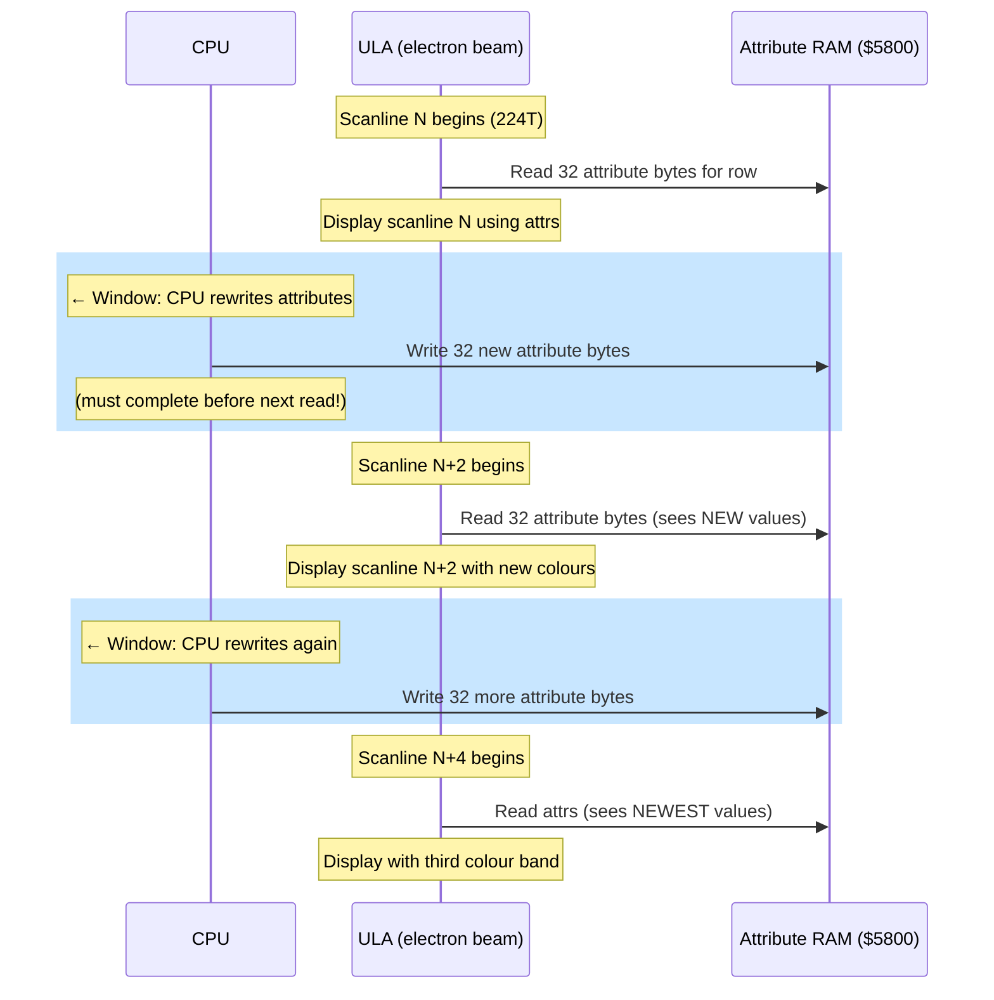

# Розділ 8: Мультиколор --- Зламуючи сітку атрибутів

> *"Мультиколор буде переможений."*
> --- DenisGrachev, Hype, 2019

---

Кожен кодер ZX Spectrum знає правило. Два кольори на комірку 8x8. Чорнило та папір. Ось що тобі дає ULA, і це все, що вона дає. Якщо твій персонаж має червоний капелюх і синє пальто, і два кольори потрапляють в одну комірку атрибутів, один із них програє. Результат — яскраві облямівки, неправильно забарвлені спрайти, персонажі, що змінюють колір, проходячи повз декорації — це конфлікт атрибутів, і це визначальне візуальне обмеження платформи.

Конфлікт атрибутів настільки фундаментальний для ідентичності Spectrum, що багато кодерів просто приймають його. Вони проектують навколо нього. Вони підбирають палітри, щоб мінімізувати його. Вони обмежують розміри спрайтів або уникають певних колірних комбінацій. Тридцять років сітка 8x8 була фактом життя.

Але ULA про це не знає.

ULA зчитує байти атрибутів під час малювання екрану, по одному рядку розгортки за раз. Вона не зчитує всі 768 байтів атрибутів одночасно. Вона зчитує кожен рядок з 32 атрибутів саме тоді, коли вони потрібні, вісім рядків розгортки потому зчитує той самий рядок знову для наступного піксельного рядка в межах цього символьного рядка, і так далі. Атрибут для будь-якої комірки зчитується вісім разів за кадр — по одному разу на кожний піксельний рядок у цій комірці.

Трюк очевидний, коли його бачиш: якщо змінити байт атрибута між зчитуваннями, ULA застосує інший колір до різних піксельних рядків в межах тієї самої комірки. Замість двох кольорів для всіх восьми рядків, ти отримуєш два кольори на *групу рядків*. Сітка 8x8 не ламається тому, що залізо було перепроектовано. Вона ламається тому, що ти переписав дані швидше, ніж залізо встигло їх спожити.

Це мультиколор. Він відомий щонайменше з початку 2000-х, коли російський ZX-журнал Black Crow опублікував алгоритм і приклад коду у своєму п'ятому номері. Але роками мультиколор залишався курйозом — вражаючим у демо, непрактичним в іграх, бо процесор витрачав стільки тактів на зміну атрибутів, що нічого не залишалося для ігрової логіки.


А потім DenisGrachev розібрався, як робити ігри з ним.

---

## Точка зору ULA

Щоб зрозуміти мультиколор, потрібно побачити екран з точки зору ULA.

ULA малює 192 видимих рядки розгортки за кадр, зверху вниз. Кожен рядок розгортки займає 224 такти (на Pentagon). Для кожного рядка розгортки ULA зчитує 32 піксельні байти та 32 байти атрибутів з пам'яті. Піксельні байти визначають, які точки є чорнилом, а які — папером. Байти атрибутів визначають, якими кольорами "чорнило" та "папір" насправді є.

В межах символьного рядка (8 піксельних рядків) ULA зчитує ті самі 32 байти атрибутів для кожного рядка розгортки. Вона не кешує їх — зчитує свіжо щоразу. Це означає, що ти маєш вікно можливості між зчитуванням атрибутів одного рядка розгортки та наступного, щоб змінити дані атрибутів.

"Традиційний" підхід до мультиколору використовує це безпосередньо. Після HALT (який синхронізує процесор з перериванням кадру) ти рахуєш такти, щоб знати точно, коли ULA зчитає кожен рядок атрибутів. Потім, у проміжку між зчитуваннями, ти перезаписуєш байти атрибутів новими значеннями. Коли ULA зчитає їх для наступного рядка розгортки, вона побачить нові кольори.

Обмеження жорстоке: точний підрахунок тактів, зміна 32 байтів між рядками розгортки, потім очікування наступної можливості. Процесор витрачає майже весь свій час на це ведення обліку. У типовому традиційному мультиколорному рушії можна змінювати атрибути кожні 2 або 4 рядки розгортки, даючи колірну роздільність 8x2 або 8x4. Але тактовий бюджет, спожитий самим кодом зміни атрибутів, не залишає майже нічого для ігрової логіки, рендерингу спрайтів або звуку.

Ось чому мультиколор залишався в демо. Демо можуть дозволити собі витрачати 100% процесора на візуальні ефекти. Ігри — ні.

---

## Ідея LDPUSH

У січні 2019 року DenisGrachev опублікував статтю на Hype під назвою "Мультиколор буде переможений" (Мультиколор будет побеждон). Заголовок був заявою про наміри. Він розробляв Old Tower, гру для ZX Spectrum з мультиколором 8x2 — атрибути змінюються кожні два піксельні рядки — і хотів пояснити, як він вирішив проблему тактового бюджету, що робила мультиколор непрактичним в іграх.

Ключова ідея — одна з тих, що здаються неминучими заднім числом: код, що виводить піксельні дані, *і є* дисплейний буфер.

Традиційний мультиколор розділяє код і дані. У тебе є буфер байтів атрибутів десь у пам'яті, і код рендерингу, що копіює їх на екран у потрібний момент. Техніка DenisGrachev'а зливає обидва. "Буфер" — це послідовність інструкцій Z80 — конкретно, `LD DE,nn`, за якою слідує `PUSH DE` — і виконання цих інструкцій записує дані дисплею безпосередньо в екранну пам'ять через вказівник стеку.

Ось як це працює.

### LD DE,nn / PUSH DE

Інструкція `LD DE,nn` завантажує 16-бітне безпосереднє значення в регістрову пару DE. Вона коштує 10 тактів (T-state) і має довжину 3 байти: байт опкоду `$11`, за яким слідують два байти даних (значення для завантаження, молодший байт першим). Інструкція `PUSH DE` декрементує SP на 1, записує старший байт DE, декрементує SP на 1 знову, потім записує молодший байт. Результат: SP опиняється на 2 нижче, зі старшим байтом за вищою адресою та молодшим байтом за нижчою адресою. Вона коштує 11 тактів (T-state).

Разом `LD DE,nn : PUSH DE` коштує 21 такт, має довжину 4 байти та записує 2 байти даних на екран. "Дані" — це безпосередній операнд інструкції LD. Щоб змінити те, що малюється, ти не переписуєш дисплейний буфер — ти патчиш байти операндів всередині самих інструкцій LD.

```z80 id:ch08_ld_de_nn_push_de
; One LDPUSH pair: writes 2 bytes to screen memory
    ld   de,$AA55       ; 10 T  load pixel data
    push de             ; 11 T  write to (SP), SP = SP - 2
                        ; ---
                        ; 21 T total, 2 bytes output
```

Рядок розгортки піксельних даних має ширину 32 байти. Але ти не можеш заповнити всі 32 байти одним лише PUSH, тому що PUSH записує вниз (SP декрементується), а тобі потрібно, щоб дані з'являлися зліва направо на екрані. Розкладка екранної пам'яті Spectrum вирішує це: в межах одного рядка розгортки послідовні байти знаходяться за зростаючими адресами. PUSH записує за спадаючими адресами. Тому дані виходять задом наперед — останній записаний через push байт з'являється за найнижчою адресою, яка є крайнім лівим байтом на екрані.

Це означає, що ти будуєш свою послідовність LDPUSH у зворотному порядку відображення. Перша `LD DE,nn : PUSH DE` в коді записує два крайніх правих байти рядка розгортки. Остання записує два крайніх лівих байти. При виконанні push-и заповнюють рядок розгортки справа наліво.

### Скільки вміщується в рядок розгортки?

DenisGrachev не заповнює всі 32 байти. Рушій GLUF (на якому працюють Old Tower та інші ігри) використовує ігрову область шириною 24 символи, з полями з кожного боку. Це 24 байти на рядок розгортки в ігровій області.

При 4 байтах коду на 2 байти виводу, тобі потрібно 48 байтів коду, щоб заповнити 24 байти екрану. Але є додатковий байт для початкового налаштування `LD SP,nn` та для зміни атрибутів між групами рядків розгортки. DenisGrachev повідомляє 51 байт на рядок розгортки згенерованого коду.

Краса цього підходу: немає окремого проходу рендерингу. Інструкції, що заповнюють екран, І Є виконуваний код. Коли тобі потрібно оновити тайл або спрайт, ти патчиш безпосередні операнди інструкцій LD. Коли код дисплею виконується, він виводить пропатчені дані. Код є дані. Дані є код.

### Вказівник стеку як курсор

Під час виконання SP вказує на правий край поточного рядка розгортки в екранній пам'яті. Кожен PUSH записує 2 байти та декрементує SP на 2, пересуваючи "курсор запису" вліво по рядку розгортки. Наприкінці виводу одного рядка розгортки SP вказує на лівий край. Код потім коригує SP на правий край наступного рядка розгортки і повторює.

Фундаментальне обмеження: переривання повинні бути вимкнені, поки SP використовується не за призначенням. Якби переривання спрацювало, процесор записав би адресу повернення в екранну пам'ять, пошкодивши дисплей. Це означає, що код рендерингу мультиколору виконується з `DI` і вмикає переривання `EI` лише після того, як SP відновлено до реального стеку. Увесь прохід рендерингу — всі 192 видимих рядки розгортки — відбувається в одному неперервному блоці.

---

## Рушій GLUF: Мультиколор у реальній грі

Old Tower був доказом концепції. GLUF (ігровий фреймворк DenisGrachev'а) був виробничим рушієм. Ось числа:

| Параметр | Значення |
|-----------|-------|
| Роздільність мультиколору | 8x2 (атрибути змінюються кожні 2 піксельні рядки) |
| Ігрова область | 24x16 символів (192x128 пікселів) |
| Буферизація | Подвійна (два набори дисплейного коду) |
| Розмір спрайта | 16x16 пікселів |
| Розмір тайла | 16x16 пікселів |
| Звук | 25 Гц (кожен другий кадр) |
| Тактів на кадр | ~70 000 (майже весь бюджет Pentagon) |

Роздільність 8x2 означає, що рушій змінює атрибути чотири рази на символьний рядок замість одного. Кожен символьний рядок має висоту 8 рядків розгортки; зміна атрибутів кожні 2 рядки дає чотири різні колірні смуги в межах одної символьної комірки. Персонаж, який зазвичай обмежений чорнилом-на-папері, раптом має до восьми кольорів (два на смугу, чотири смуги). На практиці ефект вражаючий — спрайти та тайли відображають значно більше колірних деталей, ніж архітектура Spectrum була розрахована дозволити.

### Подвійна буферизація

GLUF підтримує два повних набори дисплейного коду LDPUSH. Поки один набір виконується (малюючи поточний кадр), інший патчиться новими даними тайлів і спрайтів для наступного кадру. Це усуває мерехтіння, яке виникло б від модифікації дисплейного коду під час його виконання.

Ціна — пам'ять. Кожен набір дисплейного коду покриває ігрову область 24x16 символів при 51 байті на рядок розгортки, помножених на 128 рядків розгортки: приблизно 6 500 байтів на буфер. Два буфери споживають близько 13 000 байтів. На Spectrum 128K з банковою пам'яттю це керовано, але значуще — це означає ретельне планування пам'яті для решти активів гри.

### Двокадрова архітектура

Ось де інженерія стає жорсткою. GLUF не рендерить повний кадр кожну 1/50-у секунди. Він використовує двокадрову архітектуру:

**Кадр 1:** Зміна атрибутів для мультиколорного ефекту, потім рендеринг якомога більшої кількості тайлів у буфер дисплейного коду. Зміни атрибутів — це часо-критична частина — вони повинні відбутися в точно правильний момент відносно растрового променя.

**Кадр 2:** Завершення рендерингу залишкових тайлів, потім накладання спрайтів на буфер дисплейного коду.

Розділення необхідне, тому що навантаження просто не вміщується в один кадр. Рендеринг тайлів у буфер LDPUSH означає патчення байтів операндів всередині дисплейного коду — для кожного пікселя тайла обчислюєш, на яку інструкцію LD він впливає, і записуєш нове значення у правильний байтовий зсув. Це не просте блокове копіювання. Черезрядкова структура дисплейного коду (опкод-дані-дані-опкод-дані-дані...) означає, що рендеринг тайлів включає розкидані записи, а не послідовні.

Загальний бюджет рендерингу — приблизно 70 000 тактів на кадр — майже весь бюджет Pentagon у 71 680. Того, що залишається, ледве вистачає на ігрову логіку, обробку введення та періодичне оновлення звуку.

Звук працює на 25 Гц замість 50 Гц. Кожен другий кадр рушій повністю пропускає оновлення звуку, щоб повернути ці такти на рендеринг. Гравець не помічає вдвічі знижену частоту оновлення для простих звукових ефектів. Для музики частота 25 Гц означає, що кожна нота триває вдвічі більше кадрів, що вимагає музичного рушія, написаного спеціально для цього обмеження.

### Що бачить гравець

Гравець не бачить нічого з цього. Він бачить бокову гру з більшою кількістю кольорів, ніж Spectrum повинен мати. Спрайти рухаються по декораціях без звичного конфлікту атрибутів. Тайли відображають тінювання, текстуру та багатоколірні деталі, які були б неможливі зі стандартними атрибутами 8x8. Гра виглядає так, ніби належить більш потужній платформі.

Ось що робота DenisGrachev'а демонструє з силою: мультиколор — це не демо-трюк. Це техніка ігрового рушія. Інженерія екстремальна — подвійні буфери, двокадровий рендеринг, звук на 25 Гц — але результат — ігрова гра з візуалом, що справді ламає сприйняті ліміти Spectrum.


---

## Ringo: Інший вид мультиколору

У грудні 2022 року DenisGrachev опублікував другу статтю на Hype: "Ringo Render 64x48." Де GLUF розширив сітку атрибутів до 8x2, Ringo повністю відкинув її і побудував щось ближче до чанкі-піксельного фреймбуфера з попіксельним кольором.

Підхід концептуально простий і технічно хитрий.

### Патерн 11110000b

Заповни кожен піксельний байт в екранній пам'яті значенням `$F0` — двійкове `11110000`. Ліві чотири пікселі кожного байта встановлені (колір чорнила), а праві чотири очищені (колір паперу). Тепер, якщо змінити атрибут для цієї комірки, ліва половина відображає колір чорнила, а права — колір паперу. Одна 8-піксельна комірка відображає два різних кольори, один поруч з іншим.

Зі стандартними атрибутами 8x8 це дає сітку 64x24 незалежно забарвлених "пікселів", кожен шириною 4 реальні пікселі та висотою 8 реальних пікселів. Непогано, але не революційно.

### Перемикання двох екранів

Трюк, що робить Ringo робочим: ZX Spectrum 128K має два екранних буфери. Екран 0 живе за адресою `$4000`, Екран 1 — за `$C000` (у банку 7). Єдиний `OUT` у порт `$7FFD` перемикає, який екран відображає ULA.

Ringo готує обидва екрани з патерном `11110000b`, але з *різними* атрибутами на кожному екрані. Потім перемикається між двома екранами кожні 4 рядки розгортки. Ефект: у межах кожного 8-піксельного символьного рядка верхні 4 рядки розгортки показують атрибути Екрану 0, а нижні 4 — атрибути Екрану 1. Кожна половина може задавати незалежні кольори чорнила та паперу.

У поєднанні з піксельним патерном `11110000b` це дає:

- 2 колірні колонки на символьну комірку (ліві 4 пікселі = чорнило, праві 4 = папір)
- 2 колірні рядки на символьну комірку (верхні 4 рядки розгортки з Екрану 0, нижні 4 з Екрану 1)
- Загалом: 4 незалежно забарвлені підкомірки на 8x8 символьну комірку

На повний екран: 64 колонки x 48 рядків = **3 072 незалежно забарвлених пікселі**, кожен розміром 4x4 реальних пікселі. Ефективна роздільність — 64x48 з повним попіксельним кольором із 15-колірної палітри Spectrum.


Це принципово інший підхід порівняно з мультиколором 8x2 GLUF. GLUF змінює атрибути синхронно з променем, вимагаючи точного таймінгу та споживаючи масивні тактові бюджети. Ringo використовує апаратне перемикання подвійного екрану, яке потребує лише одну інструкцію `OUT` кожні 4 рядки розгортки. Процесорні накладні витрати самого перемикання екрану мінімальні.

### Куди йдуть такти

Дешеве перемикання екрану означає більше тактів для ігрової логіки. Але рендеринг у два екрани одночасно не безкоштовний. Кожне оновлення тайла та спрайта повинно бути записане в обидва екрани — Екран 0 і Екран 1, тому що гравець бачить композит обох.

Спрайти Ringo мають розмір 12x10 "пікселів" у сітці 64x48, що означає 12 байтів атрибутів у ширину та 10 рядків атрибутів у висоту (розподілених між двома екранами). Кожен спрайт займає 120 байтів даних. Рендеринг спрайтів використовує макроси з фіксованою кількістю тактів — послідовності інструкцій з відомим, постійним часом виконання, критичним для підтримки синхронізації з перемиканням екрану.

Рендеринг тайлів більш складний. DenisGrachev попередньо генерує код рендерингу тайлів у сторінках пам'яті, використовуючи патерни `pop af : or (hl)`:

```z80 id:ch08_where_the_t_states_go
; Tile rendering fragment (conceptual)
    pop  af             ; 10 T  load tile data from stack-based source
    or   (hl)           ;  7 T  combine with existing screen data
    ld   (hl),a         ;  7 T  write back
    inc  l              ;  4 T  next attribute column
                        ; ---
                        ; 28 T per attribute byte
```

`pop af` — це стековий трюк: дані тайла організовані як таблиця у форматі стеку в пам'яті. SP вказує на дані тайла, а POP зчитує два байти за раз. `or (hl)` комбінує колір тайла з тим, що вже є на екрані, дозволяючи прозорі тайли та багатошарові фони.

### Горизонтальний скролінг

Ringo реалізує горизонтальний скролінг зі зміщенням на пів символу. Оскільки кожен "піксель" у сітці 64x48 має ширину 4 реальних пікселі, скролінг на один "піксель" означає зсув патерну `11110000b` на 4 біти. Але патерн фіксований — ти не можеш легко зсунути його без пошкодження колірного трюку.

Натомість DenisGrachev скролить, переміщуючи дані атрибутів. Скрол на один піксель зсуває всі атрибути на одну колонку вліво або вправо та малює нову колонку на краю. Оскільки атрибути — єдине, що змінюється (піксельний патерн залишається фіксованим на `$F0`), скрол — це просто блокове копіювання байтів атрибутів. Для сітки 64x48 це 48 байтів на зсув колонки (один байт на рядок), значно дешевше за попіксельний скролінг.

Для під-"піксельного" скролінгу — плавного руху в межах 4-піксельної колонки — DenisGrachev чергує `$F0` та `$E0` (або подібні зсунуті патерни) у піксельних даних. Це вимагає більшого обліку, але досягає зміщення на пів символу, створюючи ілюзію 128-колонкової горизонтальної роздільності.

---

## Традиційний мультиколор: Підхід на основі переривань

Перш ніж перейти до практики, варто зрозуміти "класичний" підхід, який GLUF та Ringo витіснили. Традиційний мультиколор концептуально найпростіший: зміни атрибути в точно правильний момент, і ULA відобразить різні кольори на різних рядках розгортки.

Техніка працює так:

1. Виконай `HALT`, щоб синхронізуватися з перериванням кадру. Після HALT процесор знаходиться у відомій тактовій позиції відносно початку відображення.

2. Рахуй такти від HALT. ULA зчитує кожен рядок з 32 атрибутів у відомий момент кожного рядка розгортки. Додаючи `NOP` або інші інструкції відомої довжини, ти можеш позиціонувати свій код у точно правильний момент.

3. У точний такт, коли ULA закінчила зчитування атрибутів для поточного рядка розгортки (але до того, як зчитає їх для наступного), перезапиши 32 байти атрибутів новими значеннями.

4. Дочекайся, поки ULA зчитає нові значення, потім перезапиши знову для наступної зміни.

Таймінг жорстокий. Кожен рядок розгортки займає 224 такти на Pentagon. ULA зчитує 32 байти атрибутів на початку кожного рядка розгортки, і процесор повинен змінити всі 32 байти в проміжку до наступного зчитування. З `LD (HL),A : INC L` на 11 тактів за байт, запис 32 байтів займає 352 такти — більше за один повний рядок розгортки. Ти не можеш змінювати кожен рядок розгортки. У кращому випадку ти можеш змінювати кожен другий рядок (роздільність 8x2), якщо використовуєш найшвидший можливий метод виводу (на основі PUSH), і навіть тоді запаси таймінгу мінімальні.

<!-- figure: ch08_multicolor_beam_racing -->



> **Перегони:** При 224 тактах (T-state) на рядок розгортки запис 32 байтів через `LD (HL),A : INC L` коштує 352 такти -- більше за один рядок розгортки. Ось чому роздільність 8x2 (зміна кожні 2 рядки розгортки) -- це практична межа при перезапису атрибутів процесором, і ось чому LDPUSH зливає вивід пікселів та атрибутів, уникаючи окремого проходу атрибутів.

Практичний результат: традиційний мультиколор споживає 80--90% процесора на керування атрибутами. У демо, де мультиколор *і є* ефект, це прийнятно. У грі це смертельно. Жодних тактів не залишається для ігрової логіки, виявлення зіткнень або звуку.

Техніка LDPUSH DenisGrachev'а вирішує це, зливаючи вивід атрибутів з виводом пікселів. Той самий код, що записує піксельні дані, також записує атрибути, і обидва вбудовані у виконувані інструкції. Немає окремої фази "керування атрибутами", що з'їдає бюджет. Прохід рендерингу обробляє все.

---

## Врізка: Black Crow #05 --- Ранній мультиколор

Техніка зміни атрибутів між рядками розгортки була задокументована ще в 2001 році в Black Crow #05, російському журналі ZX Spectrum сцени, що розповсюджувався на TRD-дискетах. Стаття представляла базовий алгоритм — синхронізуйся з растром, рахуй такти, змінюй атрибути — разом з робочим прикладом коду.

Black Crow важливий як історичний маркер. До 2001 року демосцена ZX Spectrum еволюціонувала далеко за межі комерційного життя платформи, і кодери систематично каталогізували трюки, що виштовхували залізо за межі його проектних специфікацій. Мультиколор був одною з багатьох технік, що поширювалися через екосистему сценових журналів: Spectrum Expert, ZX Format, Born Dead, Black Crow та пізніше онлайн-платформу Hype.

Внесок DenisGrachev'а, майже двома десятиліттями пізніше, полягав не у винайденні мультиколору, а у вирішенні його практичних проблем для розробки ігор. Журнальні статті документували, що можливо. DenisGrachev показав, що *придатне для використання*.

---

## Палітра Spectrum та мультиколор

Коротка примітка про механіку кольорів, тому що візуальний вплив мультиколору повністю залежить від палітри.

ZX Spectrum має 15 кольорів: 8 базових (чорний, синій, червоний, пурпуровий, зелений, блакитний, жовтий, білий) та 7 BRIGHT-варіантів (яскравий чорний збігається зі звичайним чорним, тому лише 7 додаткових). Кожен байт атрибута задає колір чорнила (3 біти), колір паперу (3 біти), прапорець BRIGHT (1 біт, застосовується одночасно і до чорнила, і до паперу) та прапорець FLASH (1 біт).

З мультиколором 8x2 кожна символьна комірка отримує чотири рядки атрибутів замість одного. Кожен рядок задає незалежні кольори чорнила та паперу. Це до восьми кольорів на комірку (два на рядок, чотири рядки) — хоча на практиці обмеження BRIGHT (воно застосовується одночасно і до чорнила, і до паперу) зменшує ефективні комбінації.

З підходом 64x48 Ringo кожна підкомірка повністю незалежна. 15-колірна палітра доступна в кожній з 3 072 позицій. Результат ближчий до того, що 8-бітні домашні комп'ютери з потужнішим залізом — MSX2, Amstrad CPC — могли досягти нативно. На Spectrum це досягається повністю програмно, використовуючи часове співвідношення між процесором та ULA.

---

## Практика: Мультиколорний ігровий екран

Давай побудуємо спрощений мультиколорний рендерер. Мета: ігрова область шириною 24 символи з колірною роздільністю 8x2 та одним рухомим спрайтом зверху. Це не зрівняється з повним набором функцій GLUF, але продемонструє базову техніку LDPUSH та двокадровий підхід до рендерингу.

### Крок 1: Буфер дисплейного коду

Спершу нам потрібен блок пам'яті, заповнений парами інструкцій LDPUSH. Для кожного рядка розгортки в ігровій області з 24 символами нам потрібно 12 пар `LD DE,nn : PUSH DE` (кожна пара виводить 2 байти, 12 пар виводять 24 байти = повна ширина ігрової області).

```z80 id:ch08_step_1_the_display_code
; Structure of one scanline's display code (conceptual)
; SP is pre-set to the right edge of this scanline in screen memory

    ld   de,$0000       ; 10 T  rightmost 2 bytes (will be patched)
    push de             ; 11 T
    ld   de,$0000       ; 10 T  next 2 bytes leftward
    push de             ; 11 T
    ld   de,$0000       ; 10 T
    push de             ; 11 T
    ; ... 12 pairs total ...
    ld   de,$0000       ; 10 T  leftmost 2 bytes
    push de             ; 11 T
    ; --- 252 T per scanline (12 x 21) ---

    ; Then: adjust SP for the next scanline
    ; Then: change attributes (every 2nd scanline)
```

Загальний дисплейний код для 128 рядків розгортки (16 символьних рядків x 8 рядків розгортки кожний) при приблизно 51 байті на рядок розгортки — це близько 6 500 байтів.

### Крок 2: Зміни атрибутів у дисплейному коді

Кожні два рядки розгортки дисплейний код повинен включати записи атрибутів. Між послідовностями LDPUSH для рядків розгортки N та N+2 вставляємо код, що перезаписує 32 байти атрибутів для поточного символьного рядка:

```z80 id:ch08_step_2_attribute_changes
; After outputting scanline N...
; Attribute change for the next 2-scanline band

    ld   sp,attr_row_end       ; point SP at end of attribute row
    ld   de,attr_data_0        ; 10 T  rightmost 2 attribute bytes
    push de                    ; 11 T
    ld   de,attr_data_1        ; 10 T
    push de                    ; 11 T
    ; ... 16 pairs for 32 attribute bytes ...

    ld   sp,next_scanline_end  ; point SP at next scanline's right edge
    ; Continue with pixel LDPUSH pairs for scanlines N+2, N+3
```

Зміни атрибутів вбудовані безпосередньо в потік дисплейного коду. Вони виконуються в точно правильний момент, тому що вони *позиціоновані* в точно правильній точці послідовності інструкцій. Не потрібен підрахунок тактів. Не потрібне заповнення NOP. Структура коду гарантує таймінг.

### Крок 3: Рендеринг тайлів через патчення операндів

Щоб намалювати тайл у ігровій області, потрібно пропатчити байти операндів інструкцій LD у буфері дисплейного коду. Тайл 16x16 пікселів покриває 2 байти в ширину та 16 рядків розгортки у висоту. У дисплейному коді ці 2 байти — це операнд конкретної інструкції LD DE. Щоб оновити тайл:

```z80 id:ch08_step_3_tile_rendering_via
; Patch one scanline of a 16x16 tile into the display buffer
; IX points to the LD DE instruction for this position in the buffer
; HL points to the tile's pixel data for this scanline

    ld   a,(hl)             ;  7 T  read tile byte 0
    ld   (ix+1),a           ; 19 T  patch into LD DE operand (low byte)
    inc  hl                 ;  6 T
    ld   a,(hl)             ;  7 T  read tile byte 1
    ld   (ix+2),a           ; 19 T  patch into LD DE operand (high byte)
    inc  hl                 ;  6 T
    ; advance IX to the next scanline's LD DE instruction
    ; (stride depends on display code structure)
```

При 19 тактах за IX-індексований запис це недешево. Для повного тайла 16x16 (16 рядків розгортки x 2 байти x 2 патчі на байт): приблизно 1 200 тактів на тайл. В ігровій області 24x16 символів з 2-символьними тайлами є до 192 тайлів. Навіть з частковими оновленнями (перемальовка лише тайлів, що змінилися), рендеринг тайлів домінує в бюджеті.

Ось чому GLUF розділяє рендеринг на два кадри. Кадр 1 обробляє часо-критичні зміни атрибутів і рендерить якомога більше тайлів. Кадр 2 завершує тайли та компонує спрайти зверху.

### Крок 4: Накладання спрайтів

Спрайти рендеряться поверх тайлів тією ж технікою патчення операндів, але з додатковим кроком: збережи оригінальні байти операндів перед перезаписом, щоб спрайт можна було стерти на наступному кадрі, відновивши збережені дані.

```z80 id:ch08_step_4_sprite_overlay
; Sprite rendering: save background, patch sprite data
    ld   a,(ix+1)           ; read current (background) byte
    ld   (save_buffer),a    ; save for later restoration
    ld   a,(sprite_data)    ; load sprite pixel
    ld   (ix+1),a           ; patch into display code
```

Механізм збереження/відновлення — це мультиколорний еквівалент рендерингу спрайтів з брудними прямокутниками. Ти зберігаєш те, що було, малюєш спрайт, відображаєш його, потім відновлюєш збережені байти, щоб стерти спрайт перед малюванням його в новій позиції.

### Крок 5: Основний цикл

```z80 id:ch08_step_5_the_main_loop
main_loop:
    halt                    ; synchronise with frame

    ; --- Frame 1: attributes + tiles ---
    di
    ld   (restore_sp+1),sp  ; save real SP
    call execute_display     ; run the LDPUSH display code
restore_sp:
    ld   sp,$0000           ; restore SP
    ei

    call update_tiles        ; patch changed tiles into buffer B
    call read_input          ; handle player input
    call update_game_logic   ; move entities, check collisions

    halt                    ; synchronise with next frame

    ; --- Frame 2: remaining tiles + sprites ---
    di
    ld   (restore_sp2+1),sp
    call execute_display     ; display the current frame
restore_sp2:
    ld   sp,$0000
    ei

    call finish_tiles        ; patch any remaining tiles
    call erase_old_sprite    ; restore saved bytes
    call render_sprite       ; patch sprite into new position
    call update_sound        ; sound at 25 Hz (every other frame pair)

    jr   main_loop
```

Цей каркас схоплює суттєвий ритм: два кадри на логічний ігровий кадр, дисплейний код виконується з вимкненими перериваннями, рендеринг тайлів і спрайтів відбувається між проходами дисплею. Переплетення рендерингу та ігрової логіки в межах двокадрової структури — це інженерне серце мультиколорного ігрового рушія.

---

## Що означає робота DenisGrachev'а

Досягнення DenisGrachev'а полягало не у винайденні мультиколору -- техніка була відома. Воно полягало у вирішенні інженерної проблеми вміщення мультиколорного рендерингу, тайлового рушія, накладання спрайтів, подвійної буферизації, звуку та ігрової логіки в один бюджет кадру. Двокадрова архітектура, злитий буфер дисплею "код-як-дані" та компроміс зі звуком на 25 Гц -- це рішення ігрового рушія, а не демо-трюки. Ringo пішов далі, обмінявши колірну роздільність (64x48 проти піксельної сітки 192x128 GLUF) на дешевший шлях рендерингу через перемикання подвійного екрану.

---

## Підсумок

- **Конфлікт атрибутів** (два кольори на комірку 8x8) — визначальне візуальне обмеження Spectrum. ULA зчитує атрибути порядково, а не покадрово — якщо змінити їх між зчитуваннями, отримаєш більше кольорів на комірку.
- Техніка **LDPUSH** зливає дані дисплею з виконуваним кодом: послідовності `LD DE,nn : PUSH DE` записують піксельні дані в екранну пам'ять при виконанні, а безпосередні операнди слугують дисплейним буфером. Патчення операндів змінює те, що малюється.
- **GLUF** досягає мультиколору 8x2 в ігровій області 24x16 символів з подвійно буферизованим дисплейним кодом, спрайтами та тайлами 16x16 і двокадровою архітектурою, що розділяє рендеринг на 2/50-х секунди.
- **Ringo** використовує піксельний патерн `11110000b` з перемиканням подвійного екрану кожні 4 рядки розгортки для досягнення сітки 64x48 з попіксельним кольором — принципово інший компроміс, що віддає перевагу колірній незалежності над просторовою роздільністю.
- **Традиційний мультиколор** (зміна атрибутів через переривання) концептуально простіший, але споживає 80--90% процесора, роблячи його непрактичним для ігор.
- Журнал **Black Crow #05** задокументував мультиколор ще в 2001 році. Внесок DenisGrachev'а — зробив його практичним для розробки ігор.
- Робота DenisGrachev'а демонструє, що техніки демосцени — це інженерні інструменти, а не лише демо-трюки. Відмінність між "можливо в демо" та "придатне для гри" — це інженерний виклик.

---

## Спробуй сам

1. **Побудуй дисплейний буфер.** Напиши програму, що генерує блок пар `LD DE,nn : PUSH DE` у пам'яті, вказує SP на екранну пам'ять і виконує блок. Ти повинен побачити патерн на екрані, що відповідає обраним безпосереднім значенням. Зміни значення та виконай знову, щоб побачити оновлення екрану.

2. **Додай зміни атрибутів.** Розшир свій дисплейний буфер для включення записів атрибутів кожні 2 рядки розгортки. Заповни чергові смуги різними кольорами. Ти повинен побачити горизонтальні кольорові смуги в межах одного символьного рядка — доказ, що мультиколорний ефект працює.

3. **Пропатчи тайл.** Напиши процедуру, що бере піксельний тайл 16x16 і патчить його в дисплейний буфер у зазначеній позиції, модифікуючи байти операндів LD. Намалюй кілька тайлів, щоб заповнити ігрову область.

4. **Рухай спрайт.** Реалізуй патчення зі збереженням/відновленням фону: перед малюванням спрайта збережи байти операндів, які він перезапише. Після відображення кадру віднови збережені байти. Пересувай спрайт на один символ за кадр і переконайся, що він рухається чисто без залишків.

5. **Виміряй бюджет.** Використай тестову обв'язку з кольором бордюру з Розділу 1, щоб виміряти, скільки кадру споживає твій дисплейний код. На Pentagon червона смуга повинна майже заповнити бордюр — GLUF використовує ~70 000 з доступних 71 680 тактів. Подивись, скільки залишається для ігрової логіки.

---

> **Джерела:** DenisGrachev, "Multicolor Will Be Conquered" (Hype, 2019); DenisGrachev, "Ringo Render 64x48" (Hype, 2022); Black Crow #05 (ZXArt, 2001). Ігрові рушії: Old Tower, GLUF, Ringo від DenisGrachev'а.
