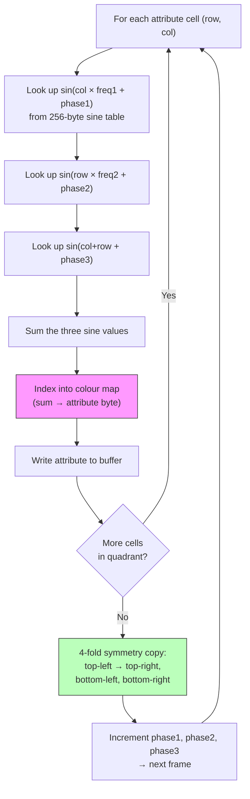

# Розділ 9: Атрибутні тунелі та хаос-зумери

> *"Це ДУЖЕ БАГОВАНЕ демо. Це НАЙВАЖЧА річ, яку я коли-небудь робив у демо — без жартів."*
> -- Introspec, file_id.diz партійної версії Eager (to live), 3BM Open Air 2015

---

Влітку 2015 року Introspec сів будувати щось, чого раніше ніколи не пробував. Демо, що з'явилось — Eager (to live), випущене під лейблом Life on Mars на 3BM Open Air — зайняло перше місце в компо демо для ZX Spectrum. Воно тривало дві хвилини, зациклене, і кожен кадр рендерився на 50 Гц із справжніми цифровими барабанами, змішаними з виходом чіпа AY. Візуальним центром був тунель, що, здавалось, вгризався в екран, кольори хвилясто розходились органічними хвилями. Коли люди бачили це, багато хто припускав важку піксельну маніпуляцію. Насправді тунель ніколи не торкнувся жодного пікселя. Весь ефект жив у пам'яті атрибутів.

Цей розділ — making-of. Ми пройдемо через два основних візуальних ефекти з Eager — атрибутний тунель та хаос-зумер — простежуючи творчу аргументацію поруч із кодом. По дорозі ми зустрінемо скриптовий рушій, що натякає на архітектуру синхронізації, розглянуту в Розділі 12, та філософський аргумент про попередні обчислення, що розділяв ZX-сцену роками. Але почнемо там, де почав Introspec: дивлячись на 768 байтів і усвідомлюючи, що їх достатньо.

---

## Сітка атрибутів як фреймбуфер

Кожен кодер ZX Spectrum знає область атрибутів за адресами `$5800`--`$5AFF`. Кожен з 768 байтів керує кольорами чорнила та паперу для блоку 8x8 пікселів, даючи сітку 32x24. У розробці ігор атрибути — джерело головного болю через конфлікт кольорів. У Розділі 8 ми бачили, як мультиколорні рушії переписують атрибути синхронно з растровим променем, щоб боротися з сіткою 8x8. Атрибутний тунель робить навпаки: він обіймає сітку.

Ідея обеззброюючо проста. Якщо заповнити піксельну пам'ять фіксованим патерном — скажімо, чергуванням смуг чорнила/паперу або шахматкою — тоді байт атрибута сам по собі визначає, що бачить глядач у кожній комірці 8x8. Зміни кольори чорнила та паперу, і візуальний вміст цієї комірки повністю зміниться. Тепер у тебе є 32x24 "пікселі" кольору, кожен — байт атрибута. Запис повного кадру означає запис 768 байтів. Жодного черезрядкового перетасування адрес екрану. Жодних бітових маніпуляцій. Жодного піксельного малювання. Просто лінійне блокове копіювання в RAM атрибутів.

При 32x24 роздільність жахлива за будь-яким нормальним стандартом. Але Introspec будував не нормальний ефект. Він будував тунель.

Подумай, як тунель виглядає з точки зору глядача. "Горло" тунелю — центр екрану — це те, куди притягується око. Стіни відходять до країв. Біля центру деталі дрібні та розмиті глибиною. Біля країв стіни близько і ти бачиш текстуру. Це чудово накладається на дисплей зі змінною роздільністю: груба роздільність у центрі (де тунель далеко і деталі не мають значення) та тонша роздільність на краях (де мають).

Introspec пішов далі з псевдо-чанкі рендерингом. У центрі екрану кілька комірок атрибутів мають однаковий колір, створюючи більші "пікселі." До країв кожна комірка 8x8 отримує своє значення. Око приймає блочний центр, тому що саме там горло тунелю — глибина природно руйнує деталі. Периферійний зір вловлює тоншу роздільність на краях, створюючи враження вищої достовірності, ніж дані насправді містять.

Ось перший урок Eager: сітка атрибутів — не обмеження, навколо якого працюєш. Це фреймбуфер, з яким працюєш.

---

## Плазма: Колірний рушій

Кольори тунелю не беруться зі збереженої текстури, накладеної на трубу. Вони беруться з розрахунку плазми — класичного підходу суми синусів, що є улюбленцем демосцени з часів Amiga, тут адаптованого для атрибутної палітри Spectrum.

Базова ідея: для кожної позиції на сітці 32x24 підсумуй кілька синусоїдальних хвиль з різними частотами та фазами. Результат, після обмеження до доступного діапазону кольорів, визначає байт атрибута. Варіюй фази з часом — і плазма анімується, створюючи той органічний, хвилястий потік.

На Z80 це означає пошук по таблицях. 256-байтна таблиця синусів, вирівняна за сторінкою, щоб можна було індексувати одним регістром, надає базову функцію. Для кожної комірки ти шукаєш `sin(x * freq1 + phase1) + sin(y * freq2 + phase2) + ...`, де множення на частоту — це насправді просто додавання до індексу (множення на 2 = пошук кожного другого запису, множення на 3 = додавання індексу до себе двічі). Накопичене значення індексує колірну карту, що видає байт атрибута.

Форма тунелю імпліцитна, не явна. Немає обчислення відстані від центру, жодної таблиці кутів, жодного перетворення в полярні координати. Натомість параметри частоти та фази плазми організовані так, що результуючий колірний патерн природно формує концентричні кільця при перегляді на екрані. Кільця виникають з інтерференції синусоїдальних хвиль, так само як патерни Муаре виникають з накладення сіток. Підлаштуй параметри — і кільця стягуються до центру, створюючи ілюзію глибини — погляд вниз у тунель.

<!-- figure: ch09_tunnel_plasma_computation -->



> **Ключова ідея:** Немає обчислення відстані від центру, немає таблиці кутів, немає перетворення в полярні координати. Форма тунелю виникає з інтерференції синусоїдальних хвиль -- концентричні кільця з'являються природно від накладення частот. Обчислюється лише одна чверть (16x12); решта дзеркально відображається.

Це дешевше за справжній геометричний тунель (який потребував би попіксельних пошуків відстані та кута) і дає візуально багатий результат. Компроміс — менша геометрична точність, але при роздільності 32x24 геометрична точність і так не стояла на порядку денному.


---

## Чотиристороння симетрія: Розділяй і владарюй

Навіть при 32x24 обчислення плазми для всіх 768 комірок кожен кадр дорогі на Z80 3,5 МГц. Introspec зрізав навантаження вчетверо класичною оптимізацією: використав природну симетрію тунелю.

Тунель при погляді ззаду симетричний відносно і горизонтальної, і вертикальної осей. Якщо обчислити одну чверть екрану — верхній лівий блок 16x12 — можна скопіювати його в інші три чверті дзеркальним відображенням. Верхній лівий у верхній правий — горизонтальне відображення. Верхній лівий у нижній лівий — вертикальне відображення. Верхній лівий у нижній правий — обидва.

Процедура копіювання щільна. У реалізації Introspec'а HL вказує на вихідний байт у верхній лівій чверті, а три адреси призначення (верхній правий, нижній лівий, нижній правий) підтримуються комбінацією абсолютних адрес та регістрової пари BC:

```z80 id:ch09_four_fold_symmetry_divide_and
    ld a,(hl)      ; read source byte from top-left quarter
    ld (nn),a      ; write to upper-right quarter (mirrored)
    ld (mm),a      ; write to lower-left quarter (mirrored)
    ld (bc),a      ; write to lower-right quarter (mirrored)
    ldi            ; copy source to its own destination AND advance HL, DE
```

Інструкції `ld (nn),a` та `ld (mm),a` використовують абсолютну адресацію — адреси призначення вбудовані безпосередньо в код, пропатчені через самомодифікацію або генерацію коду для кожної позиції комірки. Інструкція `ldi` наприкінці виконує подвійну роботу: вона копіює байт з (HL) у (DE) для власної позиції верхньої лівої чверті в буфері атрибутів, і автоінкрементує як HL, так і DE, декрементуючи BC. Це означає, що лічильник циклу, просування вихідного вказівника та один з чотирьох записів — усе складено в одну двобайтну інструкцію.

Загальна вартість: менше 15 тактів на байт для чотиристороннього копіювання. Для 192 вихідних байтів (одна чверть 768-байтної області атрибутів) це приблизно 2 880 тактів, щоб заповнити весь екран. При 3,5 МГц і бюджеті кадру ~70 000 тактів це залишає переважну більшість кадру для обчислення плазми, музичного рушія та відтворення цифрових барабанів, що зробили Eager відмінним.

Адреси `(nn)` та `(mm)` — літеральні двобайтні значення, впечені в інструкції `LD (addr),A`, пропатчені через самомодифікацію або генерацію коду для кожної позиції комірки. Це стандартна практика демосцени: відсутність кешу інструкцій у Z80 означає, що самомодифікований код виконується надійно.

---

## Хаос-зумер

Другий основний візуальний ефект у Eager — хаос-зумер. Де тунель гладкий та органічний, зумер зубчастий і фракталоподібний — поле атрибутних даних, що зумується до або від глядача, з новими деталями, що з'являються на краях по мірі просування зуму.

"Хаос" походить від візуального результату, а не від алгоритму. Ефект зумує в область атрибутних даних, збільшуючи центр, тоді як краї прокручуються всередину. Оскільки вихідні дані мають патерни на кількох масштабах, зумування розкриває самоподібну структуру, яку око зчитує як фрактал.

Реалізація спирається на розгорнуті послідовності `ld hl,nn : ldi`. Кожна `ld hl,nn` завантажує нову адресу джерела — позицію у вихідному буфері для відбору для цієї конкретної вихідної комірки. Наступна `ldi` копіює з (HL) у (DE), просуваючи DE на наступну вихідну позицію. Адреси джерел організовані так, що комірки біля центру екрану відбирають з близьких позицій вихідних даних (збільшення), тоді як комірки біля країв відбирають з широко розставлених позицій (стиснення). Варіюй відображення з часом — і зум анімується.

```z80 id:ch09_the_chaos_zoomer
    ; Unrolled chaos zoomer fragment
    ld hl,src_addr_0    ; source for output cell 0
    ldi                 ; copy to output, advance DE
    ld hl,src_addr_1    ; source for output cell 1
    ldi
    ld hl,src_addr_2    ; source for output cell 2
    ldi
    ; ... repeated for all 768 cells (or one quarter, with symmetry)
```

Ключова оптимізація: оскільки `ldi` автоінкрементує DE, тобі ніколи не потрібно обчислювати або завантажувати адресу призначення. Вивід завжди записується послідовно в RAM атрибутів. Лише адреси джерел варіюються, і вони вбудовані безпосередньо в потік інструкцій як безпосередні операнди. Це робить зумер довгою послідовністю пар `ld hl,nn : ldi` -- концептуально простою, але кожна пара -- лише 5 байтів (3 для `ld hl,nn` + 2 для `ldi`) та 26 тактів (T-state). Для повної чвертини екрану з 192 комірок це приблизно 5 000 тактів (T-state) чистого копіювання, плюс чотиристороннє симетричне копіювання зверху.

Ускладнення в тому, що адреси джерел змінюються кожен кадр по мірі прогресу зуму. Оновлення 192 двобайтних адрес, вбудованих у код, коштувало б майже стільки ж, скільки саме копіювання. Ось де в картину входить генерація коду.

---

## Генерація коду: Processing пише Z80

Introspec не писав розгорнутий код зумера вручну. Послідовності адрес різні для кожного рівня зуму, і обчислення їх під час виконання з'їло б бюджет кадру. Натомість він написав генератор коду в Processing, Java-середовищі для креативного кодування. Скетч Processing обчислював для кожного кадру та кожної вихідної комірки, яку вихідну комірку слід відібрати, потім виводив повний файл `.a80`, що містить розгорнуту послідовність `ld hl,nn : ldi` з усіма заповненими адресами. sjasmplus компілював цей згенерований вихідний код разом з рукописним кодом рушія.

Конвеєр: Processing обчислює відображення зуму, записує вихідний `.a80`, асемблер компілює його, і під час виконання скриптовий рушій обирає, який попередньо згенерований кадр виконати. Z80 не обчислює відображення. Він лише відтворює його.

Це обмінює пам'ять на швидкість — попередньо згенерований код для всіх кадрів зуму займає значну RAM, звідси вимога 128K — але вартість виконання на кадр мінімальна.

---

## Питання запилятора

ZX-сцена має довге і іноді запальне ставлення до попередніх обчислень. Російська демосцена придумала термін *запилятор* — приблизно "попередній обчислювач" — для демо, що сильно покладаються на попередньо згенеровані дані, а не на обчислення в реальному часі. Слово несе легкий присмак несхвалення. Якщо PC робить всю цікаву роботу, що насправді робить Spectrum? Це демо чи слайд-шоу?

Відповідь Introspec'а характерно виважена. Мистецтво, стверджує він, не в самому обчисленні, а в *проектуванні того, що попередньо обчислити*. Вибір правильного відображення зуму, правильної інтерполяції, правильного способу декомпозиції проблеми так, щоб попередньо згенерований код вмістився в пам'ять, а відтворення працювало на 50 Гц — це інженерія. Скетч Processing не пише себе сам. Структура коду Z80, що робить відтворення ефективним, не з'являється автоматично. Творчість живе в архітектурі, а не в тому, чи внутрішній цикл містить `add` чи `ldi`.

Він має рацію. Візуальна якість хаос-зумера залежить від вихідних даних, функції відображення, кривої зуму, колірної палітри та взаємодії з музикою. Все це художні рішення. Той факт, що обчислення адрес відбуваються під час компіляції, а не під час виконання, — це деталь реалізації, яка уможливлює візуальну якість, неможливу з обчисленнями реального часу на 3,5 МГц. Обмеження машини — її пам'ять, її набір інструкцій, її таймінг — сформували кожне рішення. Те, що формування відбулось частково в Processing і частково в асемблері Z80, не зменшує результат.

Для цілей цієї книги висновок практичний: генерація коду — легітимна і потужна техніка. Якщо твій ефект потребує обчислень, що перевищують бюджет кадру Z80, розглянь перенесення їх на час збірки. Макромова твого асемблера, скрипт Lua всередині sjasmplus або зовнішня програма на Python чи Processing — усі можуть слугувати генераторами коду. Z80 отримує робити те, що вміє найкраще: копіювати дані з максимальною швидкістю.

---

## Смак скриптового рушія

Eager містить більше, ніж тунель і зумер. Воно йде дві хвилини, з кількома візуальними варіаціями, переходами та відтворенням цифрових барабанів, що дає демо його ритмічний пульс. Координація всього цього — скриптовий рушій — тема, яку ми детально дослідимо в Розділі 12, коли обговорюватимемо синхронізацію музики. Але короткий ескіз тут підготує ту дискусію.

Рушій Introspec'а використовує два рівні скриптингу. **Зовнішній скрипт** керує послідовністю ефектів: грай тунель N кадрів, перехід до зумера, назад до тунелю з іншими параметрами, і так далі. **Внутрішній скрипт** керує варіаціями всередині одного ефекту: зміна частот плазми, зсув колірної палітри, корекція швидкості зуму.

Критична команда в скриптовій мові — те, що Introspec називає **kWORK**: "згенеруй N кадрів, потім показуй їх незалежно." Це ключ до асинхронної генерації кадрів Eager. Рушій попередньо рендерить кілька кадрів поточного ефекту в буфери пам'яті. Потім, поки ці кадри відображаються (по одному за оновлення екрану), рушій може робити іншу роботу — як відтворення зразка цифрового барабана через чіп AY.

Ця асинхронна архітектура — те, що зробило Eager таким важким у розробці. Коли відбувається удар барабана, процесор поглинений відтворенням цифрового зразка. Генерація кадрів зупиняється. Візуальний ефект виживає на попередньо відрендерених кадрах, поки барабан не закінчиться і генерація не відновиться. Під час швидких ударів барабанів генератор відстає; між ударами він наздоганяє. "Мій мозок не справляється з асинхронним кодуванням," — написав Introspec у file_id.diz партійної версії. Чесне виснаження в цій нотатці схоплює реальність переплетення часо-критичної аудіо-процедури з конвеєром генерації кадрів на машині з одним потоком і без операційної системи.

Ми повернемось до цієї архітектури в Розділі 12, де також розглянемо техніку цифрових барабанів n1k-o та подвійно буферизовані атрибутні кадри, що роблять всю систему робочою.

---

## Making-of: Хронологія та натхнення

Eager розроблявся між червнем та серпнем 2015 року. Introspec казав, що початкове натхнення прийшло від перегляду ефекту твістера в **Bomb** від Atebit — візуального трюку, що використовував маніпуляцію атрибутами для створення ілюзії тривимірної обертової колони. "Що ще можна зробити лише з атрибутами?" — було питанням, з якого почався проект.

Музику написав n1k-o (зі Skrju), чий трек дав демо його ритмічну структуру. Гібридна техніка барабанів — цифровий зразок для атакуючого транзієнту, обвідна AY для загасання — була інновацією n1k-o, і саме вона визначила все архітектурне рішення побудувати рушій асинхронної генерації кадрів. Без барабанів Eager могло б бути простішим демо. З ними воно стало тим, що Introspec назвав "найважчою річчю, яку я зробив у демо."

Розробка була стиснута приблизно в десять тижнів. Паті-версія, подана на 3BM Open Air 2015, все ще мала баги -- file_id.diz містив подяку diver з 4D+TBK "за класну підказку" та вибачення за нестабільність. Фінальна версія виправила проблеми таймінгу на різних моделях Spectrum (128K, +2, +2A/B, +3, Pentagon -- всі лише на 3,5 МГц, без турбо). Це взаємозапліднення -- сценер з однієї групи передає технічну ідею кодеру з іншої -- саме так еволюціонує демосцена ZX.

---

## Практика: Побудова спрощеного атрибутного тунелю

Давай побудуємо спрощену версію атрибутного тунелю з Eager. Ми реалізуємо:

1. Фіксований піксельний патерн у бітмап-пам'яті (щоб атрибутам було що розфарбовувати).
2. Обчислення плазми на сітці атрибутів 32x24.
3. Чотиристоронню симетрію для зменшення обчислення до однієї чверті.
4. Анімацію через інкрементування фази плазми кожен кадр.

Це не зрівняється з візуальною витонченістю Eager — ми пропускаємо псевдо-чанкі пікселі змінного розміру, код-генерований зумер та асинхронну архітектуру. Але це продемонструє базовий принцип: сітка атрибутів як твій фреймбуфер.

### Крок 1: Заповнення піксельної пам'яті патерном

Нам потрібен фіксований піксельний патерн, щоб кольори чорнила та паперу були обидва видимі. Проста шахматка працює:

```z80 id:ch09_step_1_fill_pixel_memory_with
; Fill bitmap memory ($4000-$57FF) with checkerboard pattern
    ld hl,$4000
    ld de,$4001
    ld bc,$17FF          ; 6143 bytes
    ld a,$55             ; 01010101 binary -- alternating pixels
    ld (hl),a
    ldir
```

Кожна комірка 8x8 тепер відображатиме чергування пікселів чорнила та паперу. Коли ми змінимо атрибут, шахматка покаже обидва кольори.

### Крок 2: Таблиця синусів

Вирівняй за сторінкою 256-байтну таблицю синусів для швидкого індексування. Її можна згенерувати під час збірки за допомогою Lua-скриптингу sjasmplus або попередньо обчислити та включити як двійкові дані:

```lua id:ch09_step_2_sine_table
    ALIGN 256
sin_table:
    LUA ALLPASS
    for i = 0, 255 do
        -- Sine scaled to 0..63 (6-bit unsigned)
        sj.add_byte(math.floor(math.sin(i * math.pi / 128) * 31 + 32))
    end
    ENDLUA
```

### Крок 3: Плазма для однієї чверті

Обчисли значення плазми для кожної комірки у верхній лівій чверті 16x12. Результат — індекс у колірну таблицю, що видає байт атрибута:

```z80 id:ch09_step_3_plasma_for_one_quarter
; Calculate plasma for top-left quarter (16 columns x 12 rows)
; Input: frame_phase is incremented each frame
; Output: attr_buffer filled with 192 attribute bytes

calc_plasma:
    ld iy,attr_buffer
    ld h,sin_table / 256     ; H = high byte of sine table page
    ld b,12                  ; 12 rows (half of 24)
.row_loop:
    ld c,16                  ; 16 columns (half of 32)
.col_loop:
    ; Plasma = sin(x*2 + phase1) + sin(y*3 + phase2) + sin(x+y + phase3)

    ; Term 1: sin(x*2 + phase1)
    ld a,c
    add a,a                  ; x * 2
    add a,(ix+0)             ; + phase1 (self-modifying or IX-indexed)
    ld l,a
    ld a,(hl)                ; sin_table[x*2 + phase1]
    ld d,a                   ; accumulate in D

    ; Term 2: sin(y*3 + phase2)
    ld a,b
    add a,a
    add a,b                  ; y * 3
    add a,(ix+1)             ; + phase2
    ld l,a
    ld a,(hl)                ; sin_table[y*3 + phase2]
    add a,d
    ld d,a

    ; Term 3: sin((x+y) + phase3)
    ld a,c
    add a,b                  ; x + y
    add a,(ix+2)             ; + phase3
    ld l,a
    ld a,(hl)                ; sin_table[x+y + phase3]
    add a,d                  ; total plasma value

    ; Map to attribute byte
    rrca
    rrca
    rrca                     ; shift to get ink bits in position
    and %00000111            ; 8 ink colours
    or  %00111000            ; white paper (bits 3-5 = 7)
    ld (iy+0),a              ; store in buffer
    inc iy

    dec c
    jr nz,.col_loop
    djnz .row_loop
    ret
```

Це навмисно спрощено. Виробнича версія використовувала б самомодифікований код для вбудовування значень фаз (7 тактів за завантаження проти 19 для IX-індексованих) та 256-байтну таблицю кольорів замість ланцюжка `rrca`.

### Крок 4: Чотиристороннє копіювання

Спрощений підхід копіює рядок за рядком, дзеркально відображаючи горизонтально для правої половини та індексуючи з низу для нижньої половини. Але виробнича техніка — це однопрохідне копіювання Introspec'а, яке ми бачили раніше — воно записує всі чотири квадранти одночасно з одного вихідного байта, використовуючи самомодифіковані інструкції `ld (nn),a` з попередньо пропатченими адресами. Практичний код для цього патерну знаходиться в директорії прикладів розділу як `tunnel_4way.a80`.

### Крок 5: Основний цикл

```z80 id:ch09_step_5_main_loop
main_loop:
    halt                     ; wait for vsync

    call calc_plasma         ; calculate one quarter
    call copy_four_way       ; mirror to full screen

    ; Advance plasma phases
    ld hl,phase1
    inc (hl)
    inc (hl)                 ; phase1 += 2
    ld hl,phase2
    inc (hl)                 ; phase2 += 1
    ld hl,phase3
    dec (hl)                 ; phase3 -= 1 (counter-rotating)

    jr main_loop
```

Різні інкременти фаз змушують терми плазми обертатися з різними швидкостями. Експериментуй з цими значеннями — навіть невеликі зміни породжують драматично різні візуальні текстури.


### Ключова ідея

Сітка атрибутів Є твоїм фреймбуфером для цього ефекту. Ти ніколи не торкаєшся піксельної пам'яті після початкового заповнення шахматкою. Вся анімація складається з запису 768 байтів за кадр у `$5800`--`$5AFF`. Черезрядкова розкладка екранних адрес Z80, що робить піксельні маніпуляції такими болючими, повністю нерелевантна. Область атрибутів лінійна. Копіювання швидке. Візуальний результат при 50 Гц плавний і напрочуд переконливий.

Ось урок, який Introspec виніс з побудови Eager, і він застосовний далеко за межами тунелів. Щоразу, коли колірна система ZX Spectrum тебе фруструє, розглянь інвертування проблеми. Замість боротьби з сіткою атрибутів використовуй її. Ці 768 байтів — найдешевший повноекранний анімаційний буфер на цій машині.

---

## Джерела

- Introspec, "Making of Eager," Hype, 2015 (hype.retroscene.org/blog/demo/261.html)
- Introspec, file_id.diz з Eager (to live) партійна версія, 3BM Open Air 2015
- Introspec, "Код мёртв" (Code is Dead), Hype, 2015
- Introspec, "За дизайн" (For Design), Hype, 2015

> **Далі:** Розділ 10 перенесе нас до скролера з точкового поля Illusion та чотирифазної колірної анімації Eager — де два нормальних кадри та два інвертованих кадри створюють ілюзію палітри, якої у Spectrum немає.
