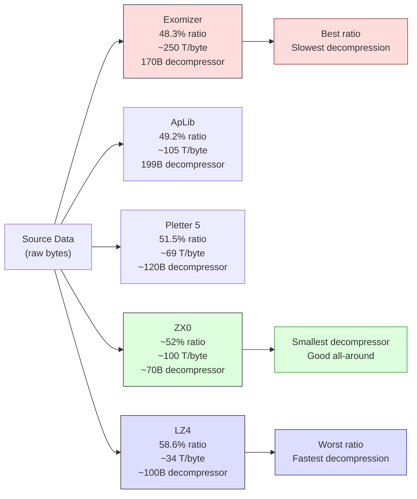

# Розділ 14: Стиснення --- Більше даних у меншому просторі

ZX Spectrum 128K має 128 кілобайт ОЗП. Це звучить щедро, поки не починаєш віднімати: екран забирає 6 912 байт (6 144 пікселі + 768 атрибутів), системні змінні претендують на свою частку, програвач AY-музики та його паттерн-дані хочуть банк-другий, твій код займає ще кілька тисяч байт, і стеку потрібен простір для дихання. Коли ти сідаєш зберігати безпосередній вміст свого демо --- графіку, кадри анімації, попередньо обчислені таблиці підстановки --- ти борешся за кожний байт.

Одне повноекранне зображення на Spectrum -- це 6 912 байт. 4K інтро може вмістити приблизно 0,6 такого зображення. 48K демо теоретично може вмістити сім екранів і нічого більше. Але демо -- це не слайд-шоу. У них є музика. У них є код. У них є ефекти, що вимагають таблиць попередньо обчислених даних. Питання не в тому, чи стискати --- а в тому, який пакувальник використовувати і коли.

Цей розділ побудований навколо бенчмарку. У 2017 році Introspec (spke, Life on Mars) опублікував "Data Compression for Modern Z80 Coding" на Hype --- ретельне порівняння десяти інструментів стиснення, протестованих на ретельно розробленому корпусі. Та стаття, з її 22 000 переглядів та сотнями коментарів, стала довідником, до якого звертаються ZX-кодери при виборі пакувальника. Ми пройдемо його результати, зрозуміємо компроміси та навчимося обирати правильний інструмент для кожного завдання.

---

## Проблема пам'яті

Будьмо конкретними щодо обмежень. Розглянь Break Space від Thesuper (Chaos Constructions 2016, 2-е місце) --- демо з 19 сценами, що працює на ZX Spectrum 128K. Одна з цих сцен, Magen Fractal від psndcj, відображає 122 кадри анімації. Кожний кадр -- це повний 6 912-байтний екран. Без стиснення це 843 264 байти --- понад шість разів загальний обсяг ОЗП машини.

psndcj стиснув усі 122 кадри до 10 512 байт. Це 1,25% від оригінального розміру. Вся анімація, кожний її кадр, вміщується в меншому просторі, ніж два нестиснених екрани.

Інша сцена в Break Space, анімація Мондріан, пакує 256 намальованих вручну кадрів --- кожний квадрат вирізаний окремо, індивідуально стиснутий --- у 3 кілобайти.

Це не теоретичні вправи. Це виробничі техніки з демо, що змагалося на одній з найпрестижніших паті сцени. Стиснення -- не оптимізація, яку ти застосовуєш наприкінці. Це фундаментальне архітектурне рішення, що визначає, що твоє демо може містити.

### Стиснення як підсилювач пропускної здатності

Introspec сформулював ідею, що підносить стиснення від трюку зі зберіганням до техніки продуктивності: **стиснення діє як метод збільшення ефективної пропускної здатності пам'яті**.

Припустимо, ефекту потрібно 2 КБ даних на кадр. Зберігай їх стисненими до 800 байт і розпаковуй за допомогою LZ4 зі швидкістю 34 такти (T-state) на вихідний байт. Розпакування коштує 69 632 такти --- майже точно один кадр. Але ти можеш перекрити його з часом бордюру, буферизувати кадр наперед з подвійною буферизацією та чергувати з рендерингом ефектів. Результат: через систему проходить більше даних, ніж шина могла б доставити з нестисненого сховища. Розпаковувач -- це підсилювач даних.

---

## Бенчмарк

Introspec не просто запустив кожний пакувальник на кількох файлах і оцінив результати на око. Він розробив корпус і вимірював систематично.

### Корпус

Тестові дані становили 1 233 995 байт у п'яти категоріях:

- **Корпус Calgary** --- стандартний академічний бенчмарк стиснення (текст, бінарні дані, змішане)
- **Корпус Canterbury** --- більш сучасний академічний стандарт
- **30 ZX Spectrum-зображень** --- завантажувальні екрани, мультиколорні зображення, ігрові екрани
- **24 музичних файли** --- PT3-паттерни, дампи регістрів AY, дані семплів
- **Різноманітні ZX-дані** --- тайлмапи, таблиці підстановки, змішані дані демо

Цей мікс має значення. Пакувальник, що відмінно працює на англійському тексті, може провалитися на ZX-графіці, де довгі серії нулів у піксельній області чергуються з майже випадковими атрибутними даними. Тестування на реальних даних Spectrum --- даних, які ти фактично стискатимеш --- є обов'язковим.

### Результати

Десять інструментів. Виміряно загальний стиснутий розмір (менше -- краще), швидкість розпакування в тактах (T-state) на вихідний байт (менше -- швидше) та розмір коду розпаковувача в байтах (менше -- краще для sizecoding-продукцій).

| Інструмент | Стиснуто (байт) | Ступінь | Швидкість (T/байт) | Розмір розпаковувача | Примітки |
|------------|-----------------|---------|---------------------|----------------------|----------|
| **Exomizer** | 596 161 | 48,3% | ~250 | ~170 байт | Найкраща ступінь стиснення |
| **ApLib** | 606 833 | 49,2% | ~105 | 199 байт | Хороший баланс |
| PuCrunch | 616 855 | 50,0% | --- | --- | Складна LZ-альтернатива |
| Hrust 1 | 613 602 | 49,7% | --- | --- | Переміщуваний стековий розпаковувач |
| **Pletter 5** | 635 797 | 51,5% | ~69 | ~120 байт | Швидкий + пристойне стиснення |
| MegaLZ | 636 910 | 51,6% | ~130 | ~110 байт | Відроджений Introspec у 2019 |
| **ZX7** | 653 879 | 53,0% | ~107 | **69 байт** | Крихітний розпаковувач |
| **ZX0** | --- | ~52% | ~100 | **~70 байт** | Наступник ZX7 |
| **LZ4** | 722 522 | 58,6% | **~34** | ~100 байт | Найшвидше розпакування |
| Hrum | --- | ~52% | --- | --- | Оголошений застарілим |

Лише Exomizer подолав бар'єр у 600 000 байт на повному корпусі. Але швидкість розпакування Exomizer --- приблизно 250 тактів (T-state) на вихідний байт --- робить його непрактичним для будь-чого, що потребує розпакування під час відтворення.

### Трикутник компромісів

Кожний пакувальник робить компроміс між трьома якостями:

1. **Ступінь стиснення** --- наскільки малими стають стиснуті дані
2. **Швидкість розпакування** --- скільки тактів (T-state) на вихідний байт
3. **Розмір коду розпаковувача** --- скільки байт займає процедура розпакування

Ти не можеш мати все три. Exomizer виграє у ступені стиснення, але повільний при розпакуванні та має великий розпаковувач. LZ4 -- найшвидший при розпакуванні, але втрачає 10 відсоткових пунктів у ступені стиснення. ZX7 має 69-байтний розпаковувач, але стискає менш агресивно, ніж Exomizer.

Геніальність Introspec полягала в тому, що він відобразив ці компроміси на фронті Парето --- кривій, де жоден інструмент не може покращитися за одним виміром без втрати за іншим. Якщо пакувальник поступається за всіма трьома осями іншому інструменту, він застарів. Якщо він лежить на фронті, він є правильним вибором для якогось випадку використання.

<!-- figure: ch14_compression_tradeoff -->



> **Компроміс:** менший стиснутий розмір = повільніше розпакування. Жоден пакувальник не виграє за всіма трьома осями (ступінь, швидкість, розмір розпаковувача). Обирай відповідно до випадку використання: Exomizer для одноразових завантажень, LZ4 для потокового відтворення в реальному часі, ZX0 для sizecoding-інтро.

Його практичні рекомендації чіткі:

- **Максимальне стиснення, швидкість неважлива:** Exomizer. Використовуй для одноразового розпакування при завантаженні --- завантажувальні екрани, дані рівнів, все, що ти розпаковуєш одного разу в буфер і використовуєш багаторазово.
- **Хороше стиснення, помірна швидкість (~105 T/байт):** ApLib. Надійний універсальний вибір, коли тобі потрібна пристойна ступінь стиснення і ти можеш дозволити ~105 тактів (T-state) на байт.
- **Швидке розпакування (~69 T/байт):** Pletter 5. Коли потрібно розпаковувати під час ігрового процесу або між сценами і ти не можеш дозволити повільне розпакування Exomizer.
- **Найшвидше розпакування (~34 T/байт):** LZ4. Єдиний вибір для потокового відтворення в реальному часі --- розпакування даних під час їх відтворення. При 34 тактах (T-state) на вихідний байт LZ4 може розпакувати понад 2 000 байт за кадр. Це 2 КБ/кадр даних.
- **Найменший розпаковувач (69--70 байт):** ZX7 або ZX0. Коли сам розпаковувач має бути крихітним --- у 256-байтних, 512-байтних або 1K інтро, де кожний байт коду на рахунку.

Нехай ці числа керують твоїми рішеннями. Не існує універсально "найкращого" пакувальника. Існує лише найкращий пакувальник для твоїх конкретних обмежень.

---

## Як працює LZ-стиснення

Всі пакувальники у таблиці вище належать до сімейства Lempel-Ziv. Розуміння базової ідеї допомагає передбачити, які дані стискаються добре, а які ні.

LZ-стиснення замінює повторювані послідовності байтів зворотними посиланнями. Збіг каже: "скопіюй N байт з позиції P байт назад у вже декодованому потоці." Стиснутий потік чергується між **літералами** (сирі байти без корисного збігу) та **збігами** (пари зсув + довжина, що посилаються на раніший вихід).

Різниці між пакувальниками зводяться до кодування: скільки біт на зсув, скільки на довжину, як сигналізувати літерал проти збігу. Exomizer використовує складні коди змінної довжини на рівні бітів, що стискають щільно, але вимагають ретельного витягування бітів для декодування --- звідси ~250 тактів (T-state) на байт. LZ4 використовує токени, вирівняні по байтах, які Z80 обробляє простими зсувами та масками --- звідси ~34 такти (T-state) на байт ціною 10 відсоткових пунктів у ступені стиснення. ZX0 використовує однобітні прапорці (0 = літерал, 1 = збіг) з переплетеними кодами Еліаса для довжин, досягаючи оптимального балансу між розміром та швидкістю.

Дані ZX Spectrum стискаються добре, тому що мають структуру: великі області ідентичних байтів (чорний фон, порожні атрибути), повторювані патерни (тайли, шрифти, UI) та кореляції піксельних даних з регулярними зсувами. Музика також добре стискається --- PT3-паттерни сповнені повторюваних нотних послідовностей та порожніх рядків. Що стискається погано: випадкові дані, вже стиснуті дані та дуже короткі файли, де накладні витрати кодування перевищують економію.

---

## ZX0 --- Вибір кодера розміру

ZX0, створений Einar Saukas, є духовним наступником ZX7 і став стандартним пакувальником для сучасної розробки на ZX Spectrum. Він заслуговує на окрему увагу.

### Чому ZX0 існує

ZX7 вже був видатним: 69-байтний розпаковувач, що досягав поважної ступені стиснення. Але Saukas побачив простір для покращення. ZX0 використовує алгоритм оптимального розбору --- він не просто знаходить хороші збіги, а знаходить *найкращу можливу послідовність* збігів та літералів для всього файлу. Результат --- ступінь стиснення, близька до значно більших пакувальників, з розпаковувачем, що залишається в діапазоні 70 байт.

### Розпаковувач

Z80-розпаковувач для ZX0 -- це вручну оптимізований асемблерний код, розроблений спеціально для набору інструкцій Z80. Він використовує регістр прапорців Z80, його інструкції блочного переносу та точний таймінг умовних переходів, щоб вичавити максимум функціональності з мінімуму байтів. Ось приклад такого коду:

```z80 id:ch14_the_decompressor
; ZX0 decompressor — standard version
; HL = source (compressed data)
; DE = destination (output buffer)
; Uses: AF, BC, DE, HL
dzx0_standard:
        ld      bc, $ffff       ; initial offset = -1
        push    bc
        inc     bc              ; BC = 0 (literal length counter)
        ld      a, $80          ; bit buffer: only flag bit set
dzx0s_literals:
        call    dzx0s_elias     ; read literal length
        ldir                    ; copy literals
        add     a, a            ; read flag bit
        jr      c, dzx0s_new_offset
        call    dzx0s_elias     ; read match length
        ex      (sp), hl        ; retrieve offset from stack
        push    hl              ; put it back
        add     hl, de          ; calculate match address
        ldir                    ; copy match
        add     a, a            ; read flag bit
        jr      nc, dzx0s_literals
dzx0s_new_offset:
        ; ... offset decoding continues ...
```

Кожна інструкція виконує подвійну функцію. Акумулятор слугує і бітовим буфером, і робочим регістром. Стек зберігає останній використаний зсув для повторних збігів. Інструкція LDIR обробляє і копіювання літералів, і копіювання збігів, зберігаючи код малим.

При приблизно 70 байтах весь розпаковувач вміщується в менший простір, ніж один рядок пікселів ZX Spectrum. Для 256-байтного інтро це залишає 186 байт для всього іншого --- ефекту, анімації, музики. Для 4K інтро 70 байт -- це нехтовні накладні витрати. Ось чому ZX0 став повсюдним.

### Коли використовувати ZX0

- **Від 256-байтних до 1K інтро:** Крихітний розпаковувач обов'язковий. Кожний байт, збережений на розпаковувачі, -- це байт, доступний для контенту.
- **4K інтро:** ZX0 може розпакувати 4 096 байт у 15--30 КБ коду та даних. Megademica від SerzhSoft (1-е місце, Revision 2019) використовувала саме цю стратегію, щоб вмістити те, що рецензенти назвали "повним new-school демо", у 4K інтро.
- **Загальна розробка демо та ігор:** Коли тобі потрібен надійний універсальний пакувальник з малим відбитком. ZX0 -- не найшвидший розпаковувач, але достатньо швидкий для одноразового розпакування при завантаженні, і його ступінь стиснення конкурентна з інструментами, що мають значно більші розпаковувачі.
- **RED REDUX** (2025) використав новіший варіант ZX2 (також від Saukas), щоб досягти видатного результату --- включення Protracker-музики у 256-байтне інтро.

ZX0 -- не правильний вибір для потокового відтворення в реальному часі (використовуй LZ4) або для максимального стиснення за будь-яку ціну (використовуй Exomizer). Але для переважної більшості проектів на ZX Spectrum він є правильним вибором за замовчуванням.

---

## RLE та дельта-кодування

Не все потребує повного LZ-пакувальника. Дві простіших техніки обробляють конкретні типи даних ефективніше.

### RLE: Кодування серій

Найпростіша схема: заміни серію ідентичних байтів лічильником та значенням. Розпаковувач тривіальний:

```z80 id:ch14_rle_run_length_encoding
; Minimal RLE decompressor — HL = source, DE = destination
rle_decompress:
        ld      a, (hl)         ; read count
        inc     hl
        or      a
        ret     z               ; count = 0 means end
        ld      b, a
        ld      a, (hl)         ; read value
        inc     hl
.fill:  ld      (de), a
        inc     de
        djnz    .fill
        jr      rle_decompress
```

Лише 12 байтів коду розпаковувача. RLE стискає прекрасно, коли дані містять довгі серії --- порожні екрани, одноколірні фони, заливки атрибутів. На складному піксельному мистецтві стискає жахливо. Перевага над LZ: для sizecoding-інтро, де навіть 70 байтів ZX0 здаються дорогими, 12-байтова схема RLE звільняє дорогоцінний простір.

RLE також виграє від **транспонування даних**: якщо твої дані --- 2D-блок (наприклад, 32x24 атрибути), де стовпці більш однорідні, ніж рядки, транспонування в стовпцевий порядок створює довші серії. Ціна --- прохід зворотного транспонування після розпакування (~13 тактів/байт). Чи загальний результат (12-байтовий розпаковувач + код зворотного транспонування + стиснуті дані) переважає ZX0 (70-байтовий розпаковувач + стиснуті дані) --- залежить від твоїх даних --- виміряй обидва.

> **Бічна панель: Самомодифікований RLE від Ped7g --- 9 байтів, що переписують себе**
>
> Для 256-байтових інтро навіть 12 байтів відчуваються дорого. Ped7g (Peter Helcmanovsky, мейнтейнер sjasmplus) створив самомодифікований RLE-розпаковувач, що стискає сам декодер до **9 байтів основного коду** --- а механізм виходу вбудований у потік даних.
>
> Трюк: RLE-дані живуть у пам'яті *перед* кодом розпаковувача. Потік даних закінчується байтами `$18, $00`, які розпаковувач записує в цільовий буфер у обчислену позицію так, що байти перезаписують інструкцію `ld (hl),c`. Байтова послідовність `$18, $23` збирається в `jr +$23`, що стрибає вперед повз розпаковувач у основний код інтро. Дані буквально переписують код, щоб завершити себе.
>
> Ось повне працюючий міні-інтро --- 120-байтовий бінарний файл, що заповнює екран кольоровими смугами, використовуючи лише самомодифікований RLE:
>
> ```z80 id:ch14_ped7g_rle_mini_intro
> ; Ped7g's self-modifying RLE mini-intro
> ; Assemble with sjasmplus: sjasmplus rle_intro.a80
> ;
> ; The RLE data is a stream of (value, count) pairs read via POP BC.
> ; SP walks through the data as a read pointer.
> ; The db $18,$00 at the end of the data stream overwrites ld (hl),c
> ; to become jr +$23, exiting the depack loop into intro_start.
> ;
> ; Contributed by Ped7g (Peter Helcmanovsky) — sjasmplus maintainer
> ; and ZX Spectrum Next contributor. Used with permission.
>
>     DEVICE ZXSPECTRUM48, $8000
>
> target  EQU $4000
>     ORG $5B00              ; loading address → print buffer
>
> intro_data:
>     dw  target             ; initial HL value (POP HL)
> ; RLE pairs: value, count (count=0 means 256 iterations)
>     .(4*3) db $AA, 0, $00, 0    ; alternating stripe pattern
>     db  $43, 32*2, $44, 32*4, $45, 32*3, $46, 32*2, $47, 32*2
>     db  $46, 32*2, $45, 32*3, $44, 32*4, $43, 32*2
>     db  $18, $00           ; data that will overwrite ld (hl),c
>                            ; creating jr rle_loop_inner+$25
> rle_start:
>     ei                     ; simulate post-LOAD BASIC environment
>     ld  sp, intro_data
>     pop hl                 ; HL = target address
> rle_loop_outer:
>     pop bc                 ; C = value, B = repeat count
> rle_loop_inner:
>     ld  (hl), c            ; ← THIS instruction gets overwritten
>     inc hl                 ;   by the $18,$00 data to become
>     djnz rle_loop_inner    ;   jr +$23, jumping to intro_start
>     jr  rle_loop_outer
> ; 31 bytes of space — fill with helper code
>     ds  $1F
> intro_start:
>     assert $ == rle_loop_inner + 2 + $23
>     inc a
>     and 7
>     out (254), a           ; cycle border colours
>     jr  intro_start
>
>     SAVESNA "rle_intro.sna", rle_start
>     SAVEBIN "rle_intro.bin", intro_data, $ - intro_data
> ```
>
> 
>
> **Аналіз кількості байтів.** Цикл розпакування --- 9 байтів: `pop bc` (1) + `ld (hl),c` (1) + `inc hl` (1) + `djnz` (2) + `jr` (2) + `pop hl` (1) + `ld sp,nn` (3) = 9 основних + 6 налаштування = **15 байтів загалом** для самодостатнього RLE-декодера з вбудованим виходом. Порівняй з 12-байтовим мінімальним RLE з попереднього розділу, якому ще потрібне зовнішнє налаштування та перевірка завершення.
>
> **Безпека переривань.** SP використовується як вказівник на дані, тому переривання пошкодять стек. `ei` на початку --- навмисний: у 256-байтовому інтро, завантаженому з BASIC, переривання вже увімкнені. Випадкове переривання записує в уже спожиті дані за вказівником SP, тому розпакування завершується правильно. Для самого коду інтро SP вже просунувся повз дані, і стек працює нормально. Але не комбінуй цю техніку з IM2 або музикою на перериваннях.
>
> **Розширені варіанти.** Ped7g зазначає кілька альтернативних стратегій виходу: (1) якщо цільова область простягається за код розпаковувача, RLE-дані можуть перезаписати зсув `jr rle_loop_outer` для стрибка далі; (2) трюк `jp $C3C3` --- розмісти значення `$C3` у даних із точними лічильниками так, щоб DJNZ завершився, коли `jp $C3C3` зібрався у пам'яті, та вирівняй інтро так, щоб адреса $C3C3 була кодом продовження. Як каже Ped7g: "можна винайти багато таких речей --- це завжди залежить від конкретної ситуації."
>
> **Подяка:** Надано Ped7g (Peter Helcmanovsky) --- мейнтейнер sjasmplus та контриб'ютор ZX Spectrum Next. Використано з дозволу.

### Дельта-кодування: зберігай те, що змінилося

Дельта-кодування зберігає різниці між послідовними значеннями замість абсолютних значень. Два кадри анімації, що ідентичні на 90%? Зберігай лише змінені байти --- список пар (позиція, нове_значення). Якщо лише 691 байт відрізняється з 6 912, дельта складає 2 073 байти (3 байти на зміну) замість повного кадру. Застосуй LZ поверх дельта-потоку, і він стиснеться ще далі --- потік різниць має більше нулів і повторюваних малих значень, ніж сирі дані кадру.

Magen Fractal з Break Space використовує це: 122 кадри по 6 912 байт кожний, стиснуті до 10 512 байт загалом, тому що кожний кадр відрізняється від попереднього незначно. Дельта + LZ -- це стандартний конвеєр для багатокадрових анімацій, тайлмапів, що прокручуються, та анімацій спрайтів, де фігура змінює позу, але фон залишається фіксованим.

---

## Підготовка даних перед стисненням

Дельта-кодування --- не єдиний трюк. Пакувальник бачить лише потік байтів, який ти йому подаєш. Якщо ти реструктуруєш дані перед стисненням, той самий LZ-алгоритм може досягти драматично різних ступенів стиснення. Це мистецтво підготовки перед стисненням --- і часто воно цінніше, ніж зміна пакувальника.

### Ентропія: теоретична нижня межа

Ентропія Шеннона вимірює мінімальну кількість бітів на байт, необхідну для представлення твоїх даних за умови ідеального кодувальника. Повністю випадковий потік байтів має ентропію 8,0 бітів/байт --- нестисненний. Файл з ідентичних байтів має ентропію 0,0. Реальні дані Spectrum десь між ними. Сира таблиця синусів може мати ентропію 6,75 бітів/байт. Застосуй дельта-кодування, і вона падає до 2,85. Застосуй другу похідну, і вона падає до 1,49 --- зниження на 78%. Це теоретичний простір, з яким пакувальник може працювати.

Тобі не потрібно обчислювати ентропію вручну. Формула достатньо проста для Python-скрипта:

```python
import math
from collections import Counter

def entropy(data: bytes) -> float:
    """Shannon entropy in bits per byte. Lower = more compressible."""
    counts = Counter(data)
    n = len(data)
    return -sum(c/n * math.log2(c/n) for c in counts.values())
```

Запусти це на сирих даних, потім на дельта-кодованих, потім на транспонованих. Перетворення, що дає найнижчу ентропію, стиснеться найкраще, незалежно від того, який пакувальник ти використовуєш.

### Друга похідна: синусоїдальні та квадратичні дані

Дельта-кодування зберігає перші різниці: `d[i] = data[i] - data[i-1]`. Для лінійної рампи (0, 3, 6, 9...) дельта-потік сталий (3, 3, 3...) --- ідеально для стиснення. Але синусоїди та плавні криві породжують дельта-потік, що сам плавно змінюється. Друга похідна (дельта від дельти) вловлює це:

| Тип даних | Сира ентропія | 1-а похідна | 2-а похідна |
|---|---|---|---|
| Таблиця синусів (256Б) | 6,75 | 2,85 | **1,49** |
| Лінійна рампа | 7,00 | 0,00 | 0,00 |
| Квадратична крива | 6,80 | 3,20 | **0,00** |
| Випадкові байти | 8,00 | 8,00 | 8,00 |

Друга похідна квадратичної функції --- стала. Це не абстрактний матаналіз --- це різниця між 6,80 та 0,00 бітів на байт. 256-байтова квадратична таблиця підстановки, закодована другою похідною, стискається майже до нічого.

Ось творче прозріння: синусоїдальне загасання та квадратичне загасання часто візуально нерозрізнювані в ефекті демо. Якщо ти анімуєш частинку, що сповільнюється, аудиторія не зможе відрізнити, чи ти використав `sin(t)` або `at² + bt + c`. Але пакувальник зможе: квадратична версія має ідеально лінійну першу похідну та сталу другу похідну. Якщо твоя анімація може стерпіти квадратичне наближення, ти заощаджуєш байти не зміною пакувальника, а зміною кривих.

### Транспонування: стовпцевий порядок для табличних даних

Дані демосцени часто табличні --- таблиці 3D-вершин (X, Y, Z на вершину), ключові кадри анімації (кут, радіус, швидкість на кадр), колірні палітри (R, G, B на запис). При рядковому зберіганні (X₀ Y₀ Z₀ X₁ Y₁ Z₁...) послідовні байти з різних стовпців мають різні статистичні властивості. Дельта-кодування робить це *гірше*:

```
Row-major:  128 64 200 129 63 201 130 62 202 ...
Delta:        64 136  57 190 138  57 190 138 ...  (wild jumps between columns)
```

Транспонуй у стовпцевий порядок (X₀ X₁ X₂... Y₀ Y₁ Y₂... Z₀ Z₁ Z₂...), і тепер послідовні байти з одного стовпця. Дельта-кодування тепер бачить плавні прогресії:

```
Column-major: 128 129 130 131 ... 64 63 62 61 ... 200 201 202 203 ...
Delta:          1   1   1   1 ...  -1  -1  -1 ...    1   1   1   1 ...  (trivial)
```

Числа вражаючі. 768-байтова таблиця вершин (256 вершин x 3 стовпці):

| Розкладка | Ентропія (сира) | Ентропія (дельта) |
|---|---|---|
| Рядкова (X,Y,Z черезрядково) | 7,52 | 7,66 (гірше!) |
| Стовпцева, крок 3 | 7,52 | **2,58** |

Дельта-кодування на рядкових даних *збільшило* ентропію. Та сама дельта на транспонованих даних зменшила її на 65%. Пакувальник не знає, що твої дані табличні --- ти мусиш йому сказати, перевпорядкувавши.

Правило: якщо твої дані мають стовпці з різними патернами, **завжди транспонуй перед стисненням**. Крок (кількість стовпців) не потрібно вгадувати --- спробуй кілька дільників довжини даних і обери той, що дає найнижчу дельта-ентропію.

На Spectrum розпаковувач просто записує байти послідовно. Транспонування відбувається у твоїх інструментах збірки, не під час виконання. Нульова вартість під час виконання.

### Розділення площин: маски та пікселі

Спрайти з масками --- окремий випадок транспонування. При зберіганні як маска-піксель-маска-піксель на рядок, послідовні байти чергуються між двома абсолютно різними розподілами (маски здебільшого $FF або $00; пікселі мають різноманітні значення). Розділи всі байти масок від усіх байтів пікселів:

```
Before: FF 3C FF 18 FF 00 ...  (mask, pixel, mask, pixel)
After:  FF FF FF ... 3C 18 00 ...  (all masks, then all pixels)
```

Блок масок стискається майже до нічого (довгі серії $FF). Блок пікселів стискається нормально. Загальна ступінь покращується на 10--20% порівняно з черезрядковим зберіганням, залежно від складності спрайта.

### Виявлення патернів: коли не стискати

Іноді дані мають структуру, яку генератор може відтворити дешевше за розпаковувач. Якщо твої дані періодичні з періодом *P*, зберігання одного періоду плюс крихітний цикл відтворення займає *P* + ~10 байтів. Якщо *P* малий відносно загального обсягу даних, це б'є будь-який пакувальник.

Таблиці синусів --- канонічний випадок. 256-байтова таблиця синусів стискається до ~140 байтів з ZX0. Але дружній до Spectrum генератор синусів (з використанням калькулятора ROM або CORDIC-ядра) породжує ті самі 256 байтів менш ніж з 30 байтів коду. Для якості демо навіть просте квадратичне наближення на чверть хвилі достатнє.

Дерево рішень: (1) Чи можеш ти згенерувати це з формули в менше байтів, ніж стиснутий розмір? Генеруй. (2) Чи дані періодичні? Збережи один період + цикл. (3) Чи дані табличні? Транспонуй + дельта + LZ. (4) Чи дані --- послідовні кадри? Дельта + LZ. (5) Нічого з вищенаведеного? Просто стискай.

### Практичні перетворення для типових даних демо

| Тип даних | Найкраще попереднє перетворення | Чому |
|---|---|---|
| Таблиці синусів/косинусів | 2-а похідна, або генерація під час виконання | Плавне прискорення -> стала 2-а похідна |
| Таблиці 3D-вершин | Транспонування (крок = поля на вершину) + дельта | Розділяє осі; плавні траєкторії по кожній осі |
| Попередньо обчислена анімація | Дельта між кадрами + LZ | Висока міжкадрова надмірність |
| Дампи регістрів AY | Транспонування (крок = 14, один на регістр) + дельта | Кожний регістр змінюється плавно між кадрами |
| Колірні рампи / градієнти | 1-а похідна | Лінійна або майже лінійна прогресія |
| Тайлові карти | Транспонування (крок = ширина карти) + дельта | Просторова локальність: сусідні тайли подібні |
| Дані бітмап-шрифту | Розділення бітових площин, або зберігання як 1-біт + RLE | Багато нульових байтів у нижніх виносних |
| Позиції частинок | Сортування по одній осі, потім дельта-кодування кожної осі | Впорядкований порядок максимізує дельта-стиснення |

Ключове прозріння: **кожний байт, заощаджений безкоштовним попереднім перетворенням --- це байт, який тобі не потрібно заощаджувати дорожчим пакувальником**. Транспонування + дельта + Pletter 5 (швидкий розпаковувач) часто б'є сирий Exomizer (повільний розпаковувач) на структурованих даних. Ти отримуєш кращу ступінь *і* швидше розпакування.

---

## Практичний конвеєр

Розуміння алгоритмів стиснення корисне. Інтеграція їх у твій конвеєр збірки обов'язкова.

### Від ресурсу до бінарного файлу

Конвеєр: вихідний ресурс (PNG) --> конвертер (png2scr) --> пакувальник (zx0) --> асемблер (sjasmplus) --> файл .tap. Пакувальник працює на твоїй машині розробки, не на Spectrum. Для ZX0: `zx0 screen.scr screen.zx0`. Включи результат за допомогою директиви INCBIN sjasmplus:

```z80 id:ch14_from_asset_to_binary
compressed_screen:
    incbin "assets/screen.zx0"
```

Під час виконання розпакуй простим викликом:

```z80 id:ch14_from_asset_to_binary_2
    ld   hl, compressed_screen    ; source: compressed data
    ld   de, $4000                ; destination: screen memory
    call dzx0_standard            ; decompress
```

### Інтеграція з Makefile

Крок стиснення належить до твого Makefile, а не до твоєї голови:

```makefile
%.zx0: %.scr
	zx0 $< $@

demo.tap: main.asm assets/screen.zx0
	sjasmplus main.asm --raw=demo.bin
	bin2tap demo.bin demo.tap
```

Зміни вихідний PNG, запусти `make`, і стиснутий бінарний файл перегенерується автоматично. Без ручних кроків, без забутої перекомпресії.

### Приклад: завантажувальний екран з ZX0

Повний мінімальний приклад --- розпакуй завантажувальний екран у відеопам'ять і чекай натискання клавіші:

```z80 id:ch14_example_loading_screen_with
; loading_screen.asm — assemble with sjasmplus
        org  $8000
start:
        ld   hl, compressed_screen
        ld   de, $4000
        call dzx0_standard

.wait:  xor  a
        in   a, ($fe)
        cpl
        and  $1f
        jr   z, .wait
        ret

        include "dzx0_standard.asm"

compressed_screen:
        incbin "screen.zx0"

        display "Total: ", /d, $ - start, " bytes"
```


Використовуй директиву DISPLAY sjasmplus для виведення інформації про розмір під час асемблювання. Завжди знай точно, наскільки великі твої стиснуті дані --- різниця між ZX0 та Exomizer на одному завантажувальному екрані може бути 400 байт, і через 8 сцен це накопичується.

### Вибір правильного пакувальника

Запитуй по порядку: (1) Sizecoding-інтро? ZX0/ZX7 --- 69--70 байтний розпаковувач безальтернативний. (2) Потокове відтворення в реальному часі? LZ4 --- нічого іншого не достатньо швидке. (3) Одноразове завантаження? Exomizer --- максимальна ступінь, швидкість неважлива. (4) Потрібен баланс? ApLib або Pletter 5, обидва на фронті Парето. (5) Дані повні ідентичних серій? Власне RLE. (6) Послідовні кадри анімації? Спочатку дельта-кодування, потім LZ.

---

## Відродження MegaLZ

У 2017 році Introspec оголосив MegaLZ "морально застарілим." Через два роки він сам його воскресив.

Ідея: *формат* стиснення та *реалізація розпаковувача* -- це окремі задачі. Формат MegaLZ був хорошим --- перший пакувальник для Spectrum, що використовував оптимальний парсер (LVD, 2005), з гамма-кодами Еліаса та трохи більшим вікном, ніж Pletter 5. Що було поганим --- це Z80-розпаковувач. Introspec написав два нових:

- **Компактний:** 92 байти, ~98 тактів (T-state) на байт
- **Швидкий:** 234 байти, ~63 такти (T-state) на байт --- швидше за три послідовних LDIR

З цими розпаковувачами MegaLZ "впевнено перемагає Pletter 5 та ZX7" за комбінованою метрикою ступінь+швидкість. Урок: не вважай пакувальник мертвим. Формат -- це складна частина. Розпаковувач -- це Z80-код, і Z80-код завжди можна переписати.

---

## Що означають числа на практиці

**4K інтро:** 4 096 байт загалом. Розпаковувач ZX0: ~70 байт. Рушій + музика + ефекти: ~2 400 байт. Залишається ~1 626 байт для стиснутих даних, що розпаковуються в ~3 127 байт сирих ресурсів. Megademica від SerzhSoft (1-е місце, Revision 2019) стиснула тунельні ефекти, переходи, AY-музику та швидкі зміни сцен рівно в 4 096 байт. Вона була номінована на Outstanding Technical Achievement на Meteoriks.

**Потокове відтворення в реальному часі:** Тобі потрібно 2 КБ даних на кадр при 50 fps. LZ4 при 34 T/байт розпаковує 2 048 байт за 69 632 такти (T-state) --- майже рівно один кадр (69 888 тактів на 48K). Щільно, але здійсненно з перекритим розпакуванням під час бордюру. ApLib потребував би 215 040 тактів для тих самих даних --- понад три кадри. Exomizer -- понад сім. Для потокового відтворення LZ4 -- єдиний варіант.

**128K демо з кількома сценами:** Вісім сцен, кожна з 6 912-байтним завантажувальним екраном. Exomizer стискає кожний до ~3 338 байт; ZX0 до ~3 594 байт. Різниця: 256 байт на екран, 2 048 байт на 8 сцен. Коли розпакування відбувається під час переходів між сценами, повільне розпакування Exomizer непомітне. Економія 2 КБ --- помітна.

**256-байтне інтро:** 70-байтний розпаковувач ZX0 залишає 186 байт для всього. Частіше на цьому розмірі ти пропускаєш LZ і генеруєш дані процедурно за допомогою LFSR-генераторів та викликів ROM-калькулятора. Але коли тобі потрібні конкретні неалгоритмічні дані --- кольорова рампа, фрагмент бітмапу --- ZX0 залишається інструментом.

---

## Підсумок: Шпаргалка по пакувальниках

| Твоя ситуація | Використовуй це | Чому |
|---------------|-----------------|------|
| Одноразове завантаження, максимальна ступінь | Exomizer | 48,3% ступінь, швидкість неважлива |
| Універсальне, хороший баланс | ApLib | 49,2% ступінь, ~105 T/байт |
| Потрібна швидкість + пристойна ступінь | Pletter 5 | 51,5% ступінь, ~69 T/байт |
| Потокове відтворення в реальному часі | LZ4 | ~34 T/байт, 2+ КБ на кадр |
| Sizecoding-інтро (256б--1K) | ZX0 / ZX7 | 69--70 байтний розпаковувач |
| 4K інтро | ZX0 | Крихітний розпаковувач + хороша ступінь |
| Серії ідентичних байтів | RLE (власне) | Розпаковувач менше 30 байт |
| Послідовні кадри анімації | Дельта + LZ | Використання міжкадрової надмірності |

Числа -- це відповідь. Не думки, не фольклор, не "я чув, що Exomizer найкращий." Introspec протестував десять пакувальників на 1,2 мегабайтах реальних даних Spectrum і опублікував результати. Використовуй його числа. Обирай пакувальник, що відповідає твоїм обмеженням. Потім переходь до складної частини --- створення чогось, вартого стиснення.

---

## Спробуй сам

1. **Стисни завантажувальний екран.** Візьми будь-який ZX Spectrum .scr файл (скачай з zxart.ee або створи свій у Multipaint). Стисни його за допомогою ZX0 та Exomizer. Порівняй розміри. Потім напиши мінімальний завантажувач, показаний у цьому розділі, для розпакування та відображення. Зміряй час розпакування за допомогою тайм-хронометражу через колір бордюру з Розділу 1.

2. **Виміряй межу потокового відтворення.** Напиши щільний цикл, що розпаковує дані стандартним розпаковувачем ZX0 та вимірює, скільки байт він може розпакувати за кадр. Порівняй з розпаковувачем LZ4. Перевір числа з таблиці бенчмарку проти своїх власних вимірювань.

3. **Побудуй дельта-пакувальник.** Візьми два екрани ZX Spectrum, що трохи відрізняються (зберіги ігровий екран, пересунь спрайт, зберіги знову). Напиши простий інструмент (на Python або мові на твій вибір), що створює дельта-потік: список пар (зсув, нове_значення) для байтів, що відрізняються. Порівняй розмір дельта-потоку з розміром повного другого екрану. Потім стисни дельта-потік за допомогою ZX0 і порівняй знову.

4. **Інтегруй стиснення в Makefile.** Налаштуй проект з Makefile, що автоматично стискає ресурси як крок збірки. Зміни вихідний PNG, запусти `make` і перевір, що стиснутий бінарний файл перегенерувався і фінальний .tap файл оновився. Це робочий процес, який ти використовуватимеш для кожного проекту відтепер.

5. **Транспонуй і виміряй.** Створи 768-байтовий файл з 256 трійок (X, Y, Z), де X --- синусоїда, Y --- косинус, Z --- лінійна рампа. Виміряй ентропію сирого файлу. Потім транспонуй його (усі значення X, потім усі Y, потім усі Z) і виміряй знову. Застосуй дельта-кодування до обох версій і порівняй. Ти маєш побачити, що транспонована+дельта версія падає нижче 3 бітів/байт, тоді як сира+дельта залишається вище 7. Стисни обидві за допомогою ZX0 і порівняй фактичні розміри --- числа ентропії передбачають переможця.

6. **Квадратична підміна.** Згенеруй 256-байтову таблицю синусів та 256-байтове квадратичне наближення (підгони `ax² + bx + c` до однієї чверті хвилі, дзеркалюй для повного циклу). Побудуй графіки обох --- вони мають бути візуально ідентичними. Тепер обчисли другу похідну кожної. Друга похідна синуса має ентропію ~1,5 бітів/байт; квадратична --- рівно 0. Стисни обидві за допомогою ZX0. Квадратична версія менша, а анімація виглядає так само.

> **Sources:** Introspec "Data Compression for Modern Z80 Coding" (Hype, 2017); Introspec "Compression on the Spectrum: MegaLZ" (Hype, 2019); Break Space NFO (Thesuper, 2016); Einar Saukas, ZX0 (github.com/einar-saukas/ZX0); Ped7g (Peter Helcmanovsky), self-modifying RLE depacker (contributed with permission, 2026)
