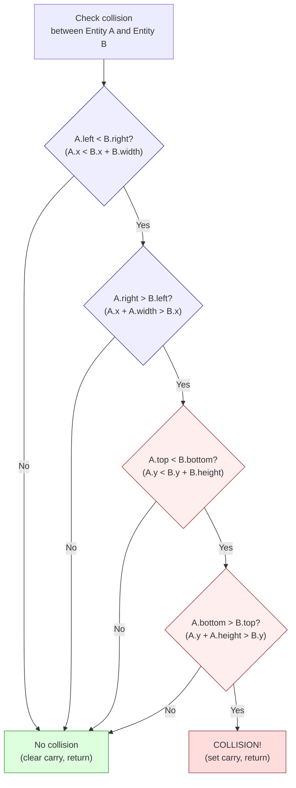

# Розділ 19: Зіткнення, фізика та ШІ ворогів

> "Кожна гра — це брехня. Фізика — підробка. Інтелект — це пошук по таблиці. Гравець ніколи не помічає, бо брехня звучить зі швидкістю 50 кадрів на секунду."

У Розділі 18 ми побудували ігровий цикл, систему сутностей, що відстежує шістнадцять об'єктів, та обробник введення. Але наразі наш гравець проходить крізь стіни, ширяє над землею, а вороги стоять нерухомо. Гра без зіткнень — це скрінсейвер. Гра без фізики — це пазл-головоломка. Гра без ШІ — це пісочниця, де нічому протидіяти.

Цей розділ додає три системи, що перетворюють техдемо на гру: виявлення зіткнень, фізика та ШІ ворогів. Усі три поділяють філософію проєктування: підроби достатньо добре, достатньо швидко, і ніхто не помітить різниці. Ми будуємо на структурі сутностей з Розділу 18 — 16-байтному записі з позиціями X/Y у форматі фіксованої точки 8.8, швидкістю в dx/dy, типом, станом та прапорцями.

---

## Частина 1: Виявлення зіткнень

### AABB: єдина форма, яка тобі потрібна

Осьово-вирівняні обмежуючі прямокутники. Кожна сутність отримує прямокутник, визначений її позицією та розмірами: лівий край, правий край, верхній край, нижній край. Два прямокутники перекриваються тоді і тільки тоді, коли виконуються всі чотири умови:

1. Лівий край A менший за правий край B
2. Правий край A більший за лівий край B
3. Верхній край A менший за нижній край B
4. Нижній край A більший за верхній край B

Якщо будь-яка з цих умов не виконується, прямокутники не перекриваються. Це **ранній вихід**, що робить AABB швидким: у середньому більшість пар сутностей *не* стикаються, тому більшість перевірок завершуються після одного чи двох порівнянь замість усіх чотирьох.

<!-- figure: ch19_aabb_collision -->



> **Early exit saves cycles:** Most entity pairs are far apart. The first X-overlap test rejects them in ~91 T-states. Only pairs that pass all four tests (worst case: ~270 T-states) are actual collisions. Test horizontal overlap first in side-scrollers -- entities are more spread out on X than Y.

На Z80 ми зберігаємо позиції сутностей як значення з фіксованою точкою 8.8, але для виявлення зіткнень нам потрібна лише цілочисельна частина — старший байт кожної координати. Точності на рівні пікселів більш ніж достатньо. Ось повна підпрограма AABB-зіткнень:

```z80 id:ch19_aabb_the_only_shape_you_need_2
; check_aabb -- Test whether two entities overlap
;
; Input:  IX = pointer to entity A
;         IY = pointer to entity B
; Output: Carry set if collision, clear if no collision
;
; Entity structure offsets (from Chapter 18):
;   +0  x_frac    (low byte of 8.8 X position)
;   +1  x_int     (high byte -- the pixel X coordinate)
;   +2  y_frac
;   +3  y_int
;   +4  type
;   +5  state
;   +6  anim_frame
;   +7  dx_frac
;   +8  dx_int
;   +9  dy_frac
;   +10 dy_int
;   +11 health
;   +12 flags
;   +13 width     (bounding box width in pixels)
;   +14 height    (bounding box height in pixels)
;   +15 (reserved)
;
; Cost: 91-270 T-states (Pentagon), depending on early exit
; Average case (no collision): ~120 T-states

check_aabb:
    ; --- Test 1: A.left < B.right ---
    ; A.left  = A.x_int
    ; B.right = B.x_int + B.width
    ld   a, (iy+1)        ; 19T  B.x_int
    add  a, (iy+13)       ; 19T  + B.width = B.right
    ld   b, a             ; 4T   B = B.right (save for test 2)
    ld   a, (ix+1)        ; 19T  A.x_int = A.left
    cp   b                ; 4T   A.left - B.right
    jr   nc, .no_collision ; 12/7T  if A.left >= B.right, no collision
                           ; --- early exit: 91T (taken, incl. .no_collision) ---

    ; --- Test 2: A.right > B.left ---
    ; A.right = A.x_int + A.width
    ; B.left  = B.x_int
    add  a, (ix+13)       ; 19T  A.x_int + A.width = A.right
    ld   b, (iy+1)        ; 19T  B.x_int = B.left
    cp   b                ; 4T   A.right - B.left (we need A.right > B.left)
    jr   c, .no_collision  ; 12/7T  if A.right < B.left, no collision
    jr   z, .no_collision  ; 12/7T  if A.right = B.left, touching but not overlapping

    ; --- Test 3: A.top < B.bottom ---
    ld   a, (iy+3)        ; 19T  B.y_int
    add  a, (iy+14)       ; 19T  + B.height = B.bottom
    ld   b, a             ; 4T
    ld   a, (ix+3)        ; 19T  A.y_int = A.top
    cp   b                ; 4T   A.top - B.bottom
    jr   nc, .no_collision ; 12/7T  if A.top >= B.bottom, no collision

    ; --- Test 4: A.bottom > B.top ---
    add  a, (ix+14)       ; 19T  A.y_int + A.height = A.bottom
    ld   b, (iy+3)        ; 19T  B.y_int = B.top
    cp   b                ; 4T   A.bottom - B.top
    jr   c, .no_collision  ; 12/7T
    jr   z, .no_collision  ; 12/7T

    ; All four tests passed -- collision detected
    scf                    ; 4T   set carry flag
    ret                    ; 10T

.no_collision:
    or   a                 ; 4T   clear carry flag
    ret                    ; 10T
```


IX/IY-індексована адресація зручна, але дорога -- 19 тактів (T-state) за доступ проти 7 для `ld a, (hl)`. Для гри з 8 ворогами та 7 кулями це прийнятно. Найгірший випадок (усі чотири тести проходять, зіткнення виявлено): приблизно 270 тактів (T-state). Найкращий випадок (перший тест не пройшов): приблизно 91 такт (T-state). Для 8 ворогів, перевірених проти гравця, середній випадок -- приблизно 8 x 120 = 960 тактів (T-state) -- 1,3% бюджету кадру Pentagon. Зіткнення дешеві.

**Попередження про переповнення:** Інструкції `ADD A, (ix+13)` обчислюють `x + width` у 8-бітному регістрі. Якщо сутність розташована на X=240 з шириною=24, результат загортається до 8, породжуючи некоректні порівняння. Переконайся, що позиції сутностей обмежені так, що `x + width` та `y + height` ніколи не перевищують 255 -- зазвичай обмежуючи ігрову область із запасом біля правого та нижнього країв. Альтернативно, підвищ порівняння до 16-бітної арифметики ціною додаткових інструкцій.

### Упорядкування тестів для найшвидшого відхилення

Порядок має значення. У сайд-скролері сутності, далекі одна від одної горизонтально — це типовий випадок. Перевірка горизонтального перекриття першою відхиляє їх після двох порівнянь. Ти можеш піти далі з швидким попереднім відхиленням:

```z80 id:ch19_ordering_the_tests_for
; Quick X-distance rejection before calling check_aabb
; If the horizontal distance between entities exceeds
; MAX_WIDTH (the widest entity), they cannot collide.

    ld   a, (ix+1)        ; 19T  A.x_int
    sub  (iy+1)           ; 19T  - B.x_int
    jr   nc, .pos_dx      ; 12/7T
    neg                   ; 8T   absolute value
.pos_dx:
    cp   MAX_WIDTH        ; 7T   widest possible entity
    jr   nc, .skip        ; 12/7T  too far apart, skip AABB check
    call check_aabb       ; only test close pairs
.skip:
```

Це попереднє відхилення коштує близько 60 тактів, заощаджуючи 82+ тактів повної AABB-перевірки. На рівні зі скролінгом зазвичай лише 2-3 вороги достатньо близько, щоб потребувати повної перевірки.

### Тайлові зіткнення: тайлова карта як поверхня зіткнень

У платформері гравець стикається зі світом — підлогами, стінами, стелями, шипами. Ми використовуємо саму тайлову карту як таблицю підстановки: перетворюємо піксельну позицію в тайловий індекс, шукаємо тип тайла, розгалужуємося за результатом. Один пошук у масиві замінює десятки перевірок прямокутників.

Припустимо тайлову карту 32x24 з тайлами 8x8 пікселів (природна символьна сітка Spectrum):

```z80 id:ch19_tile_collisions_the_tilemap
; tile_at -- Look up the tile type at a pixel position
;
; Input:  B = pixel X, C = pixel Y
; Output: A = tile type (0=empty, 1=solid, 2=hazard, 3=ladder, etc.)
;
; Map is 32 columns wide, stored row-major at 'tilemap'
; Cost: ~182 T-states (Pentagon)

tile_at:
    ld   a, c             ; 4T   pixel Y
    srl  a                ; 8T   /2
    srl  a                ; 8T   /4
    srl  a                ; 8T   /8 = tile row
    ld   l, a             ; 4T

    ; Multiply row by 32 (shift left 5)
    ld   h, 0             ; 7T
    add  hl, hl           ; 11T  *2
    add  hl, hl           ; 11T  *4
    add  hl, hl           ; 11T  *8
    add  hl, hl           ; 11T  *16
    add  hl, hl           ; 11T  *32

    ld   a, b             ; 4T   pixel X
    srl  a                ; 8T   /2
    srl  a                ; 8T   /4
    srl  a                ; 8T   /8 = tile column
    ld   e, a             ; 4T
    ld   d, 0             ; 7T
    add  hl, de           ; 11T  row*32 + column = tile index

    ld   de, tilemap      ; 10T
    add  hl, de           ; 11T  absolute address

    ld   a, (hl)          ; 7T   tile type
    ret                    ; 10T
```

Тепер перевіряємо кути та краї сутності проти тайлової карти:

```z80 id:ch19_tile_collisions_the_tilemap_2
; check_player_tiles -- Check player against tilemap
;
; Input: IX = player entity
; Output: Updates player position/velocity based on tile collisions
;
; We check up to 6 points around the player's bounding box,
; but bail out as soon as we find a solid tile.

check_player_tiles:
    ; --- Check below (feet) ---
    ; Bottom-left corner of player
    ld   b, (ix+1)        ; 19T  x_int
    ld   a, (ix+3)        ; 19T  y_int
    add  a, (ix+14)       ; 19T  + height = bottom edge
    ld   c, a             ; 4T
    call tile_at           ; 17T+body
    cp   TILE_SOLID        ; 7T
    jr   z, .on_ground     ; 12/7T

    ; Bottom-right corner
    ld   a, (ix+1)        ; 19T  x_int
    add  a, (ix+13)       ; 19T  + width
    dec  a                ; 4T   -1 (rightmost pixel of entity)
    ld   b, a
    ld   a, (ix+3)
    add  a, (ix+14)
    ld   c, a
    call tile_at
    cp   TILE_SOLID
    jr   z, .on_ground

    ; Not standing on solid ground -- apply gravity
    jr   .in_air

.on_ground:
    ; Snap Y to top of tile, clear vertical velocity
    ld   a, c              ; bottom edge Y
    and  %11111000         ; align to tile boundary (clear low 3 bits)
    sub  (ix+14)           ; subtract height to get top-left Y
    ld   (ix+3), a         ; snap y_int
    xor  a
    ld   (ix+9), a         ; dy_frac = 0
    ld   (ix+10), a        ; dy_int = 0
    set  0, (ix+12)        ; set "on_ground" flag in flags byte
    jr   .check_walls

.in_air:
    res  0, (ix+12)        ; clear "on_ground" flag

.check_walls:
    ; --- Check right (wall) ---
    ld   a, (ix+1)
    add  a, (ix+13)        ; right edge
    ld   b, a
    ld   a, (ix+3)
    add  a, 4              ; check midpoint vertically
    ld   c, a
    call tile_at
    cp   TILE_SOLID
    jr   nz, .check_left

    ; Push out left: snap X to left edge of tile
    ld   a, b
    and  %11111000
    dec  a
    sub  (ix+13)
    inc  a
    ld   (ix+1), a
    xor  a
    ld   (ix+7), a         ; dx_frac = 0
    ld   (ix+8), a         ; dx_int = 0

.check_left:
    ; --- Check left (wall) ---
    ld   b, (ix+1)         ; left edge
    ld   a, (ix+3)
    add  a, 4
    ld   c, a
    call tile_at
    cp   TILE_SOLID
    jr   nz, .check_ceiling

    ; Push out right: snap X to right edge of tile + 1
    ld   a, b
    and  %11111000
    add  a, 8
    ld   (ix+1), a
    xor  a
    ld   (ix+7), a
    ld   (ix+8), a

.check_ceiling:
    ; --- Check above (head) ---
    ld   b, (ix+1)
    ld   c, (ix+3)         ; top edge
    call tile_at
    cp   TILE_SOLID
    ret  nz

    ; Hit ceiling: push down, zero vertical velocity
    ld   a, c
    and  %11111000
    add  a, 8              ; bottom of ceiling tile
    ld   (ix+3), a
    xor  a
    ld   (ix+9), a
    ld   (ix+10), a
    ret
```

The critical insight: point-in-tile lookups are O(1) array accesses. Each `tile_at` call costs ~182 T-states. The entire tile collision system (checking feet, head, left, and right) costs roughly 800-1,200 T-states per entity, regardless of map size.

### Ковзна реакція на зіткнення

Коли гравець потрапляє на стіну, рухаючись по діагоналі, він повинен *ковзати*, а не зупинятися мертво. Розв'язуй зіткнення по кожній осі незалежно:

1. Застосуй горизонтальну швидкість. Перевір горизонтальні тайлові зіткнення. Якщо заблокований — виштовхни і обнули горизонтальну швидкість.
2. Застосуй вертикальну швидкість. Перевір вертикальні тайлові зіткнення. Якщо заблокований — виштовхни і обнули вертикальну швидкість.

Саме це робить `check_player_tiles` — кожна вісь обробляється окремо. Діагональний рух вздовж стіни природно стає ковзанням. Більшість платформерів застосовують спочатку X (контрольований гравцем), потім Y (гравітація). Поекспериментуй з обома порядками і відчуй різницю.

---

## Частина 2: Фізика

Те, що ми будуємо — це не симуляція твердих тіл, а невеликий набір правил, що створюють *відчуття* ваги та інерції. Три операції покривають 90% того, що потрібно платформеру: гравітація, стрибок та тертя.

### Гравітація: переконливе падіння

Кожен кадр додаємо константу до вертикальної швидкості сутності:

```z80 id:ch19_gravity_falling_convincingly
; apply_gravity -- Add gravity to an entity's vertical velocity
;
; Input:  IX = entity pointer
; Output: dy updated (8.8 fixed-point, positive = downward)
;
; GRAVITY_FRAC and GRAVITY_INT define the gravity constant
; in 8.8 fixed-point. A good starting value: 0.25 per frame
; = $0040 (INT=0, FRAC=64, i.e. 64/256 = 0.25 pixels/frame^2)
;
; Cost: ~50 T-states (Pentagon)

GRAVITY_FRAC equ 40h     ; 0.25 pixels/frame^2 (fractional part)
GRAVITY_INT  equ 00h     ; (integer part)
MAX_FALL_INT equ 04h     ; terminal velocity: 4 pixels/frame

apply_gravity:
    ; Skip if entity is on the ground
    bit  0, (ix+12)       ; 20T  check on_ground flag
    ret  nz               ; 11/5T  on ground -- no gravity

    ; dy += gravity (16-bit fixed-point add)
    ld   a, (ix+9)        ; 19T  dy_frac
    add  a, GRAVITY_FRAC  ; 7T
    ld   (ix+9), a        ; 19T

    ld   a, (ix+10)       ; 19T  dy_int
    adc  a, GRAVITY_INT   ; 7T   add with carry from frac
    ld   (ix+10), a       ; 19T

    ; Clamp to terminal velocity
    cp   MAX_FALL_INT     ; 7T
    ret  c                ; 11/5T  below terminal velocity, done
    ld   (ix+10), MAX_FALL_INT ; 19T  clamp integer part
    xor  a                ; 4T
    ld   (ix+9), a        ; 19T  zero fractional part (exact clamp)
    ret                    ; 10T
```

Представлення з фіксованою точкою з Розділу 4 тут робить основну роботу. Гравітація дорівнює 0.25 піксель на кадр у квадраті — значення, яке було б неможливо представити цілочисельною арифметикою. У фіксованій точці 8.8 це просто `$0040`. Кожен кадр `dy` зростає на 0.25. Через 4 кадри сутність падає зі швидкістю 1 піксель на кадр. Через 16 кадрів — зі швидкістю 4 пікселі на кадр (гранична швидкість). Крива прискорення виглядає природно, бо вона *є* природною — постійне прискорення — це просто лінійно зростаюча швидкість.

Обмеження граничної швидкості запобігає падінню сутностей настільки швидко, що вони проскакують крізь підлоги (проблема «тунелювання»). Максимальна швидкість падіння 4 пікселі на кадр означає, що сутність ніколи не зможе перемістити більше ніж половину висоти тайла за один кадр, тому тайлові перевірки зіткнень завжди її зловлять.

### Чому фіксована точка тут важлива

Без фіксованої точки гравітація або 0, або 1 піксель на кадр — ширяння або камінь, нічого між ними. Фіксована точка 8.8 дає тобі 256 значень між кожним цілим числом. $0040 (0.25) дає плавну дугу. $0080 (0.5) відчувається важко. $0020 (0.125) відчувається як місячний стрибок. Налаштування цих констант — це де твоя гра знаходить свій характер. Якщо основи фіксованої точки нечіткі, перечитай Розділ 4.

### Стрибок: антигравітаційний імпульс

Стрибок — найпростіша фізична операція в грі: встановити вертикальну швидкість на велике від'ємне значення (вгору). Гравітація загальмує його, зведе до нуля у вершині та потягне назад. Дуга стрибка — природна парабола, жодних явних обчислень дуги не потрібно.

```z80 id:ch19_jump_the_anti_gravity_impulse
; try_jump -- Initiate a jump if the player is on the ground
;
; Input:  IX = player entity
; Output: dy set to -jump_force if on ground
;
; JUMP_FORCE defines the initial upward velocity in 8.8 fixed-point.
; A good starting value: -3.5 pixels/frame = $FC80
;   (INT = $FC = -4 signed, FRAC = $80 = +0.5, so -4 + 0.5 = -3.5)
;
; Cost: ~50 T-states (Pentagon)

JUMP_FRAC equ 80h        ; fractional part of jump force
JUMP_INT  equ 0FCh       ; integer part (-4 signed + 0.5 frac = -3.5)

try_jump:
    ; Must be on ground to jump
    bit  0, (ix+12)       ; 20T  on_ground flag
    ret  z                ; 11/5T  in air -- cannot jump

    ; Set upward velocity
    ld   (ix+9), JUMP_FRAC  ; 19T  dy_frac
    ld   (ix+10), JUMP_INT  ; 19T  dy_int = -3.5 (upward)

    ; Clear on_ground flag
    res  0, (ix+12)       ; 23T

    ; (Optional: play jump sound effect here)
    ret                    ; 10T
```

При гравітації 0.25/кадр^2 і силі стрибка -3.5/кадр гравець піднімається 14 кадрів до піку приблизно 24 пікселі (~3 тайли), потім падає ще 14 кадрів. Загальний час у повітрі: 28 кадрів, трохи більше половини секунди. Чуйно, але не смикано.

### Стрибки змінної висоти

Якщо гравець відпускає кнопку стрибка під час підйому, зменши швидкість вгору вдвічі. Дотик дає короткий підстрибок, утримання — повний стрибок.

```z80 id:ch19_variable_height_jumps
; check_jump_release -- Cut jump short if button released
;
; Input:  IX = player entity
; Output: dy halved if ascending and jump button not held
;
; Cost: ~40 T-states (Pentagon)

check_jump_release:
    ; Only relevant while ascending
    bit  7, (ix+10)       ; 20T  check sign of dy_int
    ret  z                ; 11/5T  not ascending (dy >= 0), skip

    ; Check if jump button is still held
    ; (assume A contains current input state from input handler)
    bit  4, a             ; 8T   bit 4 = fire/jump
    ret  nz               ; 11/5T  still held, do nothing

    ; Button released -- halve upward velocity
    ; Arithmetic right shift of 16-bit dy (preserves sign)
    ld   a, (ix+10)       ; 19T  dy_int
    sra  a                ; 8T   shift right arithmetic (sign-extending)
    ld   (ix+10), a       ; 19T
    ld   a, (ix+9)        ; 19T  dy_frac
    rra                   ; 4T   rotate right through carry (carry from SRA above)
    ld   (ix+9), a        ; 19T
    ret                    ; 10T
```

Це 16-бітний арифметичний зсув вправо: `SRA` зберігає знак у старшому байті, `RRA` підхоплює перенесення в молодшому. Швидкість вгору зменшується вдвічі, дуга згладжується. Сорок тактів за набагато кращий відчуття стрибка.

### Тертя: уповільнення на землі

Коли гравець відпускає клавіші напрямку, він повинен сповільнюватися, а не зупинятися мертво. Операція — один зсув вправо горизонтальної швидкості.

```z80 id:ch19_friction_slowing_down_on_the
; apply_friction -- Decelerate horizontal movement
;
; Input:  IX = entity pointer
; Output: dx decayed toward zero
;
; Friction is applied as a right shift (divide by power of 2).
; SRA by 1 = divide by 2 (heavy friction, like rough ground)
; SRA by 1 every other frame = divide by ~1.4 (lighter friction)
;
; Cost: ~55 T-states (Pentagon)

apply_friction:
    ; Only apply friction on the ground
    bit  0, (ix+12)       ; 20T  on_ground flag
    ret  z                ; 11/5T  in air -- no ground friction

    ; 16-bit arithmetic right shift of dx (signed)
    ld   a, (ix+8)        ; 19T  dx_int
    sra  a                ; 8T   shift right, sign-extending
    ld   (ix+8), a        ; 19T
    ld   a, (ix+7)        ; 19T  dx_frac
    rra                   ; 4T   rotate right through carry
    ld   (ix+7), a        ; 19T
    ret                    ; 10T
```

Зсув вправо на 1 ділить швидкість на 2 кожен кадр — гравець зупиняється за кілька кадрів. Для льоду застосовуй тертя рідше:

```z80 id:ch19_friction_slowing_down_on_the_2
; apply_friction_ice -- Light friction, every other frame
;
    ld   a, (frame_counter)
    and  1
    ret  nz               ; skip odd frames
    jr   apply_friction   ; apply on even frames only
```

Варіюй тертя за типом поверхні — шукай тайл під ногами сутності та розгалужуйся:

```z80 id:ch19_friction_slowing_down_on_the_3
    ; Determine surface type
    ld   b, (ix+1)        ; player X
    ld   a, (ix+3)        ; player Y
    add  a, (ix+14)       ; + height (feet position)
    inc  a                ; one pixel below feet
    ld   c, a
    call tile_at
    cp   TILE_ICE
    jr   z, .ice_friction
    ; Default: heavy friction
    call apply_friction
    jr   .done
.ice_friction:
    call apply_friction_ice
.done:
```

### Застосування швидкості до позиції

Останній крок: перемістити сутність на її швидкість через 16-бітне додавання з фіксованою точкою по кожній осі:

```z80 id:ch19_applying_velocity_to_position
; move_entity -- Apply velocity to position
;
; Input:  IX = entity pointer
; Output: X and Y positions updated by dx and dy
;
; Cost: ~80 T-states (Pentagon)

move_entity:
    ; X position += dx (16-bit fixed-point add)
    ld   a, (ix+0)        ; 19T  x_frac
    add  a, (ix+7)        ; 19T  + dx_frac
    ld   (ix+0), a        ; 19T

    ld   a, (ix+1)        ; 19T  x_int
    adc  a, (ix+8)        ; 19T  + dx_int (with carry)
    ld   (ix+1), a        ; 19T

    ; Y position += dy (16-bit fixed-point add)
    ld   a, (ix+2)        ; 19T  y_frac
    add  a, (ix+9)        ; 19T  + dy_frac
    ld   (ix+2), a        ; 19T

    ld   a, (ix+3)        ; 19T  y_int
    adc  a, (ix+10)       ; 19T  + dy_int (with carry)
    ld   (ix+3), a        ; 19T
    ret                    ; 10T
```

### Фізичний цикл

Збираємо все разом — покадрове фізичне оновлення для однієї сутності:

```z80 id:ch19_the_physics_loop
; update_physics -- Full physics update for one entity
;
; Input:  IX = entity pointer
; Call order matters: gravity first, then move, then collide

update_entity_physics:
    call apply_gravity         ; accumulate downward velocity
    call apply_friction        ; decay horizontal velocity
    call move_entity           ; apply velocity to position
    call check_player_tiles    ; resolve tile collisions
    ret
```

Порядок навмисний: спочатку сили, потім рух, потім зіткнення. Це стандарт для платформерів. Загальна вартість на сутність: приблизно 1 000--1 500 тактів (T-state) (домінують пошуки тайлових зіткнень по ~182 такти кожний). Для 16 сутностей: 16 000--24 000 тактів (T-state), приблизно 25--33% бюджету кадру Pentagon. На практиці лише гравець та вороги, на яких діє гравітація, потребують повної перевірки тайлових зіткнень -- кулі та ефекти можуть використовувати простіші перевірки меж.

---

## Частина 3: ШІ ворогів

У тебе немає тактів для пошуку шляхів чи дерев рішень. Що у тебе є — таблиця переходів і байт стану. Цього достатньо.

### Скінченний автомат

Кожен ворог має байт `state` (зміщення +5 в нашій структурі сутності), що обирає, яка підпрограма поведінки виконується цього кадру:

| Стан | Назва    | Поведінка |
|-------|---------|-----------|
| 0     | PATROL  | Ходити туди-сюди між двома точками |
| 1     | CHASE   | Рухатися до гравця |
| 2     | ATTACK  | Випустити снаряд або атакувати |
| 3     | RETREAT | Рухатися від гравця |
| 4     | DEATH   | Програти анімацію загибелі, потім деактивувати |

Переходи — прості умови: перевірки відстані, таймери перезарядки, пороги здоров'я. Кожен — порівняння або перевірка біта, ніколи нічого дорогого.

### Таблиця JP

Ядро диспетчера ШІ — **таблиця переходів**, індексована байтом стану. O(1) диспетчеризація незалежно від кількості станів:

```z80 id:ch19_the_jp_table
; ai_dispatch -- Run the AI for one enemy entity
;
; Input:  IX = enemy entity pointer
; Output: Entity state/position/velocity updated
;
; The state byte (ix+5) indexes into a table of handler addresses.
; Each handler is responsible for:
;   1. Executing this frame's behaviour
;   2. Checking transition conditions
;   3. Setting (ix+5) to the new state if transitioning
;
; Cost: ~45 T-states dispatch overhead + handler cost

; State constants
ST_PATROL  equ 0
ST_CHASE   equ 1
ST_ATTACK  equ 2
ST_RETREAT equ 3
ST_DEATH   equ 4

ai_dispatch:
    ld   a, (ix+5)        ; 19T  load state byte
    add  a, a             ; 4T   *2 (each table entry is 2 bytes)
    ld   e, a             ; 4T
    ld   d, 0             ; 7T
    ld   hl, ai_state_table ; 10T
    add  hl, de           ; 11T  HL = table + state*2
    ld   e, (hl)          ; 7T   low byte of handler address
    inc  hl               ; 6T
    ld   d, (hl)          ; 7T   high byte of handler address
    ex   de, hl           ; 4T   HL = handler address
    jp   (hl)             ; 4T   jump to handler
                           ;      (handler returns via RET)

ai_state_table:
    dw   ai_patrol         ; state 0
    dw   ai_chase          ; state 1
    dw   ai_attack         ; state 2
    dw   ai_retreat        ; state 3
    dw   ai_death          ; state 4
```

Інструкція `jp (hl)` коштує лише 4 такти — весь накладний розхід на диспетчеризацію становить приблизно 45 тактів незалежно від кількості станів. Зверни увагу: `jp (hl)` переходить за адресою *в* HL, а не за адресою, на яку вказує HL. Дужки — це примха нотації Zilog.

### Патрулювання: тупий обхід

Найпростіша поведінка ШІ: іди в одному напрямку, поки не дійдеш до межі, потім розвернися.

```z80 id:ch19_patrol_the_dumb_walk
; ai_patrol -- Walk back and forth between two points
;
; Input:  IX = enemy entity
; Output: Position updated, state may transition to CHASE
;
; The enemy walks at a constant speed (PATROL_SPEED).
; Direction is stored in bit 1 of the flags byte:
;   bit 1 = 0: moving right
;   bit 1 = 1: moving left
;
; Patrol boundaries are defined per-enemy type (hardcoded
; or stored in a level table). Here we use a simple range
; check against the initial spawn position +/- PATROL_RANGE.
;
; Cost: ~120 T-states (Pentagon)

PATROL_SPEED equ 1        ; 1 pixel per frame
PATROL_RANGE equ 32       ; 32 pixels from centre point

ai_patrol:
    ; --- Move in current direction ---
    bit  1, (ix+12)       ; 20T  check direction flag
    jr   nz, .move_left   ; 12/7T

.move_right:
    ld   a, (ix+1)        ; 19T  x_int
    add  a, PATROL_SPEED  ; 7T
    ld   (ix+1), a        ; 19T
    ; Check right boundary
    cp   PATROL_RIGHT_LIMIT ; 7T  (or use spawn_x + PATROL_RANGE)
    jr   c, .check_player ; 12/7T  not at edge yet
    ; Hit right edge -- turn left
    set  1, (ix+12)       ; 23T  set direction = left
    jr   .check_player    ; 12T

.move_left:
    ld   a, (ix+1)        ; 19T  x_int
    sub  PATROL_SPEED     ; 7T
    ld   (ix+1), a        ; 19T
    ; Check left boundary
    cp   PATROL_LEFT_LIMIT ; 7T
    jr   nc, .check_player ; 12/7T
    ; Hit left edge -- turn right
    res  1, (ix+12)       ; 23T

.check_player:
    ; --- Detection: is the player nearby? ---
    ; Simple range check: |player.x - enemy.x| < DETECT_RANGE
    ld   a, (player_x)    ; 13T  player x_int (cached in RAM)
    sub  (ix+1)           ; 19T  delta X
    jr   nc, .pos_dx      ; 12/7T
    neg                   ; 8T   absolute value
.pos_dx:
    cp   DETECT_RANGE     ; 7T   e.g., 48 pixels
    ret  nc               ; 11/5T  too far -- stay in PATROL

    ; Player detected -- transition to CHASE
    ld   (ix+5), ST_CHASE ; 19T  set state = CHASE
    ret                    ; 10T
```

Патрулюючий ворог коштує приблизно 120 тактів на кадр. Це тривіально. Вісім патрулюючих ворогів коштують менше 1 000 тактів — ледь помітний сплеск у бюджеті кадру.

### Переслідування: невблаганний переслідувач

Поведінка переслідування проста: обчисли знак горизонтальної відстані між ворогом та гравцем і рухайся в цьому напрямку.

```z80 id:ch19_chase_the_relentless_follower
; ai_chase -- Move toward the player
;
; Input:  IX = enemy entity
; Output: Position updated, state may transition to ATTACK or RETREAT
;
; Cost: ~100 T-states (Pentagon)

CHASE_SPEED equ 2         ; faster than patrol

ai_chase:
    ; --- Move toward player ---
    ld   a, (player_x)    ; 13T
    sub  (ix+1)           ; 19T  dx = player.x - enemy.x
    jr   z, .vertical     ; 12/7T  same column -- skip horizontal

    ; Sign of dx determines direction
    jr   c, .chase_left   ; 12/7T  player is to the left (dx negative)

.chase_right:
    ld   a, (ix+1)        ; 19T
    add  a, CHASE_SPEED   ; 7T
    ld   (ix+1), a        ; 19T
    res  1, (ix+12)       ; 23T  face right
    jr   .check_attack    ; 12T

.chase_left:
    ld   a, (ix+1)        ; 19T
    sub  CHASE_SPEED      ; 7T
    ld   (ix+1), a        ; 19T
    set  1, (ix+12)       ; 23T  face left

.vertical:
.check_attack:
    ; --- Close enough to attack? ---
    ld   a, (player_x)
    sub  (ix+1)
    jr   nc, .pos_atk
    neg
.pos_atk:
    cp   ATTACK_RANGE     ; 7T   e.g., 16 pixels
    jr   nc, .check_retreat ; 12/7T  not close enough

    ; In attack range -- transition to ATTACK
    ld   (ix+5), ST_ATTACK
    ret

.check_retreat:
    ; --- Low health? Retreat. ---
    ld   a, (ix+11)       ; 19T  health
    cp   RETREAT_THRESHOLD ; 7T   e.g., 2 out of 8
    ret  nc               ; 11/5T  health OK -- stay in CHASE

    ; Health critical -- retreat
    ld   (ix+5), ST_RETREAT
    ret
```

Техніка «знак dx»: віднімання, перевірка перенесення. Перенесення встановлене — гравець ліворуч. Дві інструкції, жодної тригонометрії, жодного пошуку шляхів.

### Атака: постріл і перезарядка

Стан ATTACK випускає снаряд, потім чекає на таймер перезарядки. Ми повторно використовуємо поле `anim_frame` (зміщення +6) як зворотний відлік.

```z80 id:ch19_attack_fire_and_cooldown
; ai_attack -- Fire projectile, then cool down
;
; Input:  IX = enemy entity
; Output: May spawn a bullet, transitions back to CHASE when ready
;
; Cost: ~60 T-states (cooldown tick) or ~150 T-states (fire + spawn)

ATTACK_COOLDOWN equ 30    ; 30 frames between shots (0.6 seconds)

ai_attack:
    ; --- Cooldown timer ---
    ld   a, (ix+6)        ; 19T  anim_frame used as cooldown
    or   a                ; 4T
    jr   z, .fire         ; 12/7T  timer expired -- fire

    ; Decrement cooldown
    dec  (ix+6)           ; 23T
    ret                    ; 10T  wait

.fire:
    ; --- Spawn a bullet ---
    ; Find a free slot in the entity pool (bullet type)
    call find_free_entity  ; returns IY = free entity, or Z flag if none
    ret  z                 ; no free slots -- skip this shot

    ; Configure the bullet entity
    ld   a, (ix+1)
    ld   (iy+1), a         ; bullet X = enemy X
    ld   a, (ix+3)
    add  a, 4
    ld   (iy+3), a         ; bullet Y = enemy Y + 4 (mid-body)
    ld   (iy+4), TYPE_BULLET ; entity type
    ld   (iy+5), 0         ; state = 0 (active)

    ; Bullet direction: toward the player
    ld   a, (player_x)
    sub  (ix+1)
    jr   c, .bullet_left

.bullet_right:
    ld   (iy+8), BULLET_SPEED  ; dx_int = positive
    jr   .fire_done

.bullet_left:
    ld   a, 0
    sub  BULLET_SPEED
    ld   (iy+8), a         ; dx_int = negative (two's complement)

.fire_done:
    ; Set cooldown and return to CHASE
    ld   (ix+6), ATTACK_COOLDOWN  ; reset cooldown timer
    ld   (ix+5), ST_CHASE         ; back to chase state
    ret
```

Підпрограма `find_free_entity` (з Розділу 18) шукає неактивний слот. Якщо пул повний, постріл пропускається.

### Відступ: зворотне переслідування

Дзеркало переслідування — обчисли знак dx, рухайся в зворотному напрямку:

```z80 id:ch19_retreat_the_reverse_chase
; ai_retreat -- Move away from the player
;
; Input:  IX = enemy entity
; Output: Position updated, transitions to PATROL if far enough away
;
; Cost: ~100 T-states (Pentagon)

RETREAT_DISTANCE equ 64   ; flee until 64 pixels away

ai_retreat:
    ; --- Move away from player ---
    ld   a, (player_x)
    sub  (ix+1)           ; dx = player.x - enemy.x
    jr   c, .flee_right   ; player is left, so flee right

.flee_left:
    ld   a, (ix+1)
    sub  CHASE_SPEED
    ld   (ix+1), a
    set  1, (ix+12)       ; face left (fleeing)
    jr   .check_safe

.flee_right:
    ld   a, (ix+1)
    add  a, CHASE_SPEED
    ld   (ix+1), a
    res  1, (ix+12)       ; face right (fleeing)

.check_safe:
    ; --- Far enough away? Return to patrol ---
    ld   a, (player_x)
    sub  (ix+1)
    jr   nc, .pos_ret
    neg
.pos_ret:
    cp   RETREAT_DISTANCE
    ret  c                ; not far enough -- keep fleeing

    ; Safe distance reached -- return to PATROL
    ld   (ix+5), ST_PATROL
    ret
```

### Загибель: анімація та видалення

Здоров'я досягає нуля, стан стає DEATH. Обробник програє анімацію, потім деактивує сутність.

```z80 id:ch19_death_animate_and_remove
; ai_death -- Play death animation, then deactivate
;
; Input:  IX = enemy entity
; Output: Entity deactivated after animation completes
;
; Uses anim_frame as a countdown. When it reaches 0,
; the entity is marked inactive.
;
; Cost: ~40 T-states per frame

DEATH_FRAMES equ 8        ; 8 frames of death animation

ai_death:
    ld   a, (ix+6)        ; 19T  anim_frame (countdown)
    or   a                ; 4T
    jr   z, .deactivate   ; 12/7T

    dec  (ix+6)           ; 23T  count down
    ret                    ; 10T

.deactivate:
    res  7, (ix+12)       ; 23T  clear "active" flag (bit 7 of flags)
    ret                    ; 10T
```

Як тільки біт 7 очищений, сутність зникає з рендерингу і її слот стає доступним для повторного використання.

### Оптимізація: оновлення ШІ кожен 2-й або 3-й кадр

**Гравці не можуть відрізнити ШІ на 50 Гц від ШІ на 25 Гц.** Екран та введення гравця працюють на 50 fps, але рішення ворогів на 25 fps (кожен 2-й кадр) або 16.7 fps (кожен 3-й) нерозрізненні. Швидкість переносить сутність плавно між тіками ШІ.

```z80 id:ch19_optimisation_update_ai_every
; update_all_ai -- Update enemy AI on alternate frames
;
; Input:  frame_counter = current frame number
; Output: All enemies updated (on even frames only)

update_all_ai:
    ld   a, (frame_counter) ; 13T
    and  1                  ; 7T   check bit 0
    ret  nz                 ; 11/5T  odd frame -- skip AI entirely

    ; Even frame -- run AI for all active enemies
    ld   ix, entity_array + ENTITY_SIZE  ; skip player (entity 0)
    ld   b, MAX_ENEMIES    ; 8 enemies
.loop:
    push bc                ; 11T  save counter

    ; Check if entity is active
    bit  7, (ix+12)        ; 20T
    call nz, ai_dispatch   ; 17T + handler (only if active)

    ; Advance to next entity
    ld   de, ENTITY_SIZE   ; 10T  16 bytes per entity
    add  ix, de            ; 15T

    pop  bc                ; 10T
    djnz .loop             ; 13/8T
    ret
```

Це зменшує вартість ШІ вдвічі. Для оновлення кожен 3-й кадр використовуй перевірку на остачу від ділення на 3:

```z80 id:ch19_optimisation_update_ai_every_2
    ld   a, (frame_counter)
    ld   b, 3
    ; A mod 3: subtract 3 repeatedly
.mod3:
    sub  b
    jr   nc, .mod3
    add  a, b              ; restore: A = frame_counter mod 3
    or   a
    ret  nz                ; skip unless remainder is 0
```

Ключове спостереження: фізика працює кожен кадр для плавного руху. ШІ працює кожен 2-й або 3-й кадр для рішень. Гравець бачить плавний рух з трохи затриманою реакцією, і результат виглядає природно.

---

## Частина 4: Практика — чотири типи ворогів

Чотири типи ворогів, кожен з виразною поведінкою, підключені до системи сутностей з Розділу 18.

**1. Ходок** — патрулює платформу, розвертається на краях. Виявляє гравця за відстанню. Поведінка переслідування: слідувати на рівні землі. Шкода: лише контакт (без снарядів). Здоров'я: 1 влучання.

| Стан | Поведінка | Перехід |
|-------|-----------|------------|
| PATROL | Ходити ліво/право в межах діапазону | Гравець у межах 48px: CHASE |
| CHASE | Рухатися до гравця з подвійною швидкістю | У межах 16px: ATTACK |
| ATTACK | Пауза, кидок вперед | Перезарядка закінчилася: CHASE |
| DEATH | Блимання 8 кадрів, деактивація | -- |

**2. Стрілець** — стоїть на місці (або повільно патрулює), стріляє снарядами, коли гравець у зоні досяжності. Тримає дистанцію.

| Стан | Поведінка | Перехід |
|-------|-----------|------------|
| PATROL | Повільна хода або нерухомість | Гравець у межах 64px: ATTACK |
| ATTACK | Постріл, перезарядка 30 кадрів | Гравець поза зоною: PATROL |
| RETREAT | Рух від гравця, якщо занадто близько | Відстань > 32px: ATTACK |
| DEATH | Анімація вибуху, деактивація | -- |

**3. Пікірувальник** — рухається вертикально за синусоїдою (або простим вгору/вниз), пікірує на гравця при вирівнюванні.

```z80 id:ch19_part_4_practical_four_enemy
; ai_patrol_swooper -- Vertical sine wave patrol
;
; Input:  IX = swooper entity
; Output: Position updated with vertical oscillation
;
; Uses anim_frame as the sine table index, incrementing each AI tick
;
; Cost: ~80 T-states (Pentagon)

ai_patrol_swooper:
    ; Vertical oscillation
    ld   a, (ix+6)        ; 19T  anim_frame = sine index
    inc  (ix+6)           ; 23T  advance for next frame
    ld   h, sine_table >> 8 ; 7T  sine table base (page-aligned, per Ch.4)
    ld   l, a             ; 4T   index
    ld   a, (hl)          ; 7T   signed sine value (-128..+127)
    sra  a                ; 8T   /2 (reduce amplitude)
    sra  a                ; 8T   /4
    add  a, (ix+3)        ; 19T  base Y + oscillation
    ld   (ix+3), a        ; 19T

    ; Check for dive: is player directly below?
    ld   a, (player_x)
    sub  (ix+1)
    jr   nc, .pos
    neg
.pos:
    cp   8                ; within 8 pixels horizontally?
    ret  nc               ; not aligned -- stay patrolling

    ; Player below and aligned -- switch to dive (CHASE)
    ld   (ix+5), ST_CHASE
    ret
```

Пікірувальник використовує таблицю синусів з Розділу 4 для вертикального коливання. Коли гравець проходить знизу, він пікірує.

**4. Засідник** — сидить у сплячому режимі, поки гравець не підійде дуже близько, потім активується агресивно.

```z80 id:ch19_part_4_practical_four_enemy_2
; ai_patrol_ambusher -- Dormant until player is adjacent
;
; Input:  IX = ambusher entity
; Output: Activates if player within 16 pixels
;
; Cost: ~50 T-states (Pentagon)

AMBUSH_RANGE equ 16

ai_patrol_ambusher:
    ; Check proximity (Manhattan distance for cheapness)
    ld   a, (player_x)
    sub  (ix+1)
    jr   nc, .px
    neg
.px:
    ld   b, a              ; |dx|

    ld   a, (player_y)
    sub  (ix+3)
    jr   nc, .py
    neg
.py:
    add  a, b              ; Manhattan distance = |dx| + |dy|
    cp   AMBUSH_RANGE
    ret  nc                ; too far -- stay dormant

    ; Player is close -- activate!
    ld   (ix+5), ST_CHASE  ; go straight to aggressive chase
    ; (Could also play an activation sound/animation here)
    ret
```

Манхеттенська відстань (|dx| + |dy|) коштує приблизно 30 тактів проти ~200 для евклідової. Для перевірок відстані цього достатньо.

### Підключення до ігрового циклу

Повне покадрове оновлення, побудоване на Розділі 18:

```z80 id:ch19_wiring_it_into_the_game_loop
game_frame:
    halt                       ; wait for VBlank

    ; --- Input ---
    call read_input            ; Chapter 18

    ; --- Player physics ---
    ld   ix, entity_array      ; player is entity 0
    call handle_player_input   ; set dx from keys, try_jump from fire
    call update_entity_physics ; gravity + friction + move + tile collide

    ; --- Enemy AI (every 2nd frame) ---
    call update_all_ai

    ; --- Enemy physics (every frame) ---
    call update_all_enemy_physics

    ; --- Entity-vs-entity collisions ---
    call check_all_collisions

    ; --- Render ---
    call render_entities       ; Chapter 16 sprites
    call update_music          ; Chapter 11 AY

    jr   game_frame
```

Підпрограма `check_all_collisions` перевіряє гравця проти ворогів та кулі проти сутностей:

```z80 id:ch19_wiring_it_into_the_game_loop_2
; check_all_collisions -- Test player vs enemies, bullets vs enemies
;
; Cost: ~2,000-3,000 T-states depending on active entity count

check_all_collisions:
    ld   ix, entity_array       ; player entity
    ld   iy, entity_array + ENTITY_SIZE
    ld   b, MAX_ENEMIES + MAX_BULLETS  ; 8 enemies + 7 bullets

.loop:
    push bc

    ; Skip inactive entities
    bit  7, (iy+12)
    jr   z, .next

    ; Is this an enemy? Check player vs enemy
    ld   a, (iy+4)              ; entity type
    cp   TYPE_BULLET
    jr   z, .check_bullet

    ; Enemy: test against player
    call check_aabb
    jr   nc, .next              ; no collision
    call handle_player_hit      ; damage player, knockback, etc.
    jr   .next

.check_bullet:
    ; Bullet: check against all enemies (or just nearby ones)
    ; For simplicity, check bullet source -- don't hit the shooter
    ; This is handled by a "source" field or by checking type
    call check_bullet_collisions

.next:
    ld   de, ENTITY_SIZE
    add  iy, de
    pop  bc
    djnz .loop
    ret
```

### Примітки для Agon Light 2

Той самий код фізики та ШІ працює без змін на Agon — чиста Z80-арифметика без апаратних залежностей. Бюджет ~368 000 тактів Agon означає, що ти можеш дозволити собі більше сутностей (32 або 64), покадровий ШІ (без пропуску кожного 2-го кадру), більше точок перевірки зіткнень та багатші скінченні автомати. Тримай константи фізики ідентичними між платформами, щоб гра *відчувалася* однаково. VDP Agon надає апаратне виявлення зіткнень спрайтів для перевірок куля-проти-ворога, але тайлові зіткнення залишаються Z80-пошуком по тайловій карті.

---

## Довідник з налаштування

Числа в цьому розділі — відправні точки, не заповіді. Ось довідкова таблиця для налаштування відчуття твого платформера:

| Параметр | Значення | Ефект |
|-----------|-------|--------|
| GRAVITY_FRAC | $20 (0.125) | Ширяючий, місячний |
| GRAVITY_FRAC | $40 (0.25) | Стандартне відчуття платформера |
| GRAVITY_FRAC | $60 (0.375) | Важкий, швидке падіння |
| JUMP_INT | $FD (-3) | Низький стрибок (~2 тайли) |
| JUMP_INT:FRAC | $FC:$80 (-3.5) | Середній стрибок (~3 тайли) |
| JUMP_INT | $FB (-5) | Високий стрибок (~5 тайлів) |
| PATROL_SPEED | 1 | Повільний, передбачуваний |
| CHASE_SPEED | 2 | Відповідає швидкості ходьби гравця |
| CHASE_SPEED | 3 | Швидший за гравця — змушує стрибати |
| DETECT_RANGE | 32 | Мала дальність, ворог «тупий» |
| DETECT_RANGE | 64 | Середня дальність, збалансований |
| DETECT_RANGE | 128 | Велика дальність, ворог агресивний |
| ATTACK_COOLDOWN | 15 | Швидкий вогонь (2 постріли/секунду при 25 Гц ШІ) |
| ATTACK_COOLDOWN | 30 | Помірна частота стрільби |
| ATTACK_COOLDOWN | 60 | Повільний, обдуманий |
| Зсув тертя | >>1 кожен кадр | Зупинка за ~3 кадри (липкий) |
| Зсув тертя | >>1 кожен 2-й кадр | Зупинка за ~6 кадрів (плавний) |
| Зсув тертя | >>1 кожен 4-й кадр | Зупинка за ~12 кадрів (лід) |

Постійно тестуй ігровим процесом. Зміни одне число, пограй тридцять секунд, відчуй різницю. Налаштування фізики — це не інженерія, а ремесло. Числа повинні бути в блоці констант на початку твого вихідного файлу, чітко підписані, зручні для зміни.

---

## Підсумок

- **AABB-зіткнення** використовує чотири порівняння з раннім виходом. Більшість пар відхиляються після одного чи двох тестів. Вартість: 91--270 тактів (T-state) на пару на Z80 (домінує IX/IY-індексована адресація). Упорядкуй тести для відхилення найпоширенішого випадку без зіткнення першим (зазвичай горизонтальний). Слідкуй за 8-бітним переповненням при обчисленні `x + width` біля країв екрану.
- **Тайлове зіткнення** перетворює піксельні координати на індекс тайла через правий зсув та пошук. O(1) на перевірену точку, незалежно від розміру карти. Перевіряй чотири кути та серединні точки країв обмежуючого прямокутника сутності.
- **Ковзна відповідь на зіткнення** розв'язує зіткнення по кожній осі незалежно. Застосуй швидкість X, потім перевір X-зіткнення; застосуй швидкість Y, потім перевір Y-зіткнення. Діагональний рух вздовж стіни природно стає ковзанням.
- **Гравітація** -- це додавання значення з фіксованою точкою до вертикальної швидкості кожний кадр: `dy += gravity`. У форматі 8.8 субпіксельні значення на кшталт 0,25 пікселів/кадр^2 дають плавні, природні криві прискорення.
- **Стрибок** встановлює вертикальну швидкість у від'ємне значення. Гравітація сповільнює її, створюючи параболічну дугу без явного обчислення кривої. Стрибки змінної висоти зменшують швидкість удвічі при відпусканні кнопки.
- **Тертя** -- це правий зсув горизонтальної швидкості: `dx >>= 1`. Варіюй частоту застосування для різних типів поверхонь (кожний кадр = шорстка земля, кожний 4-й кадр = лід).
- **ШІ ворогів** використовує скінченний автомат з диспетчеризацією через JP-таблицю. П'ять станів (Патрулювання, Переслідування, Атака, Відступ, Смерть) покривають більшість поведінок ворогів у платформерах. Вартість диспетчеризації: ~45 тактів (T-state) незалежно від кількості станів.
- **Переслідування** використовує знак `player.x - enemy.x` для напрямку. Дві інструкції, нуль тригонометрії.
- **Оновлюй ШІ кожний 2-й або 3-й кадр**, щоб удвічі або втричі зменшити навантаження на процесор. Фізика працює кожний кадр для плавного руху; рішення ШІ можуть відставати на 1--2 кадри, і гравець цього не помітить.
- **Чотири типи ворогів** (Ходун, Стрілець, Пікірувальник, Засідник) демонструють, як один і той самий фреймворк скінченного автомата породжує різноманітні поведінки зміною кількох констант та одного-двох обробників станів.
- **Загальна вартість** для гри з 16 сутностями (фізика + зіткнення + ШІ): приблизно 15 000--20 000 тактів (T-state) на кадр на Spectrum (близько 25--28% бюджету Pentagon), залишаючи місце для рендерингу та звуку.

---

## Спробуй сам

1. **Побудуй тест AABB.** Розмісти дві сутності на екрані. Рухай одну клавіатурою. Зміни колір бордюру при зіткненні. Перевір поведінку раннього виходу, розмістивши сутності далеко одна від одної та виміривши такти з тестовою обв'язкою кольору бордюру з Розділу 1.

2. **Реалізуй тайлові зіткнення.** Створи просту тайлову карту з суцільними блоками та пустим простором. Рухай гравця клавіатурою з гравітацією. Перевір, що гравець приземляється на платформи, не може проходити крізь стіни та ковзає вздовж поверхонь при діагональному русі.

3. **Налаштуй фізику.** Використовуючи довідник вище, налаштуй гравітацію та силу стрибка, щоб створити три різних відчуття: ширяюче (місяць), стандартне (як Mario), важке (як Castlevania). Пограй у кожне хвилину та зверни увагу, як константи змінюють враження.

4. **Побудуй усі чотири типи ворогів.** Почни з Ходока (лише патрулювання + переслідування), потім додай Стрільця (снаряди), Пікірувальника (синусоїдальний рух) та Засідника (сплячу активацію). Тестуй кожного окремо перед об'єднанням на одному рівні.

5. **Профілюй бюджет кадру.** З усіма 16 активними сутностями використовуй багатоколірний бордюрний профілювач (Розділ 1) для візуалізації того, скільки кадру витрачається на фізику (червоний), ШІ (синій), зіткнення (зелений) та рендеринг (жовтий). Зміни частоту оновлення ШІ і виміряй різницю.

---

> **Джерела:** Dark "Programming Algorithms" (Spectrum Expert #01, 1997) — основи арифметики з фіксованою точкою; фольклор розробки ігор та знання платформи Z80; техніка таблиці переходів — стандартна практика Z80, задокументована в спільноті розробників ZX Spectrum
