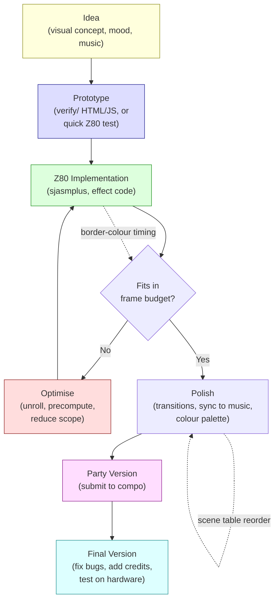

# Розділ 20: Робочий процес демо — від ідеї до компо

> *"Дизайн — це повна сукупність усіх компонентів демо, як видимих, так і прихованих. Дизайн характеризує реалізаційну, стилістичну, ідеологічну цілісність."*
> -- Introspec, "For Design," Hype, 2015

---

Демо не створюється за один сеанс натхненного кодування. Це проєкт — з дедлайнами, залежностями, креативними рішеннями, які потрібно зафіксувати за тижні до паті, технічними ставками, що спрацьовують або ні, і фінальним сабмітом, який або працює на компо-машині, або фейлиться перед аудиторією. Відстань між "у мене є ідея для демо" та "воно зайняло третє місце на DiHalt" вимірюється не рядками коду, а робочим процесом: як ти організовуєш ефекти, як плануєш час, як збираєш і тестуєш, як справляєшся з неминучим моментом, коли музика не готова, а до паті чотири дні.

Цей розділ про цей робочий процес. Ми провели дев'ятнадцять розділів за техніками — внутрішні цикли, підрахунок тактів, стиснення, звук, синхронізація. Тепер відступаємо і запитуємо: як справжнє демо збирається докупи? Як ти переходиш від порожнього екрана до двохвилинної продукції, що працює надійно, виглядає навмисно і потрапляє на потрібне паті у потрібний день?

Відповіді приходять з трьох джерел. Making-of стаття restorer'а про Lo-Fi Motion (Hype, 2020) надає детальне дослідження робочого продакшн-конвеєра — чотирнадцять ефектів, побудованих за два тижні вечірнього кодування, з системою таблиці сцен та набором інструментів, який кожен читач може відтворити. Філософські есе Introspec'а на Hype — "For Design" та "MORE" (обидва 2015) — формулюють дизайн-мислення, що відрізняє колекцію ефектів від цілісного демо. А ширша making-of культура ZX Spectrum-сцени — від детального NFO Eager до робочого процесу GABBA з iOS-відеоредактором до 256-байтного пазлу NHBF — дає нам галерею підходів для вивчення.

---

## 20.1 Що означає «дизайн» у демо

Коли демосценери кажуть «дизайн», вони не мають на увазі графічний дизайн. Вони не мають на увазі розкладку UI чи теорію кольору, хоча це також важливо. Визначення Introspec'а, опубліковане на Hype у січні 2015, ширше і вимогливіше:

> Дизайн — це повна сукупність усіх компонентів демо, як видимих, так і прихованих.

Це визначення включає ефекти, які бачить аудиторія, переходи між ними, вибір музики та як вона синхронізується з візуалами, колірну палітру, темп, емоційну дугу — але також архітектуру коду, карту пам'яті, стратегію стиснення, конвеєр збірки та рішення про те, що залишити поза межами. Демо з красивим піксель-артом і жахливим темпом має поганий дизайн. Демо з грубими візуалами, але ідеальною музичною синхронізацією та чіткою емоційною дугою може мати чудовий дизайн. Навмисно потворне демо, що обирає свою естетику зі свідомим наміром, може мати видатний дизайн.

Наслідки для робочого процесу негайні. Якщо дизайн охоплює все, то дизайн-рішення приймаються на кожному етапі. Вибір асемблера обмежує те, що може твій конвеєр збірки. Карта пам'яті визначає, які ефекти можуть співіснувати. Порядок, у якому ти будуєш ефекти, визначає, що ти можеш вирізати, якщо часу не вистачить. Кожен технічний вибір має естетичний наслідок, і кожен естетичний вибір має технічну ціну.

Виробництво демо має бути одночасно знизу-вгору і зверху-вниз, з постійним зворотним зв'язком між креативним баченням та технічною реальністю. Робочий процес повинен підтримувати цей цикл зворотного зв'язку.

---

## 20.2 Lo-Fi Motion: повне дослідження випадку

У вересні 2020 restorer опублікував making-of статтю про Lo-Fi Motion, демо для ZX Spectrum, випущене на DiHalt 2020. Стаття цінна не якимось одним технічним спостереженням, а тим, що документує *весь продакшн-конвеєр* — від початкової концепції до готового бінарника — достатньо детально, щоб його відтворити.

### Концепція: «Білоруський піксель»

Lo-Fi Motion використовує графіку атрибутної роздільності — те, що restorer називає «lo-fi» рендерингом. Більшість ефектів працюють на сітці атрибутів 32x24 або на подвоєній роздільності 32x48, використовуючи половинні знакоряди. Жодного піксельного рендерингу. Естетика навмисно блочна, вона приймає атрибутну сітку ZX Spectrum замість боротьби з нею. Назва говорить сама за себе: це lo-fi, і рух — це суть.

Це дизайн-рішення з каскадними технічними перевагами. Ефекти атрибутної роздільності дешеві для обчислення (192 або 384 байти на кадр замість 6 144), дешеві для зберігання (малі кадрові буфери — більше місця для стиснених даних) і швидкі для відображення (запис 768 байтів у RAM атрибутів легко вкладається в один кадр). Lo-fi естетика — не компроміс, а вибір, що відкриває чотирнадцять ефектів за два тижні вечірньої роботи.

### Таблиця сцен

У центрі архітектури Lo-Fi Motion — **таблиця сцен** — структура даних, що керує всім демо. Кожен запис таблиці описує одну сцену:

```z80 id:ch20_the_scene_table
; Scene table entry (conceptual structure)
scene_entry:
    DB  bank_number          ; which 16K memory bank holds this effect's code
    DW  entry_address        ; start address of the effect routine
    DW  frame_duration       ; how many frames this scene runs
    DB  param_byte_1         ; effect-specific parameter
    DB  param_byte_2         ; effect-specific parameter
    ; ... additional parameters as needed
```

Рушій демо читає таблицю сцен лінійно. Для кожного запису він підключає вказаний банк пам'яті, переходить за адресою входу і запускає ефект на вказану кількість кадрів. Коли тривалість закінчується, переходить до наступного запису. Усе демо — всі чотирнадцять ефектів, усі переходи, весь тайминг — закодовано в цій одній таблиці.

Це та сама архітектурна модель, яку ми бачили в скриптовому рушії Розділу 12, зведена до суті. Скриптовий рушій Eager мав два рівні (зовнішній скрипт для ефектів, внутрішній скрипт для варіацій параметрів) і команду kWORK для асинхронної генерації кадрів. Таблиця сцен Lo-Fi Motion простіша: один рівень, синхронна генерація, без асинхронної буферизації. Простота — це суть. Це працює. Це було побудовано за два тижні.

Модель таблиці сцен має критичну перевагу для робочого процесу: вона відокремлює контент від рушія. Додавання нового ефекту означає написати підпрограму ефекту та додати один запис до таблиці. Зміна порядку демо — перестановка записів таблиці. Коригування тайминга — зміна значень тривалості. Код рушія не змінюється. Це розділення означає, що ти можеш ітерувати структуру демо — його темп, порядок, тайминг — не торкаючись рушія, і ітерувати окремі ефекти, не торкаючись структури.

### Чотирнадцять ефектів

Lo-Fi Motion містить приблизно чотирнадцять різних візуальних ефектів. restorer перераховує їх робочими назвами: расколбас, слайм, фаєр, інтерп, плазма, рейн, діна, ртзумер, рбарс, бігпік та кілька інших. Кожен ефект — самодостатня підпрограма, що рендерить у віртуальний буфер.

Віртуальний буфер — ключовий архітектурний вибір. Більшість ефектів не пишуть безпосередньо в екранну пам'ять. Замість цього вони рендерять у **1-байт-на-піксель буфер** — блок RAM, де кожен байт представляє значення кольору однієї комірки атрибутів. Буфер зазвичай має ширину 32 байти та висоту 24 або 48 байтів (для роздільності половинного знакоряду). Після того як ефект відрендерив у буфер, окрема підпрограма виведення копіює буфер у RAM атрибутів, виконуючи необхідне перетворення формату.

Це опосередкування коштує кілька сотень тактів на кадр, але дає дві переваги. По-перше, ефекти ізольовані від фізичної розкладки екрана. Ефект, що рендерить у лінійний буфер, не потребує знання структури адрес атрибутної пам'яті. По-друге, ефекти можна компонувати: два ефекти можуть рендерити в окремі буфери, а підпрограма мікшування може змішати їх перед виведенням. Lo-Fi Motion використовує це для переходів — кросфейд між двома ефектами інтерполяцією їхніх значень буфера.

Буфер також дозволяє режим половинної знакорядної роздільності. Буфер 32x48 відображається на екран двома записами атрибутів на комірку символу (один для «верхньої половини» та один для «нижньої»), використовуючи часовий трюк перезапису атрибутів посередині рядка розгортки. Це подвоює вертикальну роздільність ціною складнішого коду виведення та жорсткіших часових обмежень.

### Самі ефекти

Кожен ефект — варіація на теми з попередніх розділів: **плазма** (сума синусів з Розділу 9), **ротозумер** (обхід текстури з Розділу 7), **вогонь** (клітинний автомат, що усереднює сусідів), **дощ** (система частинок) та **bigpic** (попередньо стиснена бітмап-анімація, розпакована покадрово, з використанням технік з Розділу 14). Жоден з цих ефектів не новий. Суть у тому, що при атрибутній роздільності кожен з них достатньо дешевий, щоб чотирнадцять вмістилися в одне демо, побудоване за два тижні. Lo-fi рішення — це мультиплікатор сили.

### Набір інструментів

Набір інструментів restorer'а для Lo-Fi Motion — конкретна відповідь на питання «які інструменти мені потрібні, щоб зробити демо?»

**Асемблер: sjasmplus.** Стандартний Z80 макроасемблер для сучасної ZX-сцени. Банкінг пам'яті (директиви SLOT/PAGE), умовна компіляція, макроси, INCBIN для вбудованих даних, DISPLAY для діагностики під час збірки, виведення в .tap/.sna/.trd. Таблиця сцен, код ефектів, стиснені дані та рушій — все компілюється за одне виконання sjasmplus.

**Емулятор: zemu.** Емулятор вибору restorer'а для Lo-Fi Motion. Unreal Speccy та Fuse однаково поширені. Важливо — точний тайминг і швидке перезавантаження: тобі потрібно тестувати нову збірку кожні кілька хвилин.

**Графіка: BGE 3.05 + Photoshop.** BGE (Burial Graphics Editor, автор — Sinn/Delirium Tremens) — це графічний редактор, що працює безпосередньо на ZX Spectrum, широко використовуваний у російській сцені для створення арту атрибутного рівня безпосередньо на цільовій платформі. Попередньо відрендерені ПК-зображення проходять через Photoshop (або Multipaint, GIMP) та власні скрипти.

**Скрипти: Ruby.** Автоматизація конвеєра перетворення: зображення в дані атрибутів, таблиці синусів у бінарні інклуди, анімаційні послідовності в дельта-стиснені потоки. Python, Perl та Processing однаково поширені. Важливо, щоб перетворення було автоматизоване і відтворюване.

**Стиснення: hrust1opt.** Hrust 1 з оптимальним парсингом. Z80-розпаковувач є переміщуваним (використовує стек як робочий буфер), що зручно для демо, які підвантажують і вивантажують дані з банкованої пам'яті.

Практичний урок: немає єдиного «правильного» набору інструментів. Правильний — це той, де кожен крок від вихідного асету до фінального бінарника автоматизований, зміна одного входу регенерує всі залежні виходи, і вся збірка завершується за секунди. Будь-який ручний крок — це баг, що чекає свого часу о 2 годині ночі перед дедлайном компо.

### Конвеєр збірки

Інструменти з'єднуються через **Makefile** (або еквівалентний скрипт збірки). Конвеєр Lo-Fi Motion виглядає приблизно так:

```text
Source assets (PNG, raw data)
    |
    v
Ruby conversion scripts
    |
    v
Binary includes (.bin, .hru)
    |
    v
sjasmplus assembly
    |
    v
Output binary (.trd or .sna)
    |
    v
Test in emulator (zemu)
```

Кожна стрілка — правило Makefile. Зміни PNG, запусти `make`, і весь ланцюжок перевиконується — перетворення, стиснення, компіляція — створюючи свіжий бінарник за секунди. Завантаж його в емулятор, подивись результат, вирішив, що змінити, відредагуй вихідник, запусти `make` знову. Цей цикл редагування-збірки-тестування, що вимірюється секундами — ось що робить можливим побудувати чотирнадцять ефектів за два тижні.

Makefile також слугує документацією. Читання правил збірки говорить тобі точно, які скрипти створюють які виходи, які ефекти залежать від яких файлів даних, і як виглядає повний граф залежностей. Коли ти повертаєшся до проєкту після шестимісячної перерви, Makefile розповідає, як все з'єднується.

### Таймлайн: два тижні вечорів

Lo-Fi Motion було побудоване приблизно за два тижні вечірніх сеансів кодування. restorer працював на денній роботі. Вечори були єдиним доступним часом.

Цей таймлайн реалістичний для lo-fi атрибутного демо і повчальний для тих, хто планує свою першу продукцію. Розклад виглядає приблизно так:

- **Дні 1-2:** Архітектура рушія. Система таблиці сцен, віртуальний буфер, підпрограма виведення, базовий фреймворк. Запустити один ефект (плазма) через повний конвеєр.
- **Дні 3-7:** Ефекти. Два-три ефекти за вечір, коли фреймворк стабільний. Кожен ефект — 100-300 рядків асемблеру, рендеринг у віртуальний буфер. Тестувати кожен окремо.
- **Дні 8-10:** Контент. Попередньо відрендерені зображення, дані шрифтів, скрипти перетворення. Тут Ruby-скрипти заробляють на своє утримання.
- **Дні 11-12:** Інтеграція. Усі ефекти в таблиці сцен, тайминг підлаштований під музику, переходи налаштовані. Тут робочий процес таблиці сцен з редагуванням та перезбіркою окупається.
- **Дні 13-14:** Полірування та налагодження. Кольори бордюру для візуалізації тайминга (Розділ 1), виправлення ефектів, що ламаються на граничних випадках, фінальний прохід стиснення, щоб все вмістилося в пам'ять.

Критичне спостереження: рушій та конвеєр споживають перші два дні. Кожен наступний день виграє від цієї інвестиції. Якщо ти пропустиш роботу над конвеєром і захардкодиш свій перший ефект прямо в екранну пам'ять, ти заощадиш день наперед і втратиш тиждень пізніше, коли спробуєш додати другий ефект і виявиш, що нічого не модульне.

---

## 20.3 Making-of культура

Демосцена ZX Spectrum має сильну культуру документування того, як створюються демо. Це не універсально для ширшої демосцени -- на багатьох платформах демо випускаються без жодної документації, окрім кредитів. На Spectrum-сцені детальні making-of статті -- це традиція, і Hype (hype.retroscene.org) -- основне місце для їх публікації.

### Eager: технічне NFO

Коли Introspec випустив Eager (to live) на 3BM Open Air 2015, ZIP-файл містив file_id.diz — традиційний інформаційний файл демо — що вийшов далеко за межі кредитів та привітань. Це був технічний опис: підхід атрибутного тунелю, оптимізація четвірною симетрією, техніка гібридних цифрових барабанів, архітектура асинхронної генерації кадрів. Kylearan, рецензуючи демо на Pouet, написав: "Big thanks for the nfo file alone, I love reading technical write-ups! Helps in understanding what I'm seeing/hearing, too."

Потім Introspec опублікував ще детальнішу making-of статтю на Hype, яка стала основним джерелом для Розділів 9 та 12 цієї книги. Стаття пояснювала не лише *що* робить демо, але *чому* — обґрунтування кожного технічного рішення, обмеження, що визначили архітектуру, креативні цілі, що сформували візуальний дизайн.

Цей рівень документації слугує декільком цілям. Для аудиторії він поглиблює розуміння — усвідомлення того, як працює ефект, робить перегляд більш вдячним, а не менш. Для інших кодерів це освіта — making-of статті на Hype — найближче, що має ZX-сцена до технічного курикулуму. Для автора це форма завершення — артикуляція рішень змушує розуміти власну роботу, а відгуки спільноти (коментарі на Hype можуть нараховувати сотні постів) стрес-тестують твоє обґрунтування.

### GABBA: інший робочий процес

Making-of стаття diver4d про GABBA (2019) документує радикально інший робочий процес порівняно з Eager. Там, де Introspec витратив тижні на скриптовий рушій та асинхронний кадровий буфер, diver4d використав Luma Fusion — iOS-відеоредактор — як інструмент синхронізації.

Ми розглянули технічні деталі в Розділі 12. Тут важливе спостереження про робочий процес: diver4d зрозумів, що покадрова аудіо-візуальна синхронізація — це задача *відеомонтажу*, а не *програмування*. Виконуючи роботу з синхронізацією в інструменті, створеному для неї, він міг ітерувати тайминг за секунди замість хвилин. Z80-код був рівнем реалізації; креативні рішення приймалися у відеоредакторі.

Це загальний принцип. Робочий процес демо — не про те, щоб робити все в асемблері. Це про використання правильного інструменту для кожної задачі. Асемблер для внутрішніх циклів. Processing або Ruby для генерації коду. Photoshop або Multipaint для графіки. Відеоредактор для тайминга. Makefile, щоб зв'язати все. Демо — це результат; інструменти — що завгодно, що доставить тебе туди найшвидше.

### NHBF: пазл

Making-of UriS'а для NHBF (2025) документує робочий процес на протилежному кінці від конвеєра Lo-Fi Motion з чотирнадцятьма ефектами. NHBF — це 256-байтне інтро: вся програма, код і дані, вміщується в менший простір, ніж один кадр атрибутів. «Робочий процес» — це одна людина, що дивиться на hex-дамп, постійно перетасовує інструкції в пошуку коротших кодувань, виявляючи, що значення регістрів з однієї підпрограми випадково збігаються з потребами даних іншої.

Ми розглянули конкретні техніки в Розділі 13. Урок робочого процесу — про креативність, що керується обмеженнями. UriS описує процес як "playing puzzle-like games" — влучна метафора, бо простір оптимізації в 256-байтному кодуванні є комбінаторним. Ти не можеш спланувати шлях до рішення. Ти можеш лише продовжувати переставляти частини і бути уважним до випадкових збігів. Відкриття Art-Top'а, що значення регістрів після підпрограми очищення екрана збігаються з довжиною текстового рядка, не було заплановано. Воно було *помічено*.

Це має значення для робочого процесу демо будь-якого масштабу. Навіть у повнорозмірному демо з нормальним рушієм, Makefile та таблицею сцен бувають моменти, коли найкраще рішення приходить від того, щоб відступити і подивитися на загальну картину, помітивши випадковий збіг між двома системами, що були спроєктовані незалежно. Мислення пазлера не виключне для sizecoding. Це спосіб мислення, що покращує будь-яку роботу над демо.

---

## 20.4 Набір інструментів в деталях

Набір інструментів ZX Spectrum демо зійшовся на стандартному наборі. Ось типова структура проєкту:

```text
src/
    main.asm            ; entry point, scene table, engine loop
    engine.asm          ; scene table interpreter, buffer management
    effects/
        plasma.asm      ; individual effect routines
        fire.asm
        rotozoomer.asm
    sound/
        player.asm      ; music player (PT3 or custom)
        drums.asm       ; digital drum sample playback
    data/
        music.pt3       ; music file (INCBIN)
        screens.zx0     ; compressed graphics (INCBIN)
        sinetable.bin   ; pre-generated lookup table (INCBIN)
Makefile
tools/
    gen_sinetable.rb    ; Ruby script: generate sine table
    convert_gfx.rb      ; Ruby script: PNG to attribute data
```

### Асемблер: sjasmplus

Робоча конячка. Банкінг пам'яті через директиви SLOT/PAGE, умовна компіляція, макроси, INCBIN для вбудованих даних, DISPLAY для діагностики під час збірки та виведення в .tap/.sna/.trd. Типове демо компілюється за одне виконання sjasmplus.

### Емулятори

**Unreal Speccy** є перевагою багатьох демосценерів російської сцени завдяки детермінованому таймінгу та точній емуляції Pentagon, з TR-DOS, TurboSound та підтримкою кількох моделей клонів. **Fuse** широко доступний на Linux та macOS. **zemu** — ще один варіант, використаний restorer'ом для Lo-Fi Motion. Для налагодження на рівні вихідного коду **DeZog** у VS Code підключається до ZEsarUX і забезпечує точки зупинки, інспекцію регістрів та перегляд пам'яті.

Обери один емулятор для основної розробки. Тестуй на інших перед релізом. Демо, які працюють в одному емуляторі й падають в іншому — це патівська традиція, якої краще уникати.

### Графіка та генерація коду

**Multipaint** застосовує атрибутні обмеження в реальному часі — цілеспрямовано створений для 8-бітного піксель-арту. **Photoshop, GIMP або Aseprite** дають творчу свободу, але потребують скриптів перетворення (Python, Ruby, Processing) для квантування та експорту. **Processing** обробляє генеративну графіку та генерацію коду — Introspec використовував його для генерації розгорнутих послідовностей коду chaos zoomer (Розділ 9).

### Автоматизація збірки та CI

Твій Makefile повинен автоматизувати повний конвеєр: вихідні асети через скрипти перетворення через стиснення до компіляції. Якщо будь-який крок потребує ручного втручання, він зафейлиться о 2 годині ночі перед дедлайном.

CI через GitHub Actions стає все поширенішим. Воркфлоу, що збирає при кожному пуші, ловить неявні залежності — демо збирається на твоїй машині, але падає на чистому середовищі через незадекларовану версію інструменту. Вихідний код Lo-Fi Motion є на GitHub, опублікований як еталонна реалізація: клонуй, запусти `make`, отримай робочий бінарник. Ця відкритість незвичайна для демосцени і цінна для навчання.

### Синхронізація та композитинг

Найважча частина демо -- не ефекти, а *тайминг*. Коли запустити плазму. Коли перейти до скролера. Який біт запускає спалах кольору. Це синхронізація, і ZX Spectrum-сцена виробила багаторівневий підхід, що поєднує демосценові інструменти з універсальним відеоредагуванням.

**Таблиця синхронізації.** На рівні Z80 синхронізація -- це таблиця даних:

```z80
sync_table:
    dw 0,     effect_logo       ; frame 0: show logo
    dw 150,   effect_plasma     ; frame 150: start plasma
    dw 312,   flash_border      ; frame 312: beat hit, flash
    dw 500,   effect_scroll     ; frame 500: start scroller
    dw 0                        ; end marker
```

Рушій інкрементує лічильник кадрів кожен VBlank, порівнює його з наступним записом таблиці та викликає обробник, коли настає потрібний кадр. Це найпростіший можливий механізм синхронізації. І саме це кожне ZX Spectrum демо зрештою виконує --- незалежно від того, як ці номери кадрів були визначені.

Питання в тому: як ти *знаходиш* правильні номери кадрів? Існує п'ять підходів, від найпростішого до найскладнішого. (Додаток J покриває повний робочий процес кожного інструменту, конвеєри експорту та покрокові рецепти.)

**Підхід 1: Vortex Tracker + ручний тайминг.** Відкрий свій .pt3 у Vortex Tracker II. У правому нижньому куті показано поточну позицію (патерн, рядок, кадр). Програй мелодію, запиши номери кадрів, де трапляються біти, акценти та переходи фраз. Внеси їх у таблицю синхронізації. Перезбери, протестуй, підлаштуй. Це підхід, який використовує більшість ZX-демосценерів, включаючи Kolnogorov (Vein): "Vortex + video editor. In Vortex the frame is shown in the bottom-right corner --- I looked at which frames to hook onto, created a table with `dw frame, action` entries, and synced from that."

Перевага: ти чуєш музику і бачиш числа одночасно. Недолік: ітерація повільна --- кожна зміна потребує перезбірки демо та перегляду з початку.

**Підхід 2: Відеоредактор як планувальник синхронізації.** Робочий процес GABBA від diver4d визнав, що покадрова синхронізація --- це задача відеомонтажу. Захопи кожен ефект як відеокліп, імпортуй кліпи та музику у відеоредактор (DaVinci Resolve, Blender VSE), знайди ідеальні точки монтажу та зчитай номери кадрів. Kolnogorov: "I exported effect clips to video, assembled them in a video editor, attached the music track, and looked at what order the effects work best in, noting the frames where events should happen." Важливе слово --- *подивився*: це візуальний, інтуїтивний процес. (Додаток J.2--J.3 покриває Blender VSE, DaVinci Resolve та робочий процес GABBA детально.)

**Підхід 3: GNU Rocket.** Стандартний інструмент синхронізації на PC та Amiga демосценах --- редактор у стилі трекера, де стовпці --- іменовані параметри, а рядки --- кроки часу. Ти встановлюєш ключові кадри з інтерполяцією (крок, лінійна, плавна, рампа) і редагуєш наживо, поки демо працює через TCP. Z80-клієнт непрактичний, але робочий процес переносний: розроби криві синхронізації в Rocket, експортуй ключові кадри, конвертуй у Z80-таблиці `dw`/`db` скриптом на Python. (Додаток J.2 описує повний конвеєр Rocket → Z80; Додаток J.7 надає покроковий рецепт.)

**Підхід 4: Blender для превізуалізації.** Для складних демо розмісти ефекти як кольорово-кодовані стрічки на таймлайні VSE з музичним треком, анімуй параметри-заглушки в Graph Editor, потім експортуй номери кадрів та значення ключових кадрів через Python API Blender'а безпосередньо як дані, готові для Z80. (Додаток J.2--J.3 покриває обидва робочі процеси --- VSE та Graph Editor.)

**Підхід 5: Ігрові рушії як генератори даних.** Unity та Unreal надлишкові як *рушії демо*, але ідеальні як *генератори даних*: VR motion capture (малюй траєкторії контролером), GPU-симуляція частинок (експортуй позиції покадрово), прототипування шейдерів (ітеруй алгоритм на повній швидкості, потім перекладай на Z80). Blender покриває більшу частину цього для не-VR роботи. Конвеєр експорту завжди однаковий: float → 8-бітна фіксована точка → дельта-кодування → транспозиція → стиснення → INCBIN. (Додаток J.4 покриває повний конвеєр з порівняльними таблицями та покроковим рецептом VR-захоплення.)

> PC-демосцена має паралельну екосистему інструментів для створення демо, побудовану на тій самій філософії процедурної генерації та екстремального стиснення: Werkkzeug/kkrunchy від Farbrausch (відкритий вихідний код з 2012), TiXL (вузлова моушн-графіка, MIT), Bonzomatic (живе шейдерне кодування) та музичні синтезатори як Sointu і WaveSabre. Жоден з них не націлений на Z80 безпосередньо, але мислення ідентичне --- ZX Spectrum-еквівалент вузлового графа Werkkzeug --- це твій Python-скрипт збірки, що генерує таблиці підстановки та видає директиви INCBIN. Додаток J.5 покриває історію, а Додаток J.6 оглядає музичні інструменти, включаючи Furnace --- сучасний трекер з прямою підтримкою AY-3-8910.

<!-- figure: ch20_vortex_tracker_frame_counter -->

```text
┌─────────────────────────────────────────────────────────────────────┐
│              FIGURE: Vortex Tracker II — frame counter              │
│                                                                     │
│  VT2 main window with pattern editor visible.                       │
│  Bottom-right: position display showing pattern:row and             │
│  absolute frame number.                                             │
│  Highlight/circle the frame counter.                                │
│                                                                     │
│  Caption: "The frame number in VT2's status bar maps directly to    │
│  the PT3 player's interrupt counter on the Spectrum. What you see   │
│  here is what your sync table references."                          │
│                                                                     │
│  Screenshot needed: open any .pt3 in VTI fork, play to a           │
│  mid-song position, capture with frame number visible.              │
└─────────────────────────────────────────────────────────────────────┘
```

> *Див. Додаток J для псевдо-скріншотів GNU Rocket, Blender VSE, Blender Graph Editor та TiXL, а також детальних описів інструментів і п'яти покрокових рецептів експорту.*

**Людський дотик.** Kolnogorov формулює принцип, який усі досвідчені демосценери розуміють, але рідко озвучують явно: "Even if we know the snare hits every 16 notes, and we flash the border every 16 notes --- it will look dead and robotic. The essence of sync is that it should be deliberately uneven and broken in places."

Алгоритмічна синхронізація --- тригер на кожному біті, фейд на кожній межі фрази --- відчувається механічно. Найкраща демо-синхронізація слідує музичним *фразам*, а не окремим бітам. Деякі події спрацьовують трохи до біта (нагнітаючи напругу). Деякі після (сюрприз). У деяких фразах взагалі немає візуальної зміни (створюючи очікування наступного удару). Ось чому ручні таблиці синхронізації, кропітко складені людиною, що дивиться і слухає, стабільно дають кращі результати, ніж будь-яка автоматизована система.

Практичний наслідок: навіть якщо ти використовуєш Rocket або Blender для планування синхронізації, фінальний прохід завжди ручний. Дивись демо з музикою. Підлаштовуй номери кадрів на слух. Додавай позабітні влучання та навмисні паузи, що роблять синхронізацію живою.

---

## 20.5 Культура компо

Демо без компо — це відео на YouTube. Демо на компо — це виступ: показане на великому екрані, з аудиторією, з іншими роботами для порівняння, з призами на кону. Компо — це місце, де робота зустрічає свою аудиторію, і культура навколо компо формує роботу.

### Головні паті

ZX Spectrum демосцену обслуговує кілька регулярних паті, кожне зі своїм характером.

**Chaos Constructions (CC)** -- найбільша та найпрестижніша ZX-демо подія, що проводиться в Санкт-Петербурзі, Росія. ZX-демо компо на CC збирає найсильніші роботи: Break Space (2016), наступники Eager та продукції від груп на кшталт Thesuper, 4D+TBK і Placeholders. CC -- це місце, куди ти йдеш, щоб змагатися на найвищому рівні. Аудиторія велика, обізнана та нещадна.

**DiHalt** проводиться в Нижньому Новгороді, Росія, і має як літню подію, так і зимову «Lite» версію. DiHalt має тенденцію бути більш експериментальним, ніж CC — аудиторія привітна до тих, хто входить вперше, і атмосфера заохочує ризик. Lo-Fi Motion було випущено на DiHalt 2020. Якщо ти входиш на своє перше компо, DiHalt Lite — хороший вибір.

**Multimatograf** — менший івент з традицією заохочення нових робіт. Категорії компо широкі, вимоги до входу мінімальні, і настрій підтримуючий. Introspec рецензував компо Multimatograf на Hype, інколи критично — він тримає кожне паті на одному рівні — але сам івент привітний до початківців.

**CAFe (Creative Art Festival)** — демосцена-подія з ширшим охопленням (не виключно ZX), але ZX-категорії збирають сильні роботи. GABBA зайняла перше місце на CAFe 2019.

**Revision** — найбільша у світі демосцена-подія, що проводиться щорічно в Саарбрюккені, Німеччина. Вона не ZX-специфічна, але категорії «8-bit demo» та «oldschool» вітають роботи для ZX Spectrum. Змагатися на Revision означає показувати свою роботу глобальній демосцені — аудиторії з тисяч, більшість з яких ніколи не бачили демо для Spectrum. Megademica від SerzhSoft виграла компо 4K intro на Revision 2019, довівши, що ZX-роботи можуть конкурувати на глобальній сцені.

### Як увійти на своє перше компо

Процес менш страшний, ніж здається.

**1. Обери паті.** Почни з меншого івента — DiHalt Lite, Multimatograf або локальне паті, якщо таке є у твоєму регіоні. Більші паті мають вищі очікування, і тиск змагання з досвідченими групами на CC може бути контрпродуктивним для першої роботи.

**2. Знай правила.** Кожне паті публікує правила компо, що вказують: вимоги до платформи (яка модель Spectrum, яка конфігурація емулятора), формат файлу (.tap, .trd, .sna), максимальний розмір файлу, чи приймаються віддалені роботи, та дедлайни подачі. Читай правила. Дотримуйся правил. Технічно вражаюче демо, що подається як .tzx, коли правила вимагають .trd, буде дискваліфіковано.

**3. Тестуй на цільовій платформі.** Якщо паті запускає роботи на реальному залізі (фізичний Pentagon або Scorpion), тестуй на цьому залізі або на емуляторі, налаштованому відповідно. Демо, що ідеально працюють на одній моделі машини і падають на іншій, тривожно поширені. Різниці тонкі: тайминг спірної пам'яті, затримки перемикання банків, особливості чипу AY. Розділ 15 покриває машинно-специфічні деталі; Розділ 5 серії GO WEST Introspec'а покриває підводні камені портативності.

**4. Подавай рано.** Більшість паті приймають віддалені роботи через email або вебформу. Подай на день раніше, якщо можливо. Подання в останню хвилину — це стрес і схильність до помилок (завантаження не того файлу, забуття включити необхідний файл метаданих). Паті-версія може бути недосконалою — багато демо оновлюються до «фінальних» версій після паті, виправляючи баги, виявлені під час показу на компо.

**5. Напиши file_id.diz або NFO.** Включи текстовий файл з кредитами (хто що робив), вимогами до платформи (яка модель, який режим) та — якщо ти готовий — коротким технічним описом. Аудиторія цінує знання того, на що вони дивляться. Сцена цінує документацію. І ти оціниш те, що написав, коли через три роки спробуєш згадати, як працює генерація таблиці плазми.

**6. Дивись компо.** Якщо ти на паті особисто, дивись своє демо на великому екрані з аудиторією. Досвід бачити свою роботу показаною публічно, чути реакцію аудиторії, порівнювати свою роботу з іншими — ось навіщо існують компо. Якщо ти подаєш віддалено, дивись стрім, якщо він є. Деякі паті публікують записи компо на YouTube згодом.

**7. Не очікуй перемоги.** Твоя перша робота — це досвід навчання. Мета — завершити щось, подати і побачити показаним. Місце — бонус. Зворотний зв'язок, який ти отримаєш — від аудиторії, від інших сценерів, від власної реакції на бачення на великому екрані — вартує більше за будь-який приз.

Віддалені роботи приймаються на більшості ZX-подій. Lo-Fi Motion була віддаленою роботою на DiHalt 2020. Деякі паті проводять онлайн-подіі, що транслюються на YouTube або Twitch. Якщо найближча до тебе демосцена-подія за 12-годинний переліт, онлайн-компо — це прийнятна стартова точка.

---

## 20.6 Спільнота

ZX Spectrum демосцена достатньо мала, щоб більшість активних учасників знали один одного, і достатньо велика, щоб підтримувати кілька активних спільнот.

### Hype (hype.retroscene.org)

Основний російськомовний форум для обговорення ZX Spectrum демосцени. Заснований і модерований Introspec'ом, він розміщує making-of статті, технічні посібники, рецензії компо та обговорення дизайну, що формують основний матеріал-джерело цієї книги. Гілки сягають сотень коментарів, де досвідчені кодери дебатують підрахунки тактів у деталях. Для не-російськомовного читача інструменти перекладу браузера справляються з прозою достатньо добре, а Z80-асемблер читається однаково будь-яким алфавітом.

Культура пряма. Якщо ти опублікуєш демо з багом тайминга, хтось скаже тобі рівно, який такт неправильний. Ця прямота породжує справжню технічну дискусію, а не ввічливі, але непорадні заохочення.

### ZXArt (zxart.ee)

Всеосяжний архів творчих робіт ZX Spectrum — демо, музика, графіка, ігри, журнали та метадані. Кожна продукція в цій книзі може бути знайдена на ZXArt зі скріншотами, кредитами, результатами паті та завантаженнями. ZXArt також розміщує оцифровані ZX-журнали у форматі TRD (Spectrum Expert, Born Dead, ZX Format), що містять оригінальні статті, які заклали техніки, яким навчає ця книга.

### Pouet (pouet.net)

Глобальна база даних продукцій демосцени. Для ZX-сцени Pouet є мостом до ширшої спільноти — ZX-демо оцінюються людьми, які переважно дивляться PC або Amiga-продукції. Зміна перспективи цінна: технічно блискучий внутрішній цикл, що вражає читачів Hype, може бути невидимим для коментатора Pouet, який фокусується на візуальному впливі та музичній синхронізації. Pouet також розміщує NFO-файли — коли ти не можеш знайти making-of статтю на Hype, перевір NFO на Pouet.

---

## 20.7 Управління проєктом для демо-мейкерів

Створення демо — це управління проєктом. Проєкт має дедлайн (дата паті), результати (фінальний бінарник), залежності (музика, графіка, ефекти, рушій) і зазвичай команду учасників з конкуруючими пріоритетами. Управління цим — не гламурно, але саме це відрізняє завершені демо від покинутих прототипів.

### Мінімальне життєздатне демо

Почни з найпростішої можливої версії свого демо, що є завершеною — не відполірованою, не вражаючою, але завершеною. Один ефект, одна музика, нормальний початок і кінець. Запусти це наскрізно через повний конвеєр збірки протягом перших кількох днів. Це твоя страховка. Якщо все піде не так — якщо складний ефект, який ти планував, не працює, якщо музикант запізнюється з фінальним треком, якщо твій диск помре за тиждень до паті — у тебе є щось для подачі.

Потім ітеруй. Додавай ефекти по одному. Замінюй тимчасову музику, коли прийде фінальний трек. Додавай переходи, полір тайминг, оптимізуй використання пам'яті. Кожна ітерація створює завершене, подаваемне демо, яке краще за попереднє. У будь-який момент ти можеш зупинитися і подати те, що маєш.

Саме так Lo-Fi Motion було побудовано. restorer не писав чотирнадцять ефектів, а потім зшивав їх разом. Він побудував рушій і один ефект, перевірив, що вони працюють, потім додавав ефекти по одному. Кожний вечір роботи створював трохи краще демо. Якби він вичерпав час на десяти ефектах замість чотирнадцяти, демо все одно було б завершеним і подаваємим.

### Робота з колаборантами

Більшість демо — це колаборації. Три принципи тримають їх у русі:

**Визнач формат даних рано.** Музикант повинен знати: PT3 чи власний програвач? Одинарний AY чи TurboSound? Як сигналізуються тригери барабанів? Художник повинен знати: атрибутна роздільність чи піксельна? Обмеження кольорів? Максимальний розмір файлу? Отримати TurboSound-композицію, коли твій рушій підтримує лише одинарний AY — катастрофа, і це твоя вина за те, що не вказав обмеження.

**Комунікуй таймлайн.** Якщо паті через чотири тижні, скажи музиканту, що тобі потрібен трек через два. Буфер — для інтеграції, налагодження та сюрпризів.

**Надавай тимчасові замінники.** Використовуй тимчасовий .pt3 з правильним темпом, поки не прийде фінальний трек. Використовуй програмерський арт, поки не прийдуть фінальні графіки. Рушій ніколи не повинен залежати від фінальних асетів. Коли справжні асети прийдуть, кинь їх у конвеєр і перезбери.

### Налагодження та тестування

Баги демо унікально болючі, бо вони проявляються перед аудиторією. Краш під час показу на компо — це і технічний провал, і соціальний конфуз. Тестування не є опціональним.

**Тестуй на кількох емуляторах.** Кожен емулятор має трохи інший тайминг, ініціалізацію пам'яті та поведінку AY. Демо, що працює в Unreal Speccy, але падає у Fuse, ймовірно має тайминг або припущення про пам'ять, що працює на Pentagon, але не на стандартному Spectrum.

**Тестуй з холодного старту.** Очисти всю пам'ять перед завантаженням демо. Не припускай жодних значень регістрів чи вмісту пам'яті від попередньої програми. Якщо твоє демо працює після запуску попереднього демо, але падає з холодного старту — у тебе баг ініціалізації.

**Тестуй файл для компо, а не зборку для розробки.** Файл, який ти подаєш, повинен бути рівно тим файлом, який ти тестував. Не «швидко перекомпільованою» версією з виправленням останньої хвилини. Виправлення останньої хвилини вносять баги останньої хвилини.

**Використовуй кольори бордюру для тайминга.** Техніка з Розділу 1: встанови бордюр на різні кольори в різних точках циклу кадру. Якщо спалах бордюру виходить у видиму область — твій код занадто повільний. Якщо ні — у тебе є запас. Це найшвидший спосіб перевірити, що ефект вкладається в бюджет кадру.

---

## 20.8 Вихід за межі платформи: «MORE» Introspec'а

У лютому 2015 Introspec опублікував коротке есе на Hype під назвою просто "MORE." Це не технічна стаття. Вона не містить коду, підрахунків тактів, внутрішніх циклів. Це виклик ZX Spectrum-сцені — і, як наслідок, усім, хто працює в межах апаратних обмежень.

Аргумент у тому, що найкращі демо — це не ті, що роблять найвражаючіші речі *попри* обмеження платформи. Це ті, що виходять за межі платформи цілком — створюють досвід, що був би значущим на будь-якому залізі. Обмеження платформи формують техніку, але не повинні обмежувати амбіцію.

> Двох пікселів достатньо, щоб розповісти історію.

Це найцитованіший рядок Introspec'а. Він означає: художній зміст демо не визначається його роздільністю, глибиною кольору, кількістю полігонів чи частотою дискретизації. Два пікселі — дві комірки атрибутів, дві точки на сітці 32x24 — можуть розповісти історію, якщо тайминг правильний, контекст зрозумілий і намір щирий. Технологія обслуговує мистецтво, а не навпаки.

Introspec посилається на "Big Ideas (Don't Get Any)" Джеймса Х'юстона — відео, де Sinclair ZX Spectrum, матричний принтер та інше застаріле обладнання виконують пісню Radiohead. Проєкт зворушливий не через технічне досягнення, а тому що вибір обладнання *означає* щось. Застарілість — це суть. Крихкість — це краса.

Практичний наслідок: техніка необхідна, але недостатня. Ти можеш опанувати кожен ефект у цій книзі і все одно створити демо, яке ніхто не запам'ятає. Те, що робить демо пам'ятним — не те, що воно робить, а те, що воно говорить. Навіть абстрактне демо має особистість: його темп щось говорить про напруження та розрядку; його колірна палітра викликає настрій; його музичний вибір створює емоційний контекст. Кодер, який ставиться до цього як до дрібниць, створює техдемо. Кодер, який ставиться до цього як до дизайн-рішень, створює демо.

Lo-Fi Motion прийняло свою lo-fi естетику як ідентичність. Eager перетворило сітку 32x24 з обмеження на креативний вибір. NHBF знайшло красу в пазлі 256 байтів. У кожному випадку обмеження стало медіумом.

Ось чого вимагає «MORE». Не більше полігонів, не більше кольорів, не більше ефектів. Більше амбіції. Більше наміру. Більше готовності ставитися до демо для ZX Spectrum як до мистецтва.

---

## 20.9 Твоє перше демо: практична дорожня карта

Для читача, який пройшов цю книгу з Розділу 1 і хоче зробити демо, ось конкретний шлях.

<!-- figure: ch20_demo_workflow_pipeline -->



> **Ітеративний цикл:** Шлях від реалізації до перевірки тайминга і назад --- це де витрачається найбільше часу розробки. Етап прототипу (HTML/JS або швидкий Z80-ескіз) валідує візуальну концепцію перед повною реалізацією. Таблиця сцен робить зміну порядку ефектів тривіальною на етапі полірування.


### Тиждень 1: Основа

1. **Налаштуй набір інструментів.** Встанови sjasmplus, обери емулятор (Unreal Speccy, Fuse або ZEsarUX), створи директорію проєкту з Makefile. Перевір, що ти можеш скомпілювати мінімальну програму і запустити її в емуляторі.

2. **Побудуй рушій таблиці сцен.** Напиши мінімальний рушій, що читає таблицю сцен і викликає підпрограми ефектів на вказану тривалість. Почни з архітектури Lo-Fi Motion: номер банку, адреса входу, кількість кадрів. Запусти з одним фіктивним ефектом (заповни екран кольором, інкрементуй колір кожен кадр).

3. **Додай музику.** Інтегруй PT3-програвач у свій обробник переривань IM2 (Розділ 11). Підстав будь-який .pt3 файл як тимчасовий. Перевір, що музика грає, поки працює фіктивний ефект.

### Тиждень 2: Ефекти

4. **Побудуй свій перший справжній ефект.** Атрибутна плазма — природна відправна точка: вона дешева, візуально насичена і добре зрозуміла (Розділ 9). Рендери у віртуальний буфер і копіюй у RAM атрибутів.

5. **Побудуй свій другий ефект.** Вогонь, ротозумер, дощ, колірні смуги — обери один з ефектів, покритих у Частині II. Два ефекти та перехід між ними — це мінімальне демо.

6. **Додай перехід.** Простий кросфейд між двома атрибутними буферами: інтерполюй значення кольорів протягом 25-50 кадрів. Або різкий зріз, синхронізований з бітом у музиці.

### Тиждень 3: Полірування

7. **Заміни тимчасову музику.** Якщо у тебе є музикант-колаборант, інтегруй фінальний трек. Якщо ні, витрати час на вибір .pt3, що підходить настрою та темпу твого демо.

8. **Налаштуй тайминг.** Тут таблиця сцен виправдовує себе. Переставляй ефекти, коригуй тривалості, вирівнюй переходи до музичних подій. Перезбирай та тестуй багаторазово.

9. **Додай початок і кінець.** Екран завантаження (стиснений ZX0, Розділ 14), вступний титр, фінальний екран кредитів. Перше і останнє враження мають значення.

### Тиждень 4: Реліз

10. **Тестуй.** Декілька емуляторів. Холодний старт. Рівно той файл, який ти будеш подавати.

11. **Напиши NFO.** Кредити, вимоги до платформи, привітання і — якщо ти відчуваєш щедрість — технічний опис того, як працюють ефекти. Майбутній ти буде вдячний.

12. **Подай.** Обери паті. Дотримуйся правил. Завантаж файл. Потім дивись компо і насолоджуйся тим, що бачиш свою роботу на екрані.

Твоя перша робота навряд чи займе призове місце. Сприймай її як досвід навчання: зворотний зв'язок від бачення своєї роботи на великому екрані та порівняння з іншими роботами вартує більше за будь-який приз. Кожне наступне демо буде кращим, бо ти знатимеш, що виправляти.

---

## Підсумок

- **Дизайн — це все.** Introspec визначає дизайн демо як «повну сукупність усіх компонентів демо, як видимих, так і прихованих» — архітектура коду, карта пам'яті, темп та емоційна дуга, а не лише візуальні ефекти.

- **Lo-Fi Motion надає відтворюваний шаблон продакшена:** таблиця сцен керує структурою демо, ефекти рендерять у віртуальні 1-байт-на-піксель буфери, а набір інструментів (sjasmplus + zemu + Ruby-скрипти + hrust1opt) з'єднується через Makefile. Чотирнадцять ефектів побудовано за два тижні вечірньої роботи.

- **Модель таблиці сцен** відокремлює контент від рушія. Додавання, видалення чи зміна порядку ефектів означає редагування таблиці даних, а не реструктуризацію коду. Це підтримує швидку ітерацію темпу та структури.

- **Making-of культура — сила ZX-сцени.** Детальні технічні описи — від NFO Eager до робочого процесу GABBA з відеоредактором до 256-байтного пазлу NHBF — слугують освітою, документацією та побудовою спільноти.

- **Стандартний набір інструментів** зходиться на sjasmplus (асемблер), Unreal Speccy або Fuse (емулятор), BGE або Multipaint (графіка), Ruby або Python скрипти (перетворення та генерація коду), ZX0 або hrust1opt (стиснення) та Makefile (автоматизація збірки). CI через GitHub Actions стає все поширенішим.

- **Синхронізація** --- найважча частина демо. Багаторівневий підхід: визнач номери кадрів у Vortex Tracker або відеоредакторі (DaVinci Resolve, Blender VSE), за бажанням сплануй інтерпольовані криві параметрів у GNU Rocket, експортуй у Z80-таблиці `dw frame, action`. Фінальний прохід завжди ручний --- алгоритмічна синхронізація відчувається роботизованою; людська синхронізація слідує фразам, а не бітам. (Додаток J покриває всі інструменти синхронізації, конвеєри генерації даних та покрокові рецепти експорту.)

- **Культура компо** зосереджена на подіях як Chaos Constructions, DiHalt, Multimatograf, CAFe та Revision. Вхід на перше компо вимагає вибору відповідної події, дотримання правил, ретельного тестування та ранньої подачі.

- **Спільнота** живе на Hype (технічні дискусії, making-of статті), ZXArt (архів продукцій) та Pouet (глобальна база даних демосцени).

- **Управління проєктом має значення.** Побудуй мінімальне життєздатне демо спочатку, потім ітеруй. Визнач формати даних з колаборантами рано. Тестуй на кількох емуляторах з холодного старту. Подавай рівно той файл, який тестував.

- **«MORE» Introspec'а** закликає демо-мейкерів виходити за межі обмежень платформи: «Двох пікселів достатньо, щоб розповісти історію.» Технологія обслуговує мистецтво, а не навпаки. Найкращі демо — не найтехнічніші, а ті, де кожен компонент, видимий і прихований, обслуговує цілісне креативне бачення.

---

*Далі: Розділ 21 — Повна гра: ZX Spectrum 128K. Ми переходимо від демо до ігор, інтегруючи все з Частин I-V у повний платформер-скролер.*

> **Джерела:** restorer, "Making of Lo-Fi Motion," Hype, 2020 (hype.retroscene.org/blog/demo/1023.html); Introspec, "For Design," Hype, 2015 (hype.retroscene.org/blog/demo/64.html); Introspec, "MORE," Hype, 2015 (hype.retroscene.org/blog/demo/87.html); Introspec, "Making of Eager," Hype, 2015 (hype.retroscene.org/blog/demo/261.html); diver4d, "Making of GABBA," Hype, 2019 (hype.retroscene.org/blog/demo/948.html); UriS, "NHBF Making-of," Hype, 2025 (hype.retroscene.org/blog/dev/1120.html)
