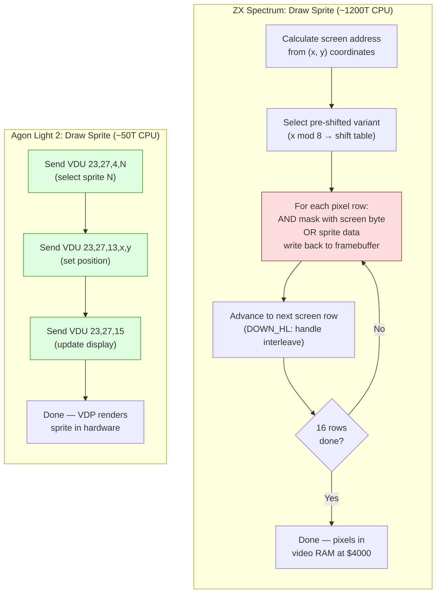

# Розділ 22: Портування — Agon Light 2

> "Той самий набір інструкцій, абсолютно інша машина."

Ти побудував гру. П'ять рівнів, чотири типи ворогів, бій з босом, музика на AY зі звуковими ефектами, екран завантаження та система меню — все працює на ZX Spectrum 128K на частоті 3,5 МГц, у 128 кілобайтах банкованої пам'яті, з рендерингом через ULA, який не змінювався з 1982 року. Кожен байт на обліку. Кожен такт зароблений.

Тепер ти збираєшся портувати це на машину, яка має той самий набір інструкцій процесора, у п'ять разів вищу тактову частоту, вчетверо більше пам'яті, апаратні спрайти, апаратний скролінг тайлової карти, SD-карту для завантаження та 24-бітний плоский адресний простір без банкування.

Це має бути просто.

Це *не* просто. Це *інакше* в такий спосіб, який тебе здивує, і ці сюрпризи навчать тебе речам про обидві машини, яких ти не дізнався б іншим шляхом.

---

## Той самий ISA, інший світ

Agon Light 2 працює на Zilog eZ80 з тактовою частотою 18,432 МГц та 512 КБ плоскої RAM. eZ80 — прямий нащадок Z80: він виконує весь набір інструкцій Z80, використовує ті самі назви регістрів, ті самі прапорці, ті самі мнемоніки. Якщо ти пишеш `LD A,(HL)` на Spectrum і `LD A,(HL)` на Agon, опкод ідентичний. Поведінка ідентична. Програміст Z80 може сісти за Agon і одразу почати писати код.

Але Agon — це не швидкий Spectrum. Це принципово інша архітектура у знайомій обгортці. Відмінності поділяються на три категорії:

**Що додає eZ80.** 24-бітні регістри, 24-бітна адресація, адресний простір 16 МБ (з яких 512 КБ заповнені), нові інструкції для 24-бітної арифметики та система режимів (ADL проти Z80-сумісного), що контролює розрядність регістрів та генерацію адрес.

**Що замінює VDP.** ULA Spectrum — мікросхема, яка зчитує відеопам'ять і малює екран — замінена повністю окремим процесором. VDP Agon — це мікроконтролер ESP32, що працює з графічною бібліотекою FabGL. Він відповідає за виведення зображення, спрайти, тайлові карти та звук. Процесор eZ80 спілкується з VDP через високошвидкісний послідовний зв'язок, надсилаючи командні послідовності. Спільної відеопам'яті немає. Ти не записуєш пікселі за адресою; ти надсилаєш команди співпроцесору.

**Що зникає.** Банкована пам'ять, спірна пам'ять, сітка атрибутів, черезрядкова розкладка екрану, фреймбуфер на 6 912 байтів, бордюр як інструмент тайминґу, прямий доступ до фреймбуфера, синхронізація з растром на рівні тактів. Усе зникло.

Щоб портувати нашу гру зі Spectrum, нам потрібно зрозуміти, що переноситься безпосередньо, що потрібно переписати, а що потрібно переосмислити з нуля.

---

## Архітектура з висоти пташиного польоту

Перш ніж зануритися в код, розкладемо дві машини поруч.

| Характеристика | ZX Spectrum 128K | Agon Light 2 |
|---------|-----------------|---------------|
| CPU | Z80A | eZ80 (Z80-сумісний + розширення ADL) |
| Тактова частота | 3,5 МГц (7 МГц на турбо-клонах) | 18,432 МГц |
| RAM | 128 КБ (8 x 16 КБ банків, перемикання через порт $7FFD) | 512 КБ плоска (24-бітна адресація) |
| Адресний простір | 16-бітний (64 КБ видно одночасно) | 24-бітний (16 МБ, 512 КБ заповнено) |
| Відео | ULA: 256x192, 8x8 кольори атрибутів, пряме відображення у пам'ять | VDP (ESP32 + FabGL): кілька режимів, до 640x480, спрайти, тайлові карти |
| Доступ до фреймбуфера | Прямий: запис у $4000--$5AFF | Непрямий: надсилання VDP-команд через послідовний порт |
| Спрайти | Тільки програмні | Апаратні: до 256, керуються VDP |
| Скролінг | Тільки програмний (зсув усього фреймбуфера) | Апаратний скролінг тайлової карти через VDP |
| Звук | AY-3-8910 (3 канали + шум) | Звук VDP (синтез на ESP32, кілька форм хвилі, ADSR) |
| Носій | Касета / DivMMC (esxDOS) | SD-карта (FAT32, файловий API MOS) |
| ОС | Відсутня (голе залізо) / esxDOS для файлового вводу-виводу | MOS (Machine Operating System) |
| Бюджет кадру | ~71 680 T-state (Pentagon) | ~368 640 T-state (при 50 Гц) |

Співвідношення бюджетів кадру — приблизно 5:1. Але це занижує реальну різницю, оскільки багато операцій, що споживають процесорні такти на Spectrum — рендеринг спрайтів, скролінг екрану, керування фреймбуфером — перекладені на VDP у Agon. Процесор eZ80 витрачає свої такти на ігрову логіку, а не на штовхання пікселів.

<!-- figure: ch22_spectrum_vs_agon_sprite -->



> **Архітектурний зсув:** На Spectrum CPU _є_ рушієм рендерингу --- кожен піксель розміщується інструкціями Z80. На Agon CPU --- _секвенсер команд_ --- він повідомляє VDP, що малювати, а співпроцесор ESP32 обробляє фактичний рендеринг. Вартість CPU падає з ~1 200T до ~50T на спрайт, але тепер ти керуєш асинхронним командним конвеєром із затримкою послідовного зв'язку.

---

## Режим ADL проти Z80-сумісного режиму

Це найважливіша архітектурна концепція для будь-якого програміста Z80, що підходить до eZ80. Помилишся — і твій код впаде в способи, які складно налагодити. Зрозумієш правильно — і розблокуєш повну потужність мікросхеми.

eZ80 має два робочих режими:

**Z80-сумісний режим (режим Z80).** Регістри 16-бітної ширини. Адреси 16-бітні. Регістр MBASE надає верхні 8 біт кожної адреси, фактично розміщуючи твоє 64 КБ вікно десь у 16 МБ адресному просторі. Код поводиться точно як стандартний Z80 — `LD HL,$4000` завантажує 16-бітне значення, `JP (HL)` переходить за 16-бітною адресою (з MBASE попереду), `PUSH HL` кладе 2 байти на стек.

**Режим ADL (Address Data Long).** Регістри 24-бітної ширини. Адреси 24-бітні. `LD HL,$040000` завантажує 24-бітне значення, `JP (HL)` переходить за повною 24-бітною адресою, `PUSH HL` кладе 3 байти на стек. Це рідний режим eZ80.

MOS завантажує Agon у режимі ADL. Твоя програма стартує у режимі ADL. Більшість програмного забезпечення Agon працює цілком у режимі ADL. Але Z80-сумісний режим існує, і розуміння взаємодії між двома режимами критично важливе.

### Навіщо тобі може знадобитися режим Z80

Якщо ти портуєш код Z80 зі Spectrum, можеш подумати: "просто переключуся в режим Z80 і запущу свій існуючий код." Це працює, до певної межі. Твої 16-бітні обчислення адрес, цикли `DJNZ`, блочні копіювання `LDIR` — усе поводиться ідентично в режимі Z80. MBASE встановлено так, що 16-бітні адреси відображаються на правильну ділянку пам'яті Agon.

Проблема — у *взаємодії з усім іншим*. Виклики MOS API очікують режим ADL. VDP-команди надсилаються через процедури MOS, які припускають 24-бітні фрейми стеку. Якщо ти в режимі Z80 і викликаєш процедуру MOS, фрейм стеку буде неправильним — MOS кладе 3 байти на адресу повернення, твій код у режимі Z80 поклав 2. Результат — пошкодження стеку і крах.

### Механізм перемикання режимів

eZ80 надає спеціальні префікси для перемикання режимів у межах однієї інструкції:

| Префікс | Ефект |
|--------|--------|
| `.SIS` (суфікс) | Виконати наступну інструкцію в режимі Z80 (короткі регістри, короткі адреси) |
| `.LIS` | Виконати в режимі: довгі регістри, короткі адреси |
| `.SIL` | Виконати в режимі: короткі регістри, довгі адреси |
| `.LIL` | Виконати в режимі ADL (довгі регістри, довгі адреси) |

А для викликів та переходів:

| Інструкція | З режиму | У режим |
|-------------|-----------|---------|
| `CALL.IS addr` | ADL | Z80 |
| `CALL.IL addr` | Z80 | ADL |

Суфікс `.IS` означає "Instruction Short" — інструкція виклику використовує короткі (16-бітні) конвенції для адреси повернення. `.IL` означає "Instruction Long" — виклик кладе 24-бітну адресу повернення.

Ось практичний патерн для виклику MOS з коду в режимі Z80:

```z80 id:ch22_the_mode_switching_mechanism
; In Z80-compatible mode, calling a MOS API function
; We need to switch to ADL mode for the call

    ; Method: use RST.LIL $08 (MOS API entry point)
    ; .LIL means "long instruction, long mode" ---
    ; pushes a 24-bit return address and enters ADL mode
    RST.LIL $08        ; call MOS API in ADL mode
    DB      mos_func   ; MOS function number follows
    ; MOS returns to us in Z80 mode (matching our caller)
```

MOS надає RST $08 як уніфіковану точку входу API. Суфікс `.LIL` чисто обробляє перехід між режимами. Після виклику виконання повертається до твого коду в режимі Z80 з правильним станом стеку.

### Практичне правило

Для портування найчистіший підхід: **запускай ігрову логіку в режимі ADL і з самого початку переклади свій код Z80 на 24-бітні конвенції.** Не намагайся працювати в режимі Z80 і перемикатися туди-сюди для кожного виклику MOS. Накладні витрати на перемикання режимів і ризик невідповідності стеку того не варті.

Це означає, що твій порт не буде побайтовою копією коду Spectrum. Це буде *переклад*. Алгоритми ті самі. Логіка та сама. Використання регістрів здебільшого те саме. Але кожна адреса — 24 біти завширшки, кожен PUSH стеку — 3 байти, і кожне завантаження безпосередньої адреси несе додатковий байт.

### Пастка MBASE

Якщо ти все ж використовуєш режим Z80, MBASE визначає верхні 8 біт кожної адреси пам'яті. При завантаженні MOS встановлює MBASE у $00, тобто адреси режиму Z80 $0000--$FFFF відображаються на фізичні адреси $000000--$00FFFF. Якщо твій код або дані знаходяться вище $00FFFF (вище перших 64 КБ), код у режимі Z80 не може їх досягти без зміни MBASE.

Це пастка для тих, хто портує зі Spectrum і думає: "У мене 512 КБ, покладу дані рівнів за адресою $080000." У режимі Z80 ця адреса не існує. Ти мусиш або використати режим ADL для доступу, або встановити MBASE у $08 (щоб адреси $0000--$FFFF відображалися на $080000--$08FFFF). Але зміна MBASE впливає на *всі* звернення до пам'яті, включаючи вибірку інструкцій — тому твій код теж мусить бути в тій ділянці, інакше ти перейдеш у сміття.

Порада проста: залишайся в режимі ADL. Використовуй повний 24-бітний адресний простір нативно.

---

## Що переноситься безпосередньо

Не все змінюється. Дивовижно велика частина ігрової логіки зі Spectrum портується з мінімальними змінами.

### Ігрова логіка та система сутностей

Система сутностей з Розділу 18 — масиви структур, що містять X, Y, тип, стан, кадр анімації, швидкість, здоров'я та прапорці — переноситься майже дослівно. Структура головного циклу (HALT, введення, оновлення, рендеринг, повтор) ідентична за концепцією, хоча конкретний механізм HALT та переривань відрізняється.

Ось цикл оновлення сутностей на Spectrum:

```z80 id:ch22_game_logic_and_entity_system
; Spectrum: Update all entities
; IX points to entity array, B = entity count
update_entities:
    ld   ix,entities
    ld   b,MAX_ENTITIES
.loop:
    ld   a,(ix+ENT_FLAGS)
    bit  0,a               ; bit 0 = active?
    jr   z,.skip

    call update_entity      ; process this entity

.skip:
    ld   de,ENT_SIZE        ; size of one entity struct
    add  ix,de              ; advance to next entity
    djnz .loop
    ret
```

І на Agon:

```z80 id:ch22_game_logic_and_entity_system_2
; Agon (ADL mode): Update all entities
; IX points to entity array, B = entity count
update_entities:
    ld   ix,entities        ; 24-bit address, loaded as 3 bytes
    ld   b,MAX_ENTITIES
.loop:
    ld   a,(ix+ENT_FLAGS)
    bit  0,a
    jr   z,.skip

    call update_entity

.skip:
    ld   de,ENT_SIZE        ; DE is now 24-bit; ENT_SIZE may differ
    add  ix,de              ; 24-bit add
    djnz .loop
    ret
```

Логіка ідентична. Інструкції ідентичні. Різниця в тому, що IX, DE та лічильник команд — усі 24-бітної ширини. Асемблер обробляє кодування — `LD IX,entities` генерує 24-бітне безпосереднє значення замість 16-бітного. Сама структура сутності може бути ідентичною, або ти можеш розширити поля позиції до 24 біт для більших карт рівнів. Це рішення дизайну, а не обмеження портування.

### Виявлення зіткнень AABB

Код зіткнень з Розділу 19 переноситься безпосередньо. Перевірки AABB використовують 8-бітні або 16-бітні порівняння — ті самі інструкції CP, SUB та умовних переходів працюють ідентично на обох машинах.

```z80 id:ch22_aabb_collision_detection
; AABB collision check: identical on both platforms
; A = entity1.x, B = entity1.x + width
; C = entity2.x, D = entity2.x + width
check_overlap_x:
    ld   a,(ix+ENT_X)
    cp   (iy+ENT_X2)       ; entity1.x < entity2.x+width?
    ret  nc                 ; no overlap
    ld   a,(ix+ENT_X2)
    cp   (iy+ENT_X)        ; entity1.x+width > entity2.x?
    ret  c                  ; no overlap
    ; overlap on X axis confirmed
```

### Арифметика з фіксованою точкою

Усі обчислення з фіксованою точкою 8.8 — гравітація, швидкість, тертя, прискорення — переносяться без змін. Патерни зсуву та додавання, 16-бітні додавання, тертя через правий зсув:

```z80 id:ch22_fixed_point_arithmetic
; Apply gravity: velocity_y += gravity
; Works identically on both platforms
    ld   a,(ix+ENT_VY_LO)
    add  a,GRAVITY_LO
    ld   (ix+ENT_VY_LO),a
    ld   a,(ix+ENT_VY_HI)
    adc  a,GRAVITY_HI
    ld   (ix+ENT_VY_HI),a
```

Арифметика на рівні байтів не залежить від того, чи регістри номінально 16- чи 24-бітні. Акумулятор завжди 8-бітний. Поширення перенесення працює однаково.

### Скінченний автомат

Скінченний автомат стану гри (титульний екран, меню, геймплей, пауза, кінець гри) використовує таблицю переходів, індексовану номером стану. На Spectrum:

```z80 id:ch22_state_machine
; Spectrum: dispatch game state
    ld   a,(game_state)
    add  a,a               ; multiply by 2 (16-bit pointers)
    ld   e,a
    ld   d,0
    ld   hl,state_table
    add  hl,de
    ld   a,(hl)
    inc  hl
    ld   h,(hl)
    ld   l,a
    jp   (hl)

state_table:
    dw   state_title
    dw   state_menu
    dw   state_game
    dw   state_pause
    dw   state_gameover
```

На Agon таблиця вказівників зберігає 24-бітні адреси:

```z80 id:ch22_state_machine_2
; Agon (ADL mode): dispatch game state
    ld   a,(game_state)
    ld   l,a
    ld   h,0               ; HL = state index
    ld   e,l
    ld   d,h               ; DE = copy of state index
    add  hl,hl             ; HL = state * 2
    add  hl,de             ; HL = state * 3 (24-bit pointers)
    ld   de,state_table
    add  hl,de
    ld   hl,(hl)           ; load 24-bit pointer
    jp   (hl)

state_table:
    dl   state_title       ; DL = define long (24-bit)
    dl   state_menu
    dl   state_game
    dl   state_pause
    dl   state_gameover
```

Зміна: вказівники — 3 байти замість 2, тому множення індексу змінюється з `*2` на `*3`, і таблиця використовує `DL` (define long) замість `DW` (define word). Логіка в іншому ідентична.

---

## Що потрібно переписати

### Рендеринг: від фреймбуфера до VDP-команд

Це найбільша окрема зміна в порті. На Spectrum рендеринг означає запис байтів за адресами відеопам'яті. Увесь конвеєр рендерингу — малювання спрайтів, очищення екрану, заливка тайлів, скролінг — це CPU-код, що маніпулює пам'яттю за адресами $4000--$5AFF.

На Agon рендеринг означає надсилання послідовностей VDP-команд. VDP розуміє протокол на основі VDU-потоків байтів (та сама система VDU-команд, що використовується BBC BASIC, розширена Agon-специфічними командами). Ти надсилаєш послідовність байтів до VDP через MOS, і ESP32 їх обробляє.

#### Спрайти

На Spectrum (з Розділу 16) малювання 16x16 маскованого спрайта коштує приблизно 1 200 T-state процесорного часу — зчитування байтів маски, AND з екраном, OR даних спрайта, запис назад. Ти робиш це для кожного спрайта, кожен кадр.

На Agon ти завантажуєш бітову карту спрайта *один раз*, а потім переміщуєш його, надсилаючи оновлення позиції:

```z80 id:ch22_rendering_from_framebuffer_to
; Agon: Create and position a hardware sprite
; Step 1: Upload sprite bitmap (done once at init)
;   VDU 23, 27, 4, spriteNum   ; select sprite
;   VDU 23, 27, 0, w, h        ; set dimensions
;   followed by pixel data

; Step 2: Move sprite (done every frame)
; VDU 23, 27, 4, spriteNum     ; select sprite
; VDU 23, 27, 13, x.lo, x.hi, y.lo, y.hi  ; set position

move_sprite:
    ; Send VDU command to move sprite
    ld   a,23
    rst  $10                ; MOS: output byte to VDP
    ld   a,27
    rst  $10
    ld   a,4               ; command: select sprite
    rst  $10
    ld   a,(sprite_num)
    rst  $10

    ld   a,23
    rst  $10
    ld   a,27
    rst  $10
    ld   a,13              ; command: move sprite to
    rst  $10

    ld   a,(sprite_x)      ; X low byte
    rst  $10
    ld   a,(sprite_x+1)    ; X high byte
    rst  $10
    ld   a,(sprite_y)      ; Y low byte
    rst  $10
    ld   a,(sprite_y+1)    ; Y high byte
    rst  $10

    ; VDU 23, 27, 15        ; show sprite (update display)
    ld   a,23
    rst  $10
    ld   a,27
    rst  $10
    ld   a,15
    rst  $10
    ret
```

Кожен `RST $10` надсилає один байт до VDP через MOS. Загальна вартість переміщення спрайта по CPU — приблизно 13 надісланих байтів x ~30 T-state на виклик RST = ~390 T-state. Порівняй це з ~1 200 T-state на Spectrum для повного маскованого малювання спрайта. І версія для Agon не потребує збереження/відновлення фону — VDP автоматично композитує спрайти поверх фону.

Компроміс: затримка. VDP обробляє команди асинхронно. Між надсиланням команди "перемістити спрайт" і фактичною появою спрайта на новій позиції є затримка послідовної передачі та затримка обробки VDP. Для плавної анімації тобі потрібно надсилати всі оновлення спрайтів на початку кадру і довіряти, що VDP обробить їх до наступного оновлення екрану.

#### Скролінг тайлової карти

На Spectrum горизонтальний скролінг означає зсув кожного байта відеопам'яті вліво або вправо — ланцюжок інструкцій `RLC` або `RRC` по сотнях байтів, що споживає значну частину бюджету кадру (ми розрахували вартість у Розділі 17). Вертикальний скролінг вимагає копіювання рядків розгортки з урахуванням черезрядкової розкладки пам'яті.

На Agon VDP підтримує апаратні тайлові карти:

```z80 id:ch22_rendering_from_framebuffer_to_2
; Agon: Set up a tilemap (done once)
; VDU 23, 27, 20, tileWidth, tileHeight
; VDU 23, 27, 21, mapWidth.lo, mapWidth.hi, mapHeight.lo, mapHeight.hi

; Scroll the tilemap (every frame)
; VDU 23, 27, 24, offsetX.lo, offsetX.hi, offsetY.lo, offsetY.hi

scroll_tilemap:
    ld   a,23
    rst  $10
    ld   a,27
    rst  $10
    ld   a,24              ; command: set scroll offset
    rst  $10

    ld   hl,(scroll_x)
    ld   a,l
    rst  $10               ; offsetX low
    ld   a,h
    rst  $10               ; offsetX high
    ld   hl,(scroll_y)
    ld   a,l
    rst  $10               ; offsetY low
    ld   a,h
    rst  $10               ; offsetY high
    ret
```

Вісім надісланих байтів. Приблизно 240 T-state процесорного часу. На Spectrum повноекранний горизонтальний піксельний скролінг коштує десятки тисяч T-state. Agon робить це апаратно майже безкоштовно.

Але спочатку потрібно налаштувати тайлову карту: завантажити визначення тайлів, задати розміри карти, заповнити карту індексами тайлів. Це одноразова вартість при завантаженні рівня, а не покадрова вартість. На Spectrum твої дані тайлів живуть у банкованій RAM і рендеряться у фреймбуфер твоїм власним кодом. На Agon дані тайлів живуть у пам'яті VDP і рендеряться ESP32. Твоя роль змінюється з "програміста графічного рушія" на "секвенсера VDP-команд."

#### Розкладка екрану

Увесь кошмар черезрядкової розкладки екрану Spectrum — розбита адресація, процедури DOWN_HL, ретельні обчислення для перетворення координат (x, y) в адреси пам'яті — зникає. VDP Agon працює в екранних координатах. Ти кажеш "малюй у точці (100, 50)", і VDP робить решту.

Це означає, що процедура DOWN_HL з Розділу 2, таблиці пошуку адрес екрану, обчислення адрес атрибутів — нічого з цього не портується. Це просто видаляється. Еквівалентна операція на Agon — "надіслати пару координат до VDP."

---

## Що потрібно переосмислити

Деякі патерни Spectrum настільки глибоко вбудовані в архітектуру гри, що ти не можеш просто переписати рівень рендерингу. Потрібно змінити сам *дизайн*.

### Архітектура пам'яті

На Spectrum ти ретельно планував, які дані йдуть у який банк:

- Банки 0--3: дані рівнів, тайлсети, графіка спрайтів
- Банки 4--6: патерни музики, звукові ефекти, таблиці підстановки
- Банк 7: тіньовий екран для подвійної буферизації

Кожне перемикання банку коштує запис у порт і обмежує те, який код може бачити які дані. Архітектура гри сформована вікном 16 КБ у 128 КБ простір.

На Agon усі 512 КБ видно одночасно. Банкування немає. Немає трюку з тіньовим екраном (VDP обробляє подвійну буферизацію внутрішньо). Ти можеш мати всю гру — усі п'ять рівнів, усі тайлсети, усі спрайти, усю музику — резидентно в пам'яті одночасно. Переходи між рівнями не вимагають завантаження з касети чи диска; ти просто вказуєш на іншу ділянку RAM.

Це спрощує розробку, але також знімає обмеження, яке змушувало створювати хорошу архітектуру. На Spectrum ти був змушений думати про локальність даних, про те, що повинно бути спільно резидентним, про послідовності завантаження. На Agon можна бути неакуратним. Не будь неакуратним. У Agon 512 КБ, а не нескінченність. Добре організована карта пам'яті --- все ще чеснота.

Типова розкладка пам'яті Agon для портованої гри:

```text
$000000 - $00FFFF   MOS and system (reserved)
$040000 - $04FFFF   Game code (~64 KB)
$050000 - $06FFFF   Level data, all 5 levels (~128 KB)
$070000 - $07FFFF   Music and SFX data (~64 KB)
$080000 - $0FFFFF   Free / working buffers
```

Усе адресується одним `LD HL,$070000` — без перемикання банків, без записів у порти.

### Завантаження

На Spectrum завантаження з касети — це хвилинний процес з характерним звуковим супроводом. Навіть з DivMMC та esxDOS файловий доступ — це послідовність викликів RST $08:

```z80 id:ch22_loading
; Spectrum + esxDOS: load a file
    ld   a,'*'             ; current drive
    ld   ix,filename
    ld   b,$01             ; read-only
    rst  $08               ; esxDOS call
    DB   $9A               ; F_OPEN
    ; A = file handle

    ld   ix,buffer
    ld   bc,size
    rst  $08
    DB   $9D               ; F_READ
    ; Data loaded

    rst  $08
    DB   $9B               ; F_CLOSE
```

На Agon MOS надає файловий API, що читає безпосередньо з SD-карти:

```z80 id:ch22_loading_2
; Agon: load a file using MOS API
    ld   hl,filename       ; 24-bit pointer to filename string
    ld   de,buffer         ; 24-bit pointer to destination
    ld   bc,size           ; 24-bit max size
    ld   a,mos_fopen       ; MOS file open function
    rst  $08               ; MOS API call
    ; A = file handle

    ld   a,mos_fread       ; MOS file read function
    rst  $08
    ; Data loaded

    ld   a,mos_fclose
    rst  $08
```

Патерн подібний — відкрити, прочитати, закрити — але Agon читає з FAT32 на SD-карті, що достатньо швидко, щоб завантажувати дані рівнів між сценами без видимої затримки. Екрани завантаження не потрібні. Процедури завантаження з касети не потрібні. Оптимізація блочного завантаження не потрібна.

### Звук

AY-3-8910 Spectrum програмується прямим записом у апаратні регістри через порти вводу-виводу. Кожна нота, кожна зміна обвідної, кожен сплеск шуму — це конкретне значення регістра, записане у конкретний момент.

Звук Agon обробляється VDP. Ти надсилаєш звукові команди через той самий послідовний зв'язок, що використовується для графіки:

```z80 id:ch22_sound
; Agon: play a note
; VDU 23, 0, 197, channel, volume, freq.lo, freq.hi, duration.lo, duration.hi

play_note:
    ld   a,23
    rst  $10
    xor  a                 ; 0
    rst  $10
    ld   a,197             ; sound command
    rst  $10
    ld   a,(channel)
    rst  $10
    ld   a,(volume)
    rst  $10
    ld   hl,(frequency)
    ld   a,l
    rst  $10
    ld   a,h
    rst  $10
    ld   hl,(duration)
    ld   a,l
    rst  $10
    ld   a,h
    rst  $10
    ret
```

Звукова система Agon підтримує кілька форм хвилі (синус, прямокутник, трикутник, пилкоподібна, шум) та ADSR-обвідні для кожного каналу — можливості, яких AY не має. Але модель програмування абсолютно інша. Ти не можеш записувати сирі значення регістрів; ти надсилаєш високорівневі команди нот. Твій програвач музики AY — обробник переривань IM2, що читає дані патернів та оновлює 14 регістрів AY кожен кадр — взагалі не портується. Потрібен новий музичний драйвер, що перекладає дані патернів у звукові команди VDP.

Один підхід: написати тонкий рівень абстракції, який обидві платформи ділять.

```z80 id:ch22_sound_2
; Abstract sound interface
; Spectrum implementation:
sound_play_note:
    ; A = channel, B = note, C = instrument
    ; ... look up AY register values, write to ports $FFFD/$BFFD
    ret

; Agon implementation:
sound_play_note:
    ; A = channel, B = note, C = instrument
    ; ... convert to VDP sound command, send via RST $10
    ret
```

Однакова сигнатура виклику. Різні внутрішні деталі. Ігровий код викликає `sound_play_note`, не знаючи, на якій платформі він працює.

### Введення

Spectrum зчитує стан клавіатури зондуванням порту $FE з адресами напівряда в акумуляторі. Джойстик Kempston зчитується з порту $1F. Це сирі зчитування портів вводу-виводу з конкретними бітовими патернами.

Agon зчитує стан клавіатури через MOS:

```z80 id:ch22_input
; Spectrum: read keyboard
    ld   a,$FD             ; half-row: Q W E R T
    in   a,($FE)
    bit  0,a               ; bit 0 = Q
    ; ...

; Agon: read keyboard via MOS
    ld   a,mos_getkey      ; MOS: get key state
    rst  $08
    ; A = key code, or 0 if no key pressed
```

Spectrum дає тобі бітову маску одночасно натиснутих клавіш, ідеально для ігрового введення (можна виявляти кілька клавіш одночасно). API клавіатури MOS Agon подієвий: він дає тобі останню натиснуту клавішу. Для ігрового введення з одночасним виявленням клавіш ти зазвичай використовуєш карту клавіатури MOS — ділянку пам'яті, що оновлюється MOS і відображає стан усіх клавіш:

```z80 id:ch22_input_2
; Agon: read simultaneous keys from keyboard map
    ld   a,(mos_keymap+KEY_LEFT)   ; 1 if left arrow held, 0 if not
    or   a
    jr   z,.no_left
    ; move player left
.no_left:
    ld   a,(mos_keymap+KEY_RIGHT)
    or   a
    jr   z,.no_right
    ; move player right
.no_right:
```

Це функціонально еквівалентно підходу Spectrum з бітовими масками, просто організоване інакше. Портування нескладне: замінити зчитування портів зчитуванням пам'яті з карти клавіатури.

---

## eZ80 на 18 МГц: що все ще має значення, а що ні

eZ80 приблизно у п'ять разів швидший за Z80A за сирою тактовою частотою. Але багато інструкцій eZ80 також виконуються за менше тактових циклів, ніж їх еквіваленти на Z80 — однобайтові регістрові інструкції часто завершуються за 1 цикл замість 4. Реальне прискорення для типового коду десь між 5x та 20x залежно від набору інструкцій.

Це радикально змінює розрахунок оптимізації.

### Що все ще має значення: ефективність внутрішнього циклу

Навіть на 18 МГц із 368 000 T-state на кадр, внутрішній цикл все ще має значення для CPU-інтенсивних операцій. Якщо ти робиш перевірки зіткнень з тайловою картою, ітеруєш по 200 сутностях або обробляєш скінченні автомати ШІ для десятків ворогів, вартість кожної ітерації гарячого циклу накопичується.

Основні техніки оптимізації Z80 — тримати значення в регістрах замість пам'яті, використовувати `INC L` замість `INC HL` де можливо, уникати IX/IY-індексованих інструкцій на гарячих шляхах (вони несуть 2-тактовий штраф префікса на eZ80, так само як 4-тактовий штраф на Z80) — все ще дають вимірювані покращення.

```z80 id:ch22_what_still_matters_inner_loop
; Tight entity scan: same optimization principles on both platforms
; Prefer: register-to-register ops, direct addressing, DJNZ
; Avoid: IX-indexed loads in hot inner loops when possible

scan_entities_fast:
    ld   hl,entity_flags    ; pointer to flags array
    ld   b,MAX_ENTITIES
.loop:
    ld   a,(hl)
    bit  0,a
    call nz,process_entity
    inc  hl                 ; next entity flag (assume 1-byte stride)
    djnz .loop
    ret
```

Цей патерн — мінімальний доступ до пам'яті, щільне використання регістрів, контроль циклу через `DJNZ` — оптимальний як на Z80 при 3,5 МГц, так і на eZ80 при 18 МГц. Хороший код — це хороший код.

### Що стає нерелевантним: трюки збереження пам'яті

На Spectrum тиск пам'яті визначає значну частину інженерії. Попередньо зсунуті спрайти зберігають 4 або 8 копій кожного спрайта, споживаючи у 4x--8x більше пам'яті, як компроміс швидкість/пам'ять. Компресія обов'язкова для вміщення даних демо у 128 КБ. Таблиці підстановки ретельно підбираються за розміром, балансуючи точність проти витрат пам'яті. Перемикання банків додає архітектурну складність з єдиною метою — адресувати більше ніж 64 КБ одночасно.

На Agon із 512 КБ плоскої RAM та SD-картою для всього, що не потребує резидентності, ці техніки збереження непотрібні. Ти можеш зберігати 8 попередньо зсунутих копій кожного спрайта, не хвилюючись про пам'ять. Можеш тримати всі таблиці підстановки на повній точності. Можеш тримати усі п'ять рівнів у RAM одночасно.

Це не означає, що слід марнувати пам'ять. Але це означає, що рішення оптимізації, зумовлені нестачею пам'яті — "чи використати 256-байтову таблицю синусів чи 128-байтову?" — стають нерелевантними. Використовуй 256. Використовуй 1 024, якщо точність допомагає.

### Що стає нерелевантним: самомодифікований код

На Spectrum самомодифікований код (SMC) — стандартна техніка оптимізації. Ти пишеш інструкції, що патчать власні безпосередні операнди для уникнення звернень до пам'яті:

```z80 id:ch22_what_becomes_irrelevant_self
; Spectrum: self-modifying code for speed
    ld   a,0               ; operand patched at runtime
    ; ... (the $00 after LD A is overwritten with the real value)
```

На eZ80 SMC все ще працює (eZ80 не має кешу інструкцій, що міг би інвалідувати), але мотивація слабша. Додаткова вартість зчитування з пам'яті менша відносно загального бюджету кадру. Що важливіше, MOS відображає деякі ділянки пам'яті як тільки для читання, і певні версії прошивки Agon можуть обмежувати виконання модифікованого коду залежно від ділянки пам'яті. SMC не заборонений на Agon, але рідко необхідний і може спричиняти неочевидні проблеми.

### Що стає нерелевантним: стекові трюки для рендерингу

На Spectrum зловживання вказівником стеку для швидкої заливки екрану (DI, встановити SP на адресу екрану, PUSH дані повторно) — класичний трюк, тому що PUSH записує 2 байти за 11 T-state — швидше за будь-який інший механізм запису. На Agon ти взагалі не пишеш у фреймбуфер. VDP обробляє рендеринг. Стекові трюки для відображення безглузді.

---

## Порівняльна таблиця

Ось порівняння тієї самої гри на обох платформах бік-о-бік. Ці числа репрезентативні для платформера, побудованого в Розділах 21--22.

| Метрика | ZX Spectrum 128K | Agon Light 2 |
|--------|-----------------|---------------|
| **Розмір ігрового коду** | ~12 КБ | ~14 КБ |
| **Код рендерингу** | ~5 КБ (рушій спрайтів, скролінг, керування екраном) | ~2 КБ (послідовності VDP-команд) |
| **Загальний код** | ~17 КБ | ~16 КБ |
| **Дані рівнів (усі 5)** | ~40 КБ (стиснені, завантажуються порівнево) | ~60 КБ (нестиснені, усі резидентні) |
| **Графіка спрайтів/тайлів** | ~20 КБ (упаковані, 1bpp + маски) | ~80 КБ (8bpp RGBA, завантажені у VDP) |
| **Музика + SFX** | ~16 КБ (PT3 + таблиці SFX) | ~20 КБ (конвертований формат + дані форм хвилі) |
| **Загальні дані** | ~76 КБ (вміщується у 128 КБ з банкуванням) | ~160 КБ (легко вміщується у 512 КБ) |
| **Потрібна компресія?** | Так, обов'язкова | Ні, необов'язкова |
| **Вартість малювання спрайта** | ~1 200 T/спрайт (програмно) | ~400 T/спрайт (VDP-команди) |
| **Вартість скролінгу на кадр** | ~15 000--30 000 T (програмний зсув) | ~240 T (VDP-команда зміщення) |
| **Бюджет кадру** | ~71 680 T | ~368 640 T |
| **Досяжний fps** | 25--50 (залежить від кількості сутностей) | 60 (обмежено VDP, не CPU) |
| **Складність розробки** | Висока (банкування пам'яті, розкладка екрану, рушій рендерингу) | Середня (протокол VDP, API MOS, режим ADL) |
| **Візуальний результат** | Монохромні або 2-кольори-на-комірку спрайти, кольори атрибутів, 256x192 | Повноколірні спрайти, плавний скролінг, 320x240 або вище |

Різниця в розмірі коду показова. На Spectrum *рушій рендерингу* — значна частка кодової бази. На Agon VDP-команди замінюють більшість цього коду. Але гра для Spectrum менша за загальним обсягом даних, тому що все стиснене та щільно упаковане. Версія для Agon використовує більше пам'яті для багатших ассетів (8-біт-на-піксель спрайти замість 1-біт-на-піксель з масками).

Порівняння бюджетів кадру — найвражаюче число. Гра на Agon *простоює по CPU більшу частину кадру*. Після обробки ігрової логіки, надсилання оновлень спрайтів та обробки введення, eZ80 немає чим зайнятися до наступного кадру. На Spectrum ти борешся за кожен такт, щоб вмістити все в бюджет.

---

## Процес портування: крок за кроком

Ось практична послідовність портування гри з Розділу 21 на Agon.

### Крок 1: Налаштувати проект Agon

Створи новий проект із набором інструментів Agon. Тобі знадобиться:

- Асемблер eZ80 (ez80asm або інструменти Zilog ZDS)
- Заголовковий файл MOS API (mos_api.inc), що визначає номери функцій та константи
- Спосіб передачі бінарника на Agon (SD-карта або завантаження через послідовний порт)

Твоя точка входу відрізняється від Spectrum. Замість `ORG $8000` з сирим JP на стартову адресу, Agon завантажує виконувані файли за адресою $040000 і MOS передає керування на цю адресу:

```z80 id:ch22_step_1_set_up_the_agon
; Agon: application entry point
    .ASSUME ADL=1          ; we are in ADL mode
    ORG  $040000

    JP   main              ; standard entry

main:
    ; Your game starts here
    ; ... initialize VDP, load assets, enter game loop
```

### Крок 2: Замінити рівень рендерингу

Це основний обсяг роботи. Видали код рендерингу Spectrum та заміни його послідовностями VDP-команд:

1. **Завантажити бітові карти спрайтів у VDP.** Конвертуй 1bpp-дані спрайтів у формат бітових карт VDP (зазвичай 8bpp RGBA). Надішли піксельні дані за допомогою VDU 23,27 команд визначення спрайтів.

2. **Завантажити тайлсет у VDP.** Конвертуй 8x8 тайли з формату атрибутів Spectrum у формат тайлів VDP. Визнач розміри тайлової карти та заповни її індексами тайлів для поточного рівня.

3. **Замінити процедуру малювання спрайтів** на VDU 23,27 команди позиціювання спрайтів (як показано раніше).

4. **Замінити процедуру скролінгу** на VDU 23,27 команди зміщення тайлової карти.

5. **Видалити код обчислення адрес екрану**, процедуру DOWN_HL, процедури адрес атрибутів та всі прямі записи у фреймбуфер.

### Крок 3: Перекласти ігрову логіку

Пройди по коду ігрової логіки (оновлення сутностей, виявлення зіткнень, фізика, ШІ, скінченний автомат) та адаптуй під режим ADL:

- Заміни всі `DW` (define word) на `DL` (define long) для таблиць адрес.
- Заміни арифметику вказівників з 16-бітної на 24-бітну там, де задіяні адреси.
- Переконайся, що пари `PUSH`/`POP` збалансовані — кожен push тепер 3 байти, а не 2.
- Перевір, що лічильники блочного копіювання `LDIR` та `LDDR` правильні (BC у режимі ADL 24-бітний; якщо твій лічильник вміщується у 16 біт, верхній байт мусить бути нульовим).

### Крок 4: Переписати звук

Напиши новий музичний драйвер, що читає дані патернів та генерує VDP-звукові команди замість записів у регістри AY. Формат даних патернів може залишитися тим самим; змінюється лише стадія виведення.

### Крок 5: Переписати введення

Заміни зчитування портів на зчитування карти клавіатури MOS. Підхід із картою клавіш простий і забезпечує одночасне виявлення клавіш.

### Крок 6: Переписати завантаження

Заміни файлові операції esxDOS на виклики файлового API MOS. Патерн подібний; відрізняються лише номери функцій та конвенція виклику.

### Крок 7: Тестувати і налаштовувати

Запусти гру. Перевір позиції спрайтів, бокси зіткнень, швидкість скролінгу, тайминг звуку. Асинхронна обробка VDP означає, що візуальні оновлення можуть надходити на один кадр пізніше, ніж очікувалося — підлаштуй тайминг гри за потреби.

---

## Чому кожна платформа робить тебе кращим

Spectrum навчає ефективності на рівні тактів і творчого розв'язання обмежень: ти вчишся рахувати такти, використовувати розкладку пам'яті та винаходити техніки на кшталт мультиколору та ефектів лише на атрибутах, що існують тільки завдяки обмеженням апаратури. Agon навчає системній архітектурі: керуванню асинхронним співпроцесором, структуруванню командних конвеєрів та побудові інструментів конвертації ресурсів для більших обсягів даних. Spectrum робить тебе кращим оптимізатором; Agon робить тебе кращим системним архітектором. Обидві навички переносяться.

---

## Примітка про інструкції eZ80

eZ80 додає кілька інструкцій, які програмісти Z80 оцінять. Найкорисніші для розробки ігор:

**LEA (Load Effective Address).** Обчислити адресу з базового регістра плюс 8-бітне знакове зміщення, не модифікуючи базовий регістр:

```z80 id:ch22_a_note_on_ez80_instructions
; eZ80: LEA IX, IY + offset
; Compute IX = IY + displacement without changing IY
    LEA  IX,IY+ENT_SIZE    ; IX points to next entity
```

На Z80 для цього потрібні `PUSH IY` / `POP IX` / `LD DE,ENT_SIZE` / `ADD IX,DE` — чотири інструкції та 40+ T-state. LEA робить це за одну інструкцію.

**TST (Test Immediate).** AND акумулятора з безпосереднім значенням та встановлення прапорців, без модифікації A:

```z80 id:ch22_a_note_on_ez80_instructions_2
; eZ80: TST A, mask
; Test bits without destroying A
    TST  A,$80             ; test sign bit
    jr   nz,.negative      ; branch if bit 7 set, A unchanged
```

На Z80 тобі знадобився б `BIT 7,A` (що не працює з довільними масками) або `PUSH AF` / `AND mask` / `POP AF` (дорого).

**MLT (Multiply).** 8x8 беззнакове множення, результат у 16-бітній регістровій парі:

```z80 id:ch22_a_note_on_ez80_instructions_3
; eZ80: MLT BC
; B * C -> BC (16-bit result)
    ld   b,sprite_width
    ld   c,frame_number
    mlt  bc                ; BC = B * C
```

На Z80 множення вимагає циклу або таблиці підстановки. MLT — одна інструкція. Для ігрової логіки — обчислення зміщень спрайтів, індексів тайлової карти, позицій кадрів анімації — це суттєве спрощення.

---

## Підсумок

- Agon Light 2 виконує той самий набір інструкцій Z80, що й Spectrum, але з 24-бітною адресацією (режим ADL), 512 КБ плоскої RAM, апаратними спрайтами та тайловими картами через VDP-співпроцесор та ~5x більшим бюджетом кадру.
- **Режим ADL** — рідний режим. Запускай гру в режимі ADL. Уникай Z80-сумісного режиму для будь-чого, крім запуску застарілого коду, який неможливо конвертувати. Перемикання режимів через суфікси `.LIL`/`.SIS` доступне, але додає складність і ризик.
- **Ігрова логіка портується безпосередньо**: системи сутностей, виявлення зіткнень, фізика з фіксованою точкою, скінченні автомати та ШІ — все переноситься з мінімальними змінами (переважно розширення вказівників з 16-бітних до 24-бітних).
- **Рендеринг потрібно переписати**: прямий доступ Spectrum до фреймбуфера замінюється послідовностями VDP-команд для спрайтів, тайлових карт та скролінгу. Вартість рендерингу по CPU різко падає, але тепер ти керуєш асинхронним командним конвеєром.
- **Звук потрібно переписати**: записи в регістри AY замінюються VDP-звуковими командами. Дані патернів можуть залишитися тими самими; змінюється лише вихідний драйвер.
- **Архітектура пам'яті спрощується**: без банкування, без трюків із тіньовим екраном, без компресії, продиктованої дефіцитом. Усі ассети можуть бути резидентними одночасно.
- **Трюки Spectrum, що стають нерелевантними на Agon**: самомодифікований код для швидкості, рендеринг через вказівник стеку, попередньо зсунуті копії спрайтів як компроміс пам'ять/швидкість, обчислення адрес черезрядкового екрану, візуальні ефекти на атрибутах.
- **Трюки Spectrum, що все ще мають значення на Agon**: щільні внутрішні цикли, ефективний за регістрами код, data-oriented розкладка структур, попередньо обчислені таблиці підстановки.
- **Кожна платформа вчить різним навичкам**: Spectrum вчить ефективності на рівні тактів та творчого розв'язання обмежень; Agon вчить системній архітектурі, комунікації з співпроцесором та керуванню конвеєром даних.
- **eZ80 додає корисні інструкції**: LEA для обчислення адрес, MLT для апаратного множення, TST для неруйнівного тестування бітів — усі спрощення, що замінюють мультиінструкційні патерни Z80.

---

> **Джерела:** Zilog eZ80 CPU User Manual (UM0077); Agon Light 2 Official Documentation, The Byte Attic; Dean Belfield, "Agon Light --- Programming Guide" (breakintoprogram.co.uk); FabGL Library Documentation (fabgl.com); Agon MOS API Documentation (github.com/AgonConsole8/agon-docs); Розділи 15--21 цієї книги.
